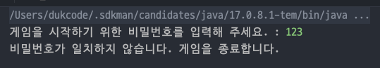
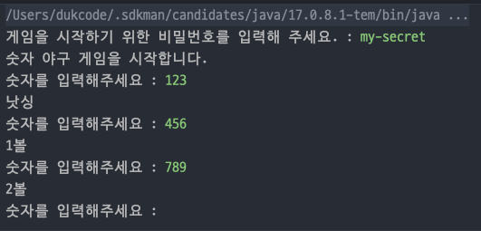

# [우아한테크코스 프리코스 미션1] 숫자 야구 구현 과정

우테코 프리코스의 첫 미션에 도전한다. 이번 미션은 앞으로 겪게될 미션보다는 쉬운 난이도에 속한다고 한다. 콘솔로 동작하는 간단한 숫자 야구를 구현하면 되는 미션이다.

구현 난이도는 굉장히 쉽다고 할 수 있을 것 같다. 하지만 프리코스를 진행하며 성장하기 위해서 배운 것들을 적용해 보려고 한다. 읽었던
책인 [오브젝트](https://www.yes24.com/Product/Goods/74219491)의 내용을 기반으로 객체지향적인 설계를 해볼 예정이다.

~~즉, 과하게 객체지향 원칙을 적용해 볼 예정이다.~~

미션 내용을 조금 확장해서 인터페이스만 구현하면 게임팩을 갈아 끼듯이 숫자 야구 외에도 다른 같은 게임을 쉽게 구현할 수 있는 일종의 **게임 프레임워크**를 만들어 보려고한다.

## 추상화와 책임의 분리

게임에 대해 생각해보자. 우테코 미션의 숫자 야구 기반 위에서 다른 게임을 구현한다면 어떤 공통된 특성이 있는 게임을 만들 수 있을까? 내가 생각해 본 공통점은 다음과 같다.

- 게임 재시작이 가능하다.
- 게임 클리어만 존재하고 게임 오버는 존재하지 않는다.
- 턴제 게임이다. (사용자는 입력을 하고 입력에 따라 클리어가 결정된다.)

위와 같은 특성을 가질 수 있는 게임은 예를 들어 **목숨이 무한인 행맨 게임** 등을 생각해 볼 수 있을 것이다. 그런데 잘 생각해보면 게임 재시작은 게임 외의 부가 기능이지 게임 자체의 본질이 아니다. 여기서
**게임 자체**와
**게임 시스템** 두 계층으로 추상화 계층을 나누어 보자.

- `GameSystem` : 게임 시스템, 게임을 자신만의 방식으로 진행할 책임
    - `ReplayableGameSystem` : 재시작이 가능한 게임 시스템
- `Game` : 게임, 게임에 공통적으로 적용되는 규칙에 따라 게임을 진행할 책임
    - `TurnBasedGame` : 게임 클리어만 존재하고 오버는 존재하지 않는 턴제 게임

위와 같이 `GameSystem`과 `Game`을 인터페이스로 작성하고 나머지 클래스들을 구현해보자.

### ReplayableGameSystem 클래스

```java
public interface GameSystem {

    void run();
}
```

`GameSystem`은 `run()` 인터페이스만을 가지고 있다. 이 인터페이스의 책임은 **게임을 자신만의 방식으로 구동**하는 것이다.

만약 게임을 한번만 진행하고 종료하는 게임 시스템을 구현하려면 다음과 같이 간단히 구현할 수 있다.

```java
public class PlayOnceGameSystem implements GameSystem {

    private final Game game;

    public PlayOnceGameSystem(Game game) {
        this.game = game;
    }

    public void run() {
        game.init();
        game.play();
    }
}
```

게임 재시작 을 지원하는 `ReplayableGameSystem`클래스를 구현해보자.

```java
public class ReplayableGameSystem implements GameSystem {

    private final ReplayableGameSystemView systemView;
    private final Game game;

    public ReplayableGameSystem(ReplayableGameSystemView systemView, Game game) {
        this.systemView = systemView;
        this.game = game;
    }

    public void run() {
        boolean replay = true;
        while (replay) {
            game.init();
            game.play();
            replay = systemView.requestReplayInput();
        }
    }

}
```

`run()`메서드를 실행시키면 게임 초기화 및 진행 후 게임 재시작 여부를 `ReplayableGameSystemView`를 통해 받고 이에 따라 게임을 재시작 또는 종료한다.

#### GameSystemView 클래스

`ReplayableGameSystemView`로 사용자에게 입력을 받거나 및 필요한 내용을 출력하는 책임을 분리했다. 그 이유는 입력 및 출력의 방법이 달라진다면 해당 클래스만 수정하면 되기 때문이다. (GUI로
입출력을 한다면..?)

만약 책임을
분리하지 않으면 `ReplayableGameSystem`은 입출력 방법 변경 시에도 수정되어야 하고 게임 재시작 방식에 변화가 있을 때에도 수정되어야 한다. 변화의 이유가 1개인 SRP를 지키기 위해 클래스를
분리하였다.

```java
public interface ReplayableGameSystemView {

    boolean requestReplayInput();
}
```

인터페이스는 위와 같고 구현체는 콘솔을 통해 입출력을 받도록 아래와 같이 구현하였다.

```java
public class ReplayableGameSystemConsoleView implements ReplayableGameSystemView {

    private static final String RESTART = "1";
    private static final String EXIT = "2";
    private static final String REQUEST_REPLAY_PROMPT = "게임을 새로 시작하려면 " + RESTART +
            ", 종료하려면 " + EXIT + "를 입력하세요.";

    @Override
    public boolean requestReplayInput() {
        System.out.println(REQUEST_REPLAY_PROMPT);
        String input = Console.readLine();
        validInput(input);
        return parseInput(input);
    }

    private void validInput(String input) {
        if (!input.equals(RESTART) && !input.equals(EXIT)) {
            throw new IllegalArgumentException("입력은 " + RESTART + " 이거나 " + EXIT + " 여야 합니다.");
        }
    }

    private boolean parseInput(String input) {
        if (input.equals(RESTART)) {
            return true;
        }

        return false;
    }
}
```

`ReplayableGameSystemConsoleView`클래스는 게임 본질 외적인 시스템에 관련한 입출력을 콘솔을 통해 진행한다. 만약 GUI를 통해
진행된다면 `ReplayableGameSystemGuiView`를
구현하면 될 것이다.

### TurnBasedGame 클래스

게임 그 자체를 나타내는 `Game` 인터페이스를 먼저 추가하였다.

```java
public interface Game {

    void init();

    void play();

}
```

여러가지 게임의 종류가 존재할 수 있다. 턴제 게임이라던지 실시간 게임, 또는 게임 오버가 존재하는 게임, 온라인 게임 등 여러 게임이 존재할 수 있다. 위의 예시를 기반으로 게임을 추상화 해보면 초기화와 플레이라는
두가지 행동으로 객체를 추상화 시킬 수 있다.

이제 해당 클래스를 구현하는 **게임오버 없는 턴제 게임** 클래스를 구현해보자.

```java
public class TurnBasedGame implements Game {

    private final TurnBasedGameView turnBasedGameView;
    private final TurnBasedGameService turnBasedGameService;

    public TurnBasedGame(TurnBasedGameView turnBasedGameView, TurnBasedGameService turnBasedGameService) {
        this.turnBasedGameView = turnBasedGameView;
        this.turnBasedGameService = turnBasedGameService;
    }

    public void init() {
        turnBasedGameService.init();
    }

    public void play() {
        turnBasedGameView.printStart();

        while (true) {
            TurnResult turnResult = turnBasedGameService.playTurn(turnBasedGameView.requestTurnInput());
            turnBasedGameView.printResult(turnResult);
            if (turnResult.isGameCleared()) {
                turnBasedGameView.printClear();
                return;
            }
        }
    }
}
```

`TurnBasedGameService`와 `TurnBasedGameView`를 생성자로 받고 `play()`메서드에서 두 객체의 협력을 통해 게임을 진행시킨다.

간단히 인풋을 받아 턴을 진행하고 결과를 계산하고 출력한다. 이를 반복하다가 게임이 클리어 되었다면 클리어 결과를 출력하고 게임 진행을 종료시킨다.

#### TurnBasedGameView 클래스

```java
public interface TurnBasedGameView {

    void printStart();

    TurnInput requestTurnInput();

    void printClear();

    void printResult(TurnResult turnResult);
}
```

`TurnBasedGameView`는 **게임 오버 없는 턴제 게임**에서 필요한 입출력을 담당하는 클래스이다. 시작 뷰를 출력하는 `printStart()`, 턴 입력을 받는 `requestTurnInput()`,
게임 클리어 뷰를 출력하는 `printClear()`, 턴 결과를 출력하는 `printResult()` 메서드로 구성되어있다.

만약 GUI로 입출력을 받고 싶으면 `TurnBasedGameView`가 GUI에서 동작하도록 구현하면 되고 콘솔로 입출력을 받고 싶으면 입출력을 콘솔로 하도록 구현하면 될 것이다.

```java
public interface TurnBasedGameService {
    void init();

    TurnResult playTurn(TurnInput turnInput);
}

```

`TurnBasedGameService`는 `playTurn()`메서드를 통해 턴의 입력을 받고 결과를 반환한다. 해당 클래스는 **게임 오버 없는 턴제 게임**이라는 점을 고려해 숫자 야구 말고도 **목숨이 무한인
행맨 게임** 등을 구현하기만
하고 `TurnBasedGame`의 생성자로 의존성을 주입시킨다면 코드의 변경 없이 여러 게임을 실행시킬 수 있을 것이다.

이제 입출력 클래스를 살펴보자.

```java
public interface TurnInput {
}

public interface TurnResult {
    boolean isGameCleared();
}
```

`TurnResult`와 `TurnInput` 클래스는 간단한 DTO의 역할을 한다.

## 숫자 야구 구현하기

이제 위의 클래스를 기반으로 해서 세부 사항을 구현해보자. 가장 먼저 `TurnBasedGameService`를 구현하는 `BaseballGameService`를 작성해보자.

### BaseballGameService 클래스

```java
public class BaseballGameService implements TurnBasedGameService {

    private final BaseballNumberGenerator numberGenerator;
    private BaseballNumber answer;

    public BaseballGameService(BaseballNumberGenerator numberGenerator) {
        this.numberGenerator = numberGenerator;
    }

    @Override
    public void init() {
        answer = numberGenerator.generate();
    }

    @Override
    public BaseballGameTurnResult playTurn(TurnInput turnInput) {
        BaseballGameTurnInput baseballGameTurnInput = (BaseballGameTurnInput) turnInput;
        BaseballNumber baseballNumber = baseballGameTurnInput.getBaseballNumber();

        return calculateResult(baseballNumber);
    }

    private BaseballGameTurnResult calculateResult(BaseballNumber baseballNumber) {
        int numBall = answer.countBall(baseballNumber);
        int numStrike = answer.countStrike(baseballNumber);
        return new BaseballGameTurnResult(numStrike == 3, numBall, numStrike);
    }
}

```

`init()`과 `playTurn()`메서드를 구현하면 된다. `playTurn()`메서드는 `TurnInput`의 정보를 가지고 `TurnResult`를 계산해서 반환한다. 즉, 숫자 게임 한 턴을 수행한다.

`init()`메서드 에서는 컴퓨터가 설정한 정답을 다시 생성한다. 여기서 `BaseballNumberGenerator` 클래스를 주입받아 해당
클래스에 새로운 정답을 요청한다.

정답을 생성하는 책임을 분리한 이유는 다음과 같다.

- 정답 생성 로직이 변경될 수 있다.(ex. 정해진 순서에 따라 답을 생성하기 등)
- 테스트 시 랜덤한 값에 클래스가 의존하고 있다면 해당 클래스를 테스트 하기 어렵다.

정답 생성 로직을 분리하면서 `BaseballGameService`의 책임은 숫자 야구의 턴을 진행시키는 것으로 작아졌다. 즉, 정답을 생성하는 책임이 분리되었다.

예를 들어, 게임 클리어 조건이 변경되면 `BaseballService()`의 `playTurn()`메서드만 수정하면 되고 게임 정답 생성 조건이 변경되면 `BaseballNumberGenerator`를 구현하고
주입하면 된다.

```java
public interface BaseballNumberGenerator {
    BaseballNumber generate();
}
```

`BaseballNumberGenerator`는 위와 같이 하나의 메서드를 가지고 있다. 랜덤하게 정답을 생성하도록 인터페이스를 구현해보자.

```java
public class RandomBaseballNumberGenerator implements BaseballNumberGenerator {

    @Override
    public BaseballNumber generate() {
        List<Integer> numbers = new ArrayList<>();
        while (numbers.size() < 3) {
            int randomNumber = Randoms.pickNumberInRange(1, 9);
            if (!numbers.contains(randomNumber)) {
                numbers.add(randomNumber);
            }
        }
        return new BaseballNumber(numbers);
    }
}
```

위처럼 랜덤한 서로 다른 세자리 숫자(1 ~ 9)를 가진 정답을 생성할 수 있다. 해당 클래스를 `BaseballGameService`를 생성할 때 주입하면 정답을 랜덤하게 생성하도록 게임 설정을 변경할 수 있다.

만약 매판 고정된 정답을 원한다면 다음과 같이 클래스를 작성할 수 있을 것이다.

```java
public class FixedBaseballNumberGenerator implements BaseballNumberGenerator {

    private final List<Integer> fixedNumbers;

    public FixedBaseballNumberGenerator(List<Integer> fixedNumbers) {
        valid(fixedNumbers);
        this.fixedNumbers = fixedNumbers;
    }

    public void valid(List<Integer> fixedNumbers) {
        // 생략...
    }

    @Override
    public BaseballNumber generate() {
        return new BaseballNumber(fixedNumbers);
    }
}
```

`BaseballGameTurnInput`클래스는 입력의 값을 검증한다. 요구 사항은 서로 다른 숫자(1 ~ 9) 세자리의 입력 외의 입력은 모두 `IllegalArgumentException`를 던지는
것이다. `valid()`메서드를 통해 해당 로직을 구현한다.

```java
public class BaseballGameTurnInput implements TurnInput {

    private final BaseballNumber baseballNumber;

    public BaseballGameTurnInput(String input) {
        valid(input);
        baseballNumber = createBaseballNumber(input);
    }

    private BaseballNumber createBaseballNumber(String input) {
        List<Integer> numbers = new ArrayList<>();
        for (char ch : input.toCharArray()) {
            numbers.add(ch - '0');
        }
        return new BaseballNumber(numbers);
    }

    private void valid(String input) {
        validLength(input);

        int[] countNumbers = new int[10];
        for (char ch : input.toCharArray()) {
            validIsNumber(ch);
            validDuplicate(countNumbers, ch);
        }
    }

    private void validDuplicate(int[] countNumbers, char ch) {
        if (countNumbers[ch - '0']++ == 2) {
            throw new IllegalArgumentException("입력은 서로 다른 숫자여야 합니다.");
        }
    }

    private void validIsNumber(char ch) {
        if (!Character.isDigit(ch)) {
            throw new IllegalArgumentException("입력은 숫자여야 합니다.");
        }
    }

    private void validLength(String input) {
        if (input.length() != 3) {
            throw new IllegalArgumentException("입력은 3자리여야 합니다.");
        }
    }

    public BaseballNumber getBaseballNumber() {
        return baseballNumber;
    }
}
```

`getter`를 통해 핵심 도메인인 `BaseballNumber`를 반환한다. `BaseballNumber`의 책임은 볼이 몇개인지 스트라이크가 몇개인지 찾는 것이다.

```java
public class BaseballNumber {

    private final List<Integer> numbers;

    public BaseballNumber(List<Integer> numbers) {
        this.numbers = numbers;
    }

    public int countStrike(BaseballNumber otherBaseballNumber) {
        List<Integer> otherNumbers = otherBaseballNumber.numbers;
        int numStrike = 0;
        for (int idx = 0; idx < 3; ++idx) {
            if (Objects.equals(otherNumbers.get(idx), numbers.get(idx))) {
                numStrike++;
            }
        }

        return numStrike;
    }

    public int countBall(BaseballNumber otherBaseballNumber) {
        List<Integer> otherNumbers = otherBaseballNumber.numbers;
        int numBall = 0;
        for (int idx = 0; idx < 3; ++idx) {
            int index = otherNumbers.indexOf(numbers.get(idx));
            if (index != -1 && idx != index) {
                numBall++;
            }
        }

        return numBall;
    }
}
```

위와 같은 로직으로 볼과 스트라이크의 갯수를 찾을 수 있다. 생성자에서 입력을 검증하지 않았는데 이는 `TurnInput`의 구현체에서 일어나기 때문이다.

### BaseballGameConsoleView 클래스

이제 마지막으로 `BaseballGameConsoleView`를 구현해보자.

```java
public class BaseballGameConsoleView implements TurnBasedGameView {

    private static final String START_MESSAGE = "숫자 야구 게임을 시작합니다.";
    private static final String REQUEST_INPUT_MESSAGE = "숫자를 입력해주세요 : ";
    private static final String CLEAR_MESSAGE = "3개의 숫자를 모두 맞히셨습니다! 게임 종료";

    private static final String BALL_UNIT = "볼";
    private static final String STRIKE_UNIT = "스트라이크";
    private static final String NOTHING = "낫싱";

    private static void printNumStrike(int numStrike) {
        System.out.printf("%d%s", numStrike, STRIKE_UNIT);
    }

    private static void printNumBall(int numBall) {
        System.out.printf("%d%s ", numBall, BALL_UNIT);
    }

    private static void printNewLine() {
        System.out.println();
    }

    private static void printNothing() {
        System.out.print(NOTHING);
    }

    @Override
    public void printStart() {
        System.out.println(START_MESSAGE);
    }

    @Override
    public TurnInput requestTurnInput() {
        System.out.print(REQUEST_INPUT_MESSAGE);
        return new BaseballGameTurnInput(Console.readLine());
    }

    @Override
    public void printClear() {
        System.out.println(CLEAR_MESSAGE);
    }

    @Override
    public void printResult(TurnResult turnResult) {
        BaseballGameTurnResult baseballGameTurnResult = (BaseballGameTurnResult) turnResult;

        int numBall = baseballGameTurnResult.getNumBall();
        int numStrike = baseballGameTurnResult.getNumStrike();

        if (numBall == 0 && numStrike == 0) {
            printNothing();
            printNewLine();
            return;
        }

        if (numBall != 0) {
            printNumBall(numBall);
        }

        if (numStrike != 0) {
            printNumStrike(numStrike);
        }

        printNewLine();
    }
}
```

인터페이스만 미션 요구사항에 맞게 잘 구현하면 된다. 책임을 분리했기 때문에 쉽게 구현할 수 있다.

## 조립하기

이제 위에서 구현한 클래스를 조립하고 실행하면 된다.

```java
public class GameFactory {
    private GameFactory() {
    }

    public static Game createBaseballGame() {
        return new TurnBasedGame(new BaseballGameConsoleView(),
                new BaseballGameService(new RandomBaseballNumberGenerator()));
    }
}
```

먼저 `GameFactory`라는 팩토리 클래스를 만든다. 숫자 야구 게임을 생성한다. 이를 호출해서 숫자 야구 게임 객체를 반환받을 수 있다.

```java
public class Application {
    public static void main(String[] args) {
        GameSystem gameSystem = new ReplayableGameSystem(
                new ReplayableGameSystemConsoleView(),
                GameFactory.createBaseballGame());

        gameSystem.run();
    }
}
```

`Application`클래스에서 최종적인 조립을 끝낸다. 숫자 야구 게임을 재시작 게임 시스템에 넣고 게임을 실행시킨다.

만약 다른 게임을 다른 방식으로 실행시키고 싶다고 가정해보자. 예를 들어 개발자만 아는 비밀번호를 입력해야 게임을 실행시킬 수 있다고 해보자.

```java
public class PasswordRequiredGameSystem implements GameSystem {

    private final PasswordRequiredGameSystemView systemView;
    private final Game game;

    private static final String GAME_PASSWORD = "my-secret";

    public PasswordRequiredGameSystem(PasswordRequiredGameSystemView systemView, Game game) {
        this.systemView = systemView;
        this.game = game;
    }

    @Override
    public void run() {
        String password = systemView.requestPasswordInput();
        if (password.equals(GAME_PASSWORD)) {
            game.init();
            game.play();
            return;
        }

        systemView.printPasswordFailed();
    }
}

```

위와 같이 구현한다. 게임 시스템 뷰는 구현을 생략한다.(여러분에게 맡긴다.) 그리고 `Application`에서 다음과 같이 조립하고 실행해보자.

```java
public class Application {
    public static void main(String[] args) {

        GameSystem gameSystem = new PasswordRequiredGameSystem(
                new PasswordRequiredGameSystemConsoleView(),
                GameFactory.createBaseballGame());

        gameSystem.run();
    }
}
```



위와 같이 비밀번호가 틀리면 게임을 종료한다.



비밀번호가 일치하면 게임을 진행한다.

위의 예시 처럼 여러 방법으로 게임 시스템의 변화를 줄 수 있다. 단지 인터페이스를 구현하고 조립하면 된다. 객체의 책임과 관심사를 분리했기 때문에 가능한 일이다. 마찬가지로 턴제 게임 외에 다른 게임을 구현하고
싶다면 `Game` 인터페이스를 구현하고, 다른 종류의 턴제 게임을 구현하고 싶다면 `TurnBasedGameService`클래스를 구현하면 조립을 통해 간단하게 유연한 소프트웨어를 만들 수 있다.