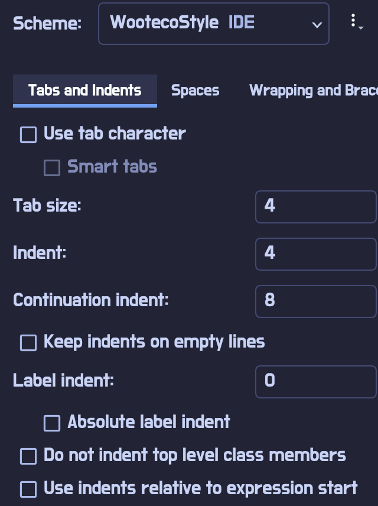
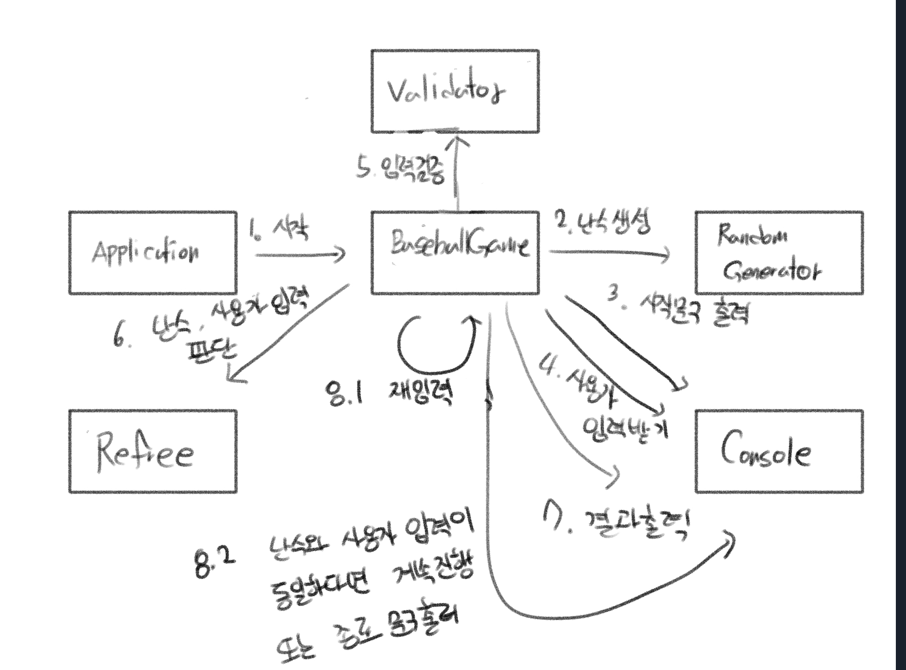
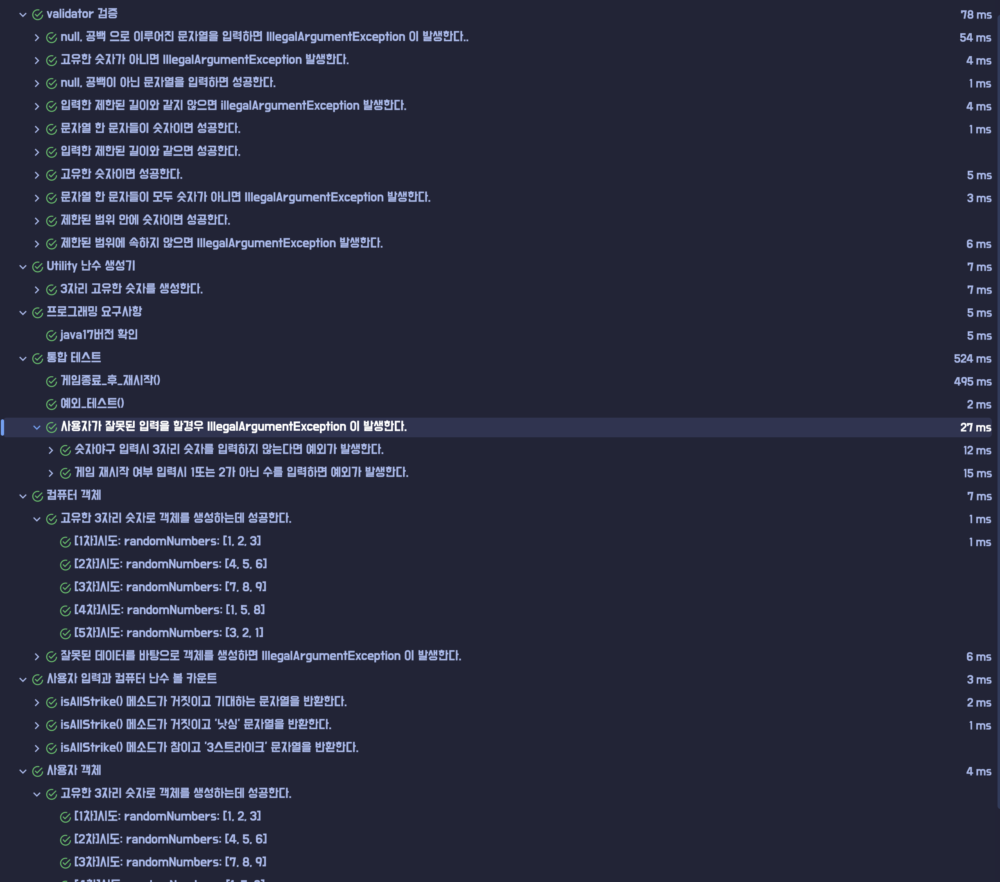

## whyWhale 숫자야구게임 TODO LIST
1. 프로그래밍 요구사항 [환경설정]
- [x] java17 버전 점검


- [x] 코드 컨벤션



2. 기능 요구사항 분석
- [x] 입출력 요구사항 바탕 매커니즘 분석하기
- [x] 기능 리스트 만들기
3. 구현 요구사항
- [x] 라이브러리 사용
    - random 값 추출(camp.nextstep.edu.missionutils.Randoms의 pickNumberInRange()를 활용)
    - 사용자 입력 (camp.nextstep.edu.missionutils.Console의 readLine()을 활용)
- [x] 기본 테스트 성공과
4. 코드 품질 높이기
- [x] 테스트 코드 작성


## 입출력 요구사항 매커니즘 분석 [숫자 야구 게임]
1. 프로그램 시작 문구 출력하기
2. 난수 생성하기
3. 사용자 입력 문구 출력하기
4. 사용자에게 숫자 입력받기
5. 사용자 입력 검증하기
6. 숫자 판별하기
7. 결과 출력하기
8.
- **난수3자리와 사용자 입력 숫자가 같으면** 게임 종료 문구 출력 and 게임을 새로 시작하는지, 종료하는지 문구 출력 새로 시작하려면 3번 순서로 돌아가고 아니면 완전히 시스템 종료하기.
- 난수3자리와 사용자 입력 숫자가 같지 않으면  3번으로 되돌아간다.

**초기 메커니즘 설계**



## 📌기능 목록
- [x] 난수 생성하기 (**라이브러리 이용하기**)
- [x] 콘솔 메시지 출력하기
- [x] 사용자 입력 받기 (**라이브러리 이용하기**)
- [x] 사용자 입력 검증하기 (IllegalException 발생)

    - [x] 게임 중 숫자3자리 입력시
        - 3자리가 아닌 경우
        - 숫자가 아닌 경우
        - 유니크한 3자리가 아닌 경우
        - null 또는 공백문자일 경우

    - [x] 게임 재시작 여부 입력시
        - null 또는 공백문자일 경우
        - 1 또는 2가 아닌 경우
- [x] 난수와 사용자입력을 바탕으로 ball, strike 판별하기
- [x] 재입력 받기

## 테스트 코드 작성
- java 17버전 확인
- 난수 생성하기 (**라이브러리 이용하기**)
    - [x] 3개의 고유한 숫자로만 이루어져있는지 확인
- 사용자 입력 검증하기 (IllegalArgumentException 발생)

    - 게임 중 숫자3자리 입력시
        - [x] 3자리가 아닌 경우
        - [x] 숫자가 아닌 경우
        - [x] 유니크한 3자리가 아닌 경우
        - [x] null 또는 공백 문자열인 경우

    - 게임 재시작 여부 입력시
        - [x] null 또는 공백 문자열인 경우
        - [x] 숫자가 아닌 경우
        - [x] 1 또는 2가 아닌 경우

- 난수와 사용자입력을 바탕으로 ball, strike 판별하기
    - [x] 볼 스트라이크 판별 후 기대한 바와 같이 문자열을 출력하는지 확인




## 시스템 매커니즘(구현 후)


## 기능 요구사항 되돌아보기
[추출 대상]
- 컴퓨터, 플레이어

[제한 사항] 
- 숫자 범위: [1 ~ 9]
- 서로 다른 3자리의 수를 가져야함(컴퓨터,플레이어)
예외 상황:
- 사용자가 잘못된 값을 입력할 경우 IllegalArgumentException 발생

필요한 기능
- 사용자 입력 받기 (숫자야구 입력, 3Strike 시 재실행 여부 입력)
- 게임 시작 문구 및 사용자 입력 문구, 스트라이크|볼 결과 출력하기
- 사용자 입력 검증하기
- [1~9] 까지의 서로다른 3자리의 난수 생성하기
- 검증된 사용자 입력과 컴퓨터 입력을 바탕으로 스트라이크 | 볼 카운팅하기
- 사용자 입력 변환하기  [문자열 -> 리스트(숫자야구),숫자(재실행 여부 1 or 2)]


## 🧐고민되는 부분 [자문자답]
1. Question. 사용자 입력의 유효성 검증시 같은 숫자가 있으면 안되지 않을까?
- Answer. 그러면 사용자 입력 또한 유니크한 숫자로 이루어졌는지 확인할 필요가 있다고 생각한다.
- Why. 왜냐하면 [라이브러리 사용예시] 에서 유니크한 값으로 랜덤값을 추출하기 때문이다.

2. Question. 메소드 행위는 누가 해야하는게 적절할까요? 


    Q. 사용자 입력 검증은 누가 제어하는게 좋을까?

- 숫자 야구 게임 자체에서? Validator 라는 또 다른 객체가 해야할까?
- Answer. 확장성을 고려한다면 Validator 기반으로 BaseballGame에서 Validator의 기능들을 조합해서 입력을 검증하하는 것이 더 좋다고 판단했다.
- why. 검증 시스템 정책은 게임 정책 마다 다를 수 있다고 생각한다. 그렇기 때문에 baseball game 자체에서 validator 객체 행위들을 조합하여 메소드를 생성하는 것이 좋다고 생각한다.
  또한 다른 방법이 존재한다. Validator 라는 네이밍 자체가 다양한 곳에서 쓸수있는 범용적인 느낌이 들 수도 있기 때문에 BaseBallValidator 라고 네이밍을 바꾸고 BaseBall game만의 입력 유효성 검증을 제어해도 괜찮다고 생각한다.


    Q. 컴퓨터의 수는 어떻게 만들것인가?       
- 기본 객체 생성과 동시에 스스로 1,9까지의 3자리의 서로다른 수를 만들어야 하는가? , 숫자야구 게임 시스템에서 수를 만들도록 제어해야 하는가?
- Answer. 확장성을 고려한다면 Validator 기반으로 BaseballGame에서 Validator의 기능들을 조합해서 입력을 검증 하는 것이 좋다고 판단했다.
- why. 검증 시스템 정책은 게임 정책 마다 다를 수 있다고 생각한다. 그렇기 때문에 baseball game 자체에서 validator 객체 행위들을 조합하여 메소드를 생성하는 것이 좋다고 생각한다.
  또한 다른 방법이 존재한다. Validator 라는 네이밍 자체가 다양한 곳에서 쓸수있는 범용적인 느낌이 들 수도 있기 때문에 BaseBallValidator 라고 네이밍을 바꾸고 BaseBall game만의 입력 유효성 검증을 제어해도 괜찮다고 생각한다.


    Q. 숫자야구게임의 사용자 입력과 컴퓨터 입력의 비교는 누가해야하는가?
- 숫자야구게임 자체에서 해야하는가? , 혹은 심판 또는 중재자가 와서 해야하는가?
- answer. 심판이라는 객체를 추가하여서 판별하기로 결정했다. 
- why. 실제 야구 경기를 보면 타자의 스윙에 따라 심판이 볼과 스트라이크를 판별하고 있다. 그리고 이러한 판별을 "볼카운트"라고 칭한다.
  해당 기능 구현상황에 비유하자면 투수가 공을 던지고(컴퓨터가 난수를 생성) 타자가 공을 치면(사용자가 숫자를 입력하면) 심판이 판별(볼카운트)하는 것이다.


    Q. 사용자 입력은 누가 제어해야 하는가?
- 사용자를 객체가 입력을 받을 수 있도록 해야하는가? , Prompt라는 외부 객체가 사용자의 입력을 받을 수 있도록 제어해야 하는가?
- answer. Prompt라는 외부 객체를 참조하여 BaseballGame 객체에서 제어하는 것이 좋다고 판단했다.
- why. 왜냐하면 게임 종류마다 입력을 받는 횟수나 문구를 출력하는 것은 게임 방식이 다양할 수 있기 때문이다. 
 특정적으로 BaseBallGame의 고유한 Console을 가져도 괜찮지만 입력은 어떤 게임에서 사용자의 입력은 필요할 수 있다고 생각하기 때문에 따로 호출해서 제어 하는게 좋을 것 같다.  
    
    
    Q. 형식 변환은 누가 해야하는가 ?
- 사용자 입력 같은 경우 숫자로만 들어온다는 보장이 없기에 문자열로 받고 유효성을 검증할텐데, 문자열 입력 후 변환은 사용자 객체 스스로가 해야하는가 아니면 Utils?, 혹은 Mapper와 같은 외부 객체가 해야하는가?
- answer. 특정 BaseballGame 만의 매퍼 혹은 변환기라는 외부 객체로 변환하는 것이 좋을 것 같다.
- why. BaseballGame 객체는 게임 내부에 전체 과정을 제어하는 총 진행자라고 생각한다. 그렇기 때문에 변환하는 것은 특정 객체가 하는 것이 좋을 것 같다.
 또한 BaseballGame 객체는 변환하는 역할까지 한다면 코드가 길어져 가독성을 떨어뜨릴수 있다고 생각한다.
----
# 미션 - 숫자 야구

## 🔍 진행 방식

- 미션은 **기능 요구 사항, 프로그래밍 요구 사항, 과제 진행 요구 사항** 세 가지로 구성되어 있다.
- 세 개의 요구 사항을 만족하기 위해 노력한다. 특히 기능을 구현하기 전에 기능 목록을 만든다.
- 기능 요구 사항에 기재되지 않은 내용은 스스로 판단하여 구현한다.

## 📮 미션 제출 방법

- 미션 구현을 완료한 후 GitHub을 통해 제출해야 한다.
    - GitHub을 활용한 제출 방법은 [프리코스 과제 제출](https://github.com/woowacourse/woowacourse-docs/tree/master/precourse) 문서를 참고해
      제출한다.
- GitHub에 미션을 제출한 후 [우아한테크코스 지원](https://apply.techcourse.co.kr) 사이트에 접속하여 프리코스 과제를 제출한다.
    - 자세한 방법은 [제출 가이드](https://github.com/woowacourse/woowacourse-docs/tree/master/precourse#제출-가이드) 참고
    - **Pull Request만 보내고 지원 플랫폼에서 과제를 제출하지 않으면 최종 제출하지 않은 것으로 처리되니 주의한다.**

## 🚨 과제 제출 전 체크 리스트 - 0점 방지

- 기능 구현을 모두 정상적으로 했더라도 **요구 사항에 명시된 출력값 형식을 지키지 않을 경우 0점으로 처리**한다.
- 기능 구현을 완료한 뒤 아래 가이드에 따라 테스트를 실행했을 때 모든 테스트가 성공하는지 확인한다.
- **테스트가 실패할 경우 0점으로 처리**되므로, 반드시 확인 후 제출한다.

### 테스트 실행 가이드

- 터미널에서 `java -version`을 실행하여 Java 버전이 17인지 확인한다.
  Eclipse 또는 IntelliJ IDEA와 같은 IDE에서 Java 17로 실행되는지 확인한다.
- 터미널에서 Mac 또는 Linux 사용자의 경우 `./gradlew clean test` 명령을 실행하고,
  Windows 사용자의 경우 `gradlew.bat clean test` 또는 `./gradlew.bat clean test` 명령을 실행할 때 모든 테스트가 아래와 같이 통과하는지 확인한다.

```
BUILD SUCCESSFUL in 0s
```

---

## 🚀 기능 요구 사항

기본적으로 1부터 9까지 서로 다른 수로 이루어진 3자리의 수를 맞추는 게임이다.

- 같은 수가 같은 자리에 있으면 스트라이크, 다른 자리에 있으면 볼, 같은 수가 전혀 없으면 낫싱이란 힌트를 얻고, 그 힌트를 이용해서 먼저 상대방(컴퓨터)의 수를 맞추면 승리한다.
    - 예) 상대방(컴퓨터)의 수가 425일 때
        - 123을 제시한 경우 : 1스트라이크
        - 456을 제시한 경우 : 1볼 1스트라이크
        - 789를 제시한 경우 : 낫싱
- 위 숫자 야구 게임에서 상대방의 역할을 컴퓨터가 한다. 컴퓨터는 1에서 9까지 서로 다른 임의의 수 3개를 선택한다. 게임 플레이어는 컴퓨터가 생각하고 있는 서로 다른 3개의 숫자를 입력하고, 컴퓨터는 입력한 숫자에 대한
  결과를 출력한다.
- 이 같은 과정을 반복해 컴퓨터가 선택한 3개의 숫자를 모두 맞히면 게임이 종료된다.
- 게임을 종료한 후 게임을 다시 시작하거나 완전히 종료할 수 있다.
- 사용자가 잘못된 값을 입력할 경우 `IllegalArgumentException`을 발생시킨 후 애플리케이션은 종료되어야 한다.

### 입출력 요구 사항

#### 입력

- 서로 다른 3자리의 수
- 게임이 끝난 경우 재시작/종료를 구분하는 1과 2 중 하나의 수

#### 출력

- 입력한 수에 대한 결과를 볼, 스트라이크 개수로 표시

```
1볼 1스트라이크
```

- 하나도 없는 경우

```
낫싱
```

- 3개의 숫자를 모두 맞힐 경우

```
3스트라이크
3개의 숫자를 모두 맞히셨습니다! 게임 종료
```

- 게임 시작 문구 출력

```
숫자 야구 게임을 시작합니다.
``` 

#### 실행 결과 예시

```
숫자 야구 게임을 시작합니다.
숫자를 입력해주세요 : 123
1볼 1스트라이크
숫자를 입력해주세요 : 145
1볼
숫자를 입력해주세요 : 671
2볼
숫자를 입력해주세요 : 216
1스트라이크
숫자를 입력해주세요 : 713
3스트라이크
3개의 숫자를 모두 맞히셨습니다! 게임 종료
게임을 새로 시작하려면 1, 종료하려면 2를 입력하세요.
1
숫자를 입력해주세요 : 123
1볼
...
```

---

## 🎯 프로그래밍 요구 사항

- JDK 17 버전에서 실행 가능해야 한다. **JDK 17에서 정상적으로 동작하지 않을 경우 0점 처리한다.**
- 프로그램 실행의 시작점은 `Application`의 `main()`이다.
- `build.gradle` 파일을 변경할 수 없고, 외부 라이브러리를 사용하지 않는다.
- [Java 코드 컨벤션](https://github.com/woowacourse/woowacourse-docs/tree/master/styleguide/java) 가이드를 준수하며 프로그래밍한다.
- 프로그램 종료 시 `System.exit()`를 호출하지 않는다.
- 프로그램 구현이 완료되면 `ApplicationTest`의 모든 테스트가 성공해야 한다. **테스트가 실패할 경우 0점 처리한다.**
- 프로그래밍 요구 사항에서 달리 명시하지 않는 한 파일, 패키지 이름을 수정하거나 이동하지 않는다.

### 라이브러리

- `camp.nextstep.edu.missionutils`에서 제공하는 `Randoms` 및 `Console` API를 사용하여 구현해야 한다.
    - Random 값 추출은 `camp.nextstep.edu.missionutils.Randoms`의 `pickNumberInRange()`를 활용한다.
    - 사용자가 입력하는 값은 `camp.nextstep.edu.missionutils.Console`의 `readLine()`을 활용한다.

#### 사용 예시

```java
List<Integer> computer = new ArrayList<>();
while (computer.size() < 3) {
    int randomNumber = Randoms.pickNumberInRange(1, 9);
    if (!computer.contains(randomNumber)) {
        computer.add(randomNumber);
    }
}
```

---

## ✏️ 과제 진행 요구 사항

- 미션은 [java-baseball-6](https://github.com/woowacourse-precourse/java-baseball-6) 저장소를 Fork & Clone해 시작한다.
- **기능을 구현하기 전 `docs/README.md`에 구현할 기능 목록을 정리**해 추가한다.
- 과제 진행 및 제출 방법은 [프리코스 과제 제출](https://github.com/woowacourse/woowacourse-docs/tree/master/precourse) 문서를 참고한다.