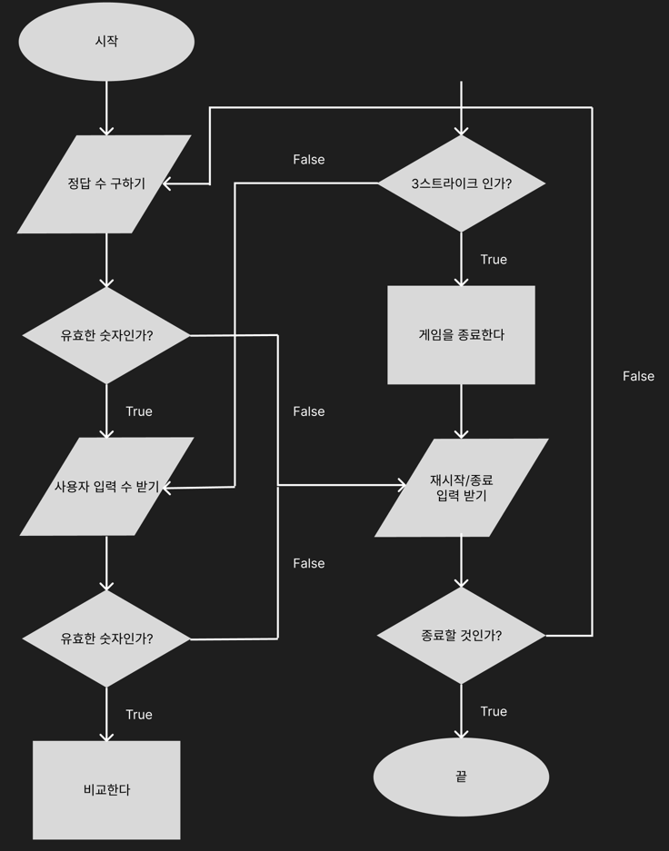

## 구현할 기능 목록 정리


### 애플리케이션의 기능

- 같은 수가 같은 자리에 있으면 `스트라이크`, 다른 자리에 있으면 `볼`, 같은 수가 전혀 없으면 `낫싱`이라는 힌트 제공

- 상대방의 역할은 컴퓨터가 하며, 1에서 9까지 **서로 다른 임의의 수** 3개를 선택한다
- 게임 플레이어는 서로 다른 3개의 숫자를 입력하고, 입력한 숫자에 대한 결과(힌트) 를 출력한다.
- 3개의 숫자를 모두 맞추면 게임이 종료된다.
- 게임을 종료한 후 (게임 중간에는 해당 안됨❌ ) 게임을 **다시 시작**하거나 **완전히 종료**할 수 있다.
- 사용자가 잘못된 값을 입력한 경우 `IllegalArgumentException` 을 발생시킨 후, 애플리케이션은 **종료**된다.


### 입력 요구사항

- 서로 다른 3자리 수
- 게임이 끝난 경우에는 재시작 : 1 혹은 종료 : 2


### 출력 요구사항

- 게임 시작 문구 출력

```
숫자 야구 게임을 시작합니다.
```

- 숫자 입력 요구 시

```
숫자를 입력해주세요 : {사용자가 3자리의 수 입력}
```

- 입력한 수에 대한 결과를 볼, 스트라이크 개수로 표시

```
1볼 1스트라이크
```

```
2볼
```

```
2스트라이크
```

- 하나도 없는 경우 `낫싱` 표시

```
낫싱
```

- 3개의 숫자를 모두 맞힌 경우, 3스트라이크 문자와 함께 게임 종료 문구

```
3스트라이크
3개의 숫자를 모두 맞히셨습니다! 게임 종료
게임을 새로 시작하려면 1, 종료하려면 2를 입력하세요.
```

단, 게임을 종료 후 `1` 을 입력하여 재시작할 시, 게임 시작 문구는 출력되지 않는다.


## 애플리케이션 요청 흐름도 정리해보기



### 변할 수 있는 부분 생각해보기

1. 숫자 야구 게임 숫자 개수가 3개에서 다른 개수로 변경될 수 있지 않을까?
2. 서로 다른 임의의 수가 아닌 같은 수로 변경될 수 있지 않을까?
   1. 일반적인 숫자 야구 게임의 룰은 중복된 수를 허용하지 않는다. 중복된 수를 허용하게 되면 상대방의 수를 유추하기 힘드므로 게임이 혼란스러워질 수 있다.
3. 게임이 사용자에게 건내는 문구가 변경될 수 있다.
4. 게임을 재시작 또는 종료하는 방법이 변경될 수 있다.


## 결론

### Baseball

1. 게임을 시작
2. 사용자가 맞춰야 하는 정답 (컴퓨터의 숫자) 생성
3. 사용자에게 응답해야하는 결과 문구 생성
4. 게임 종료 후, 사용자의 응답이 재시작을 원하는지 종료를 원하는지 판단


## Answer

1. 사용자가 맞춰야 하는 정답 생성
2. 입력값을 기준으로 볼, 스트라이크 개수를 판단

## Rule

1. 사용자가 입력한 숫자가 유효한 값인지 판단
   1. 숫자 형식으로 입력했는지
   2. 입력한 숫자 길이가 정답 길이와 일치하는지
   3. 중복된 수를 포함한 상태로 입력했는지
