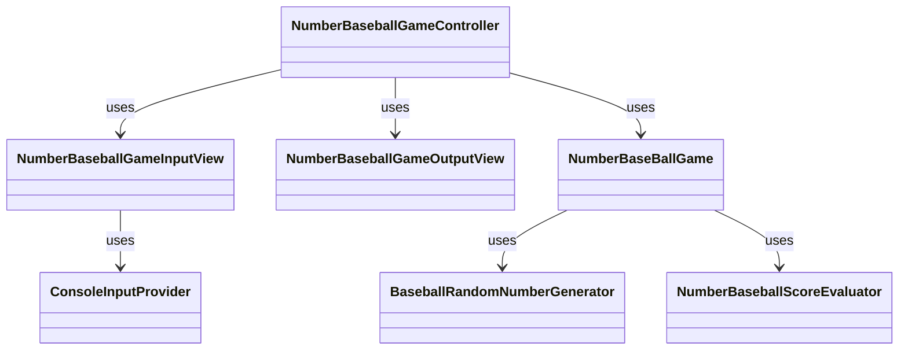

# 기능 목록

기능 목록은 코드를 작성하며 추가될 수 있습니다.

## 게임 시작 및 유저 인터페이스

-[x] 사용자에게 게임 시작 메시지를 출력합니다 `ex:숫자 야구 게임을 시작합니다.`
-[x] 사용자에 숫자 입력을 요청하는 메시지를 출력합니다. `ex:숫자를 입력 해주세요.`

## 입력처리

-[x] 사용자로부터 3자리 수를 입력 받습니다.
-[x] 입력값이 유효한지 확인합니다. `ex: 3자리가 아닐 시 IllegalArgumentException`

## 게임 로직

-[x] 랜덤한 3자리의 숫자를 생성합니다.
-[x] 사용자가 입력한 숫자로 부터 스트라이크,볼,낫싱을 판단합니다.
-[x] 결과를 사용자에게 표시합니다.

## 게임 종료 및 재시작

-[x] 사용자가 컴퓨터의 숫자를 모두 맞춘다면 종료하고 메시지를 출력합니다.`ex: 3개의 숫자를 모두 맞히셨습니다! 게임 종료`
-[x] 게임이 종료되었다면 게임을 재시작할지, 또는 종료할지를 물어봅니다. `ex:게임을 새로 시작하려면 1, 종료하려면 2를 입력하세요. `

## 리팩토링

-[] 추상화를 통한 강한 의존성 제거
-[] 라인 정리 및 컨벤션 확인
-[] 스트림 api를 통해 가독성 향상 시키기
-[] 동작 파라미터화를 통한 코드 재사용성 높이기
-[] 원시값 맵핑

## 구조

