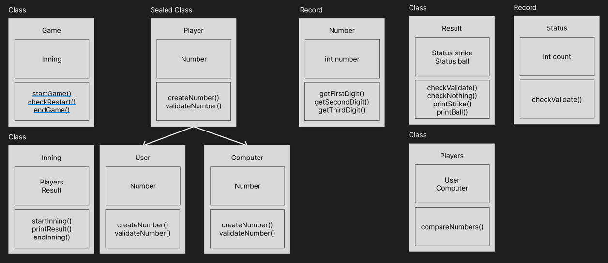

## 📄 요구 사항 정리

- 컴퓨터가 랜덤으로 3자리의 숫자를 생성한다.
    - `camp.nextstep.edu.missionutils`에서 제공하는 `Randoms`의 `pickNumberInRange()` 사용
    - '129' 같이 숫자의 각 자리는 1~9까지의 '서로 다른 수'로 이루어져 있다.
    - '119' 같이 중복 숫자는 없다.

- 사용자는 이 3자리의 숫자를 입력해서 맞힌다.
    - `camp.nextstep.edu.missionutils`에서 제공하는 `Console`의 `readLine()` 사용
    - 볼: 사용자가 입력한 숫자가 컴퓨터가 가지고 있는 숫자 중에 포함 되어있을 경우
        - Com '129', UserInput '912' -> 3볼
        - Com '129', UserInput '987' -> 1볼

    - 스트라이크: 사용자가 입력한 숫자가 컴퓨터가 가지고 있고, 자리까지 맞을 경우
        - Com '129', UserInput '129' -> 3스트라이크
        - Com '129', UserInput '192' -> 1스트라이크 2볼
        - Com '129', UserInput '128' -> 2스트라이크

    - 낫씽: 사용자가 입력한 숫자가 컴퓨터와 자리도 맞지 않고, 하나도 가지고 있지 않을 경우
        - Com '129', UserInput '567' -> 낫씽

- 3스트라이크로 사용자가 컴퓨터의 숫자를 맞히면 게임을 종료한 후 다시 시작하거나 완전히 종료할 수 있다.
    - 게임 재시작은 1, 게임 종료는 2를 입력받는다.

- 사용자가 잘못된 값을 입력할 경우 `IllegalArgumentException`을 발생시킨 후 애플리케이션은 종료되어야 한다.

### 📄기능 정리

- 게임을 진행하는 기능 -> 시작, 진행, 끝 게임 전반을 판단하고 진행
- Output을 표시하고 Input을 받는 View 기능.
    - Input 유효성 검증 로직이 필요 -> 사용자가 게임 진행시 3자리 숫자인지, 게임이 끝났을 때 재시작할때 받는 숫자를 검증
    - Output 출력 -> 스트라이크, 볼, 낫씽을 표시할 수 있게 결과를 반환하고 출력, 게임 진행에 따른 메세지 출력, 에러 메세지 출력
- 스트라이크, 볼 판단 기능 -> 사용자에게 받은 숫자와 컴퓨터가 생성한 숫자를 토대로 스트라이크인지, 볼인지 판단하고 반환하는 기능
- 숫자를 랜덤으로 생성하는 기능 -> 이 객체에는 게임 기능을 도와주는 로직이 포함되어야 한다.(ex. 숫자를 넣으면 boolean을 반환하는 로직)

## ✅ TODO

### 📑 설계

- [x] 클래스 설계
   - View: Input, Output을 처리하는 클래스
     - Input 검증 클래스: InputValidator
     - Output 변환 클래스: GameResult
     - View 관련 메세지를 담은 Enum
     - Exception Error 메세지를 담화 Enum
   - GameManager: 게임의 시작, 진행, 끝, 재시작 같이 게임 진행을 담당하는 클래스
   - GameService: 도메인(InputValidator, GameResult, BaseballNumbers)을 이용하여 결과를 반환하는 클래스
   - BaseballNumbers: 랜덤 숫자 생성, 숫자에 관한 로직을 담당하는 클래스
   - GameResult: 스트라이크, 볼을 판단하고 반환하는 클래스

- [x] 예외 상황 정리
    - UserInput
        - 숫자가 아닌 다른 것을 입력했을 경우
        - 서로 다른 3개의 숫자가 아닌 4개의 숫자나 중복된 숫자를 입력했을 경우
        - 게임 재시작/종료시 1, 2가 아닌 다른 숫자를 입력하거나 다른 것을 입력했을 경우

### ✔️ 구현 기능(TODO)
- [x] View
  - [x] 게임 시작 문구 출력
  - [x] 게임 끝 문구 출력
  - [x] 숫자 입력 문구 출력
  - [x] 숫자 입력 기능
- [x] GameManger
  - [x] 게임 시작
  - [x] 게임 플레이
  - [x] 정답을 맞추고 게임을 이겼는지 확인
  - [x] 게임 재시작
- [x] GameService
  - [x] GameResult를 이용 결과를 반환하는 기능
  - [x] 3스트라이크로 게임을 이겼는지 판단하는 기능
  - [x] InputValidator를 이용해서 숫자를 검증하고, 게임을 재시작 할지 반환하는 기능
  - [x] BaseballNumbers로 숫자를 생성하는 기능
- [x] BaseballNumbers
  - [x] 랜덤 숫자 생성 기능
- [x] GameResult
  - [x] 스트라이크, 볼 판단하는 기능
  - [x] 문자열로 결과 반환하는 기능
  - [x] 3스트라이크로 게임이 끝났는지 판단하는 기능
- [x] InputValidator
  - [x] 입력받은 숫자에 대한 유효성 검사 기능
    - [x] 3자리 숫자 유효성 검사(문자 x, 0이 들어가 있는지, 3자리가 맞는지, 중복된 숫자는 없는지)
    - [x] 게임 종료 숫자 유효성 검사(문자 x, 1 or 2를 제외한 모든 숫자 x, 1자리 숫자가 맞는지)
- [x] 에러 메세지 Enum
- [x] View 관련 메세지 Enum
- [x] Application(main)
  - [x] controller를 이용해 게임 요청

