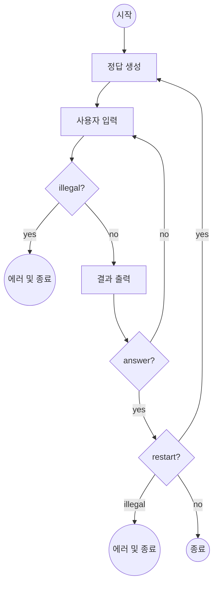
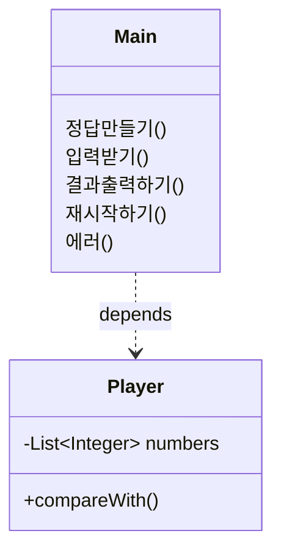

# 구현 아웃라인

1. 정답 숫자 생성
2. 유효한 입력 판단
3. 개별 결과 출력 (스트라이크, 볼)
4. 입력이 정답일 경우 재시작 여부 질문

# 구현한 기능 목록

1. class Application

- [x] 전체 게임의 설정 관리 (정답 길이, 개별 숫자 범위)

~~- [x] 개별 게임 시작~~

~~- [x] 정답 객체 생성~~

- [x] 사용자 입력값 검증
- [x] 사용자 입력 객체 생성
- [x] 결과 출력

~~- [x] 정답 확인 시 게임 종료~~

- [x] 재시작 여부 질문

2. class Game

- [x] 개별 게임 시작
- [x] 정답 객체 생성
- [x] 사용자 입력 객체 생성
- [x] 결과 전달
- [x] 정답 확인 시 게임 종료

2. class Player

- [x] List\<Integer>를 포장하는 Player 클래스 정의
- [x] 무작위 객체 생성하기
- [x] 주어진 입력에 맞는 객체 생성하기
- [x] 두 객체 비교하기

3. enum Result

- [x] STRIKE, BALL 값의 인덱스를 표시하는 열거형 정의

# Flowchart

# Class Diagram _(draft)_

