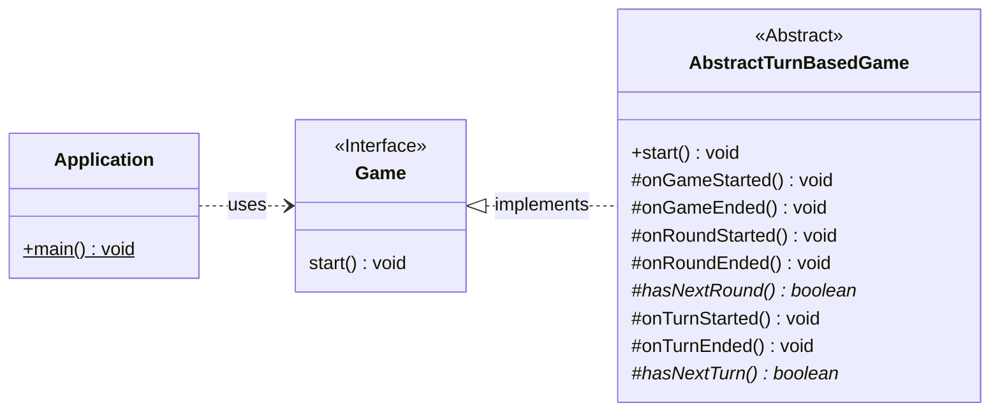
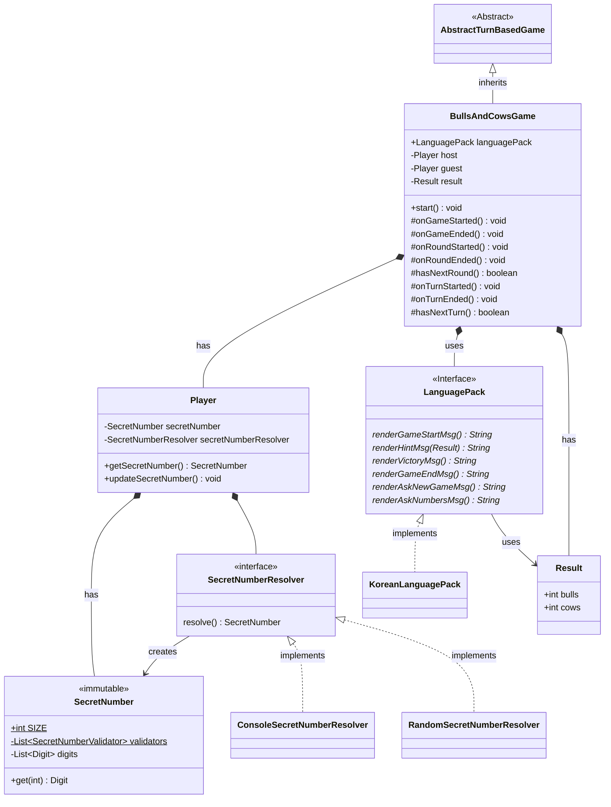
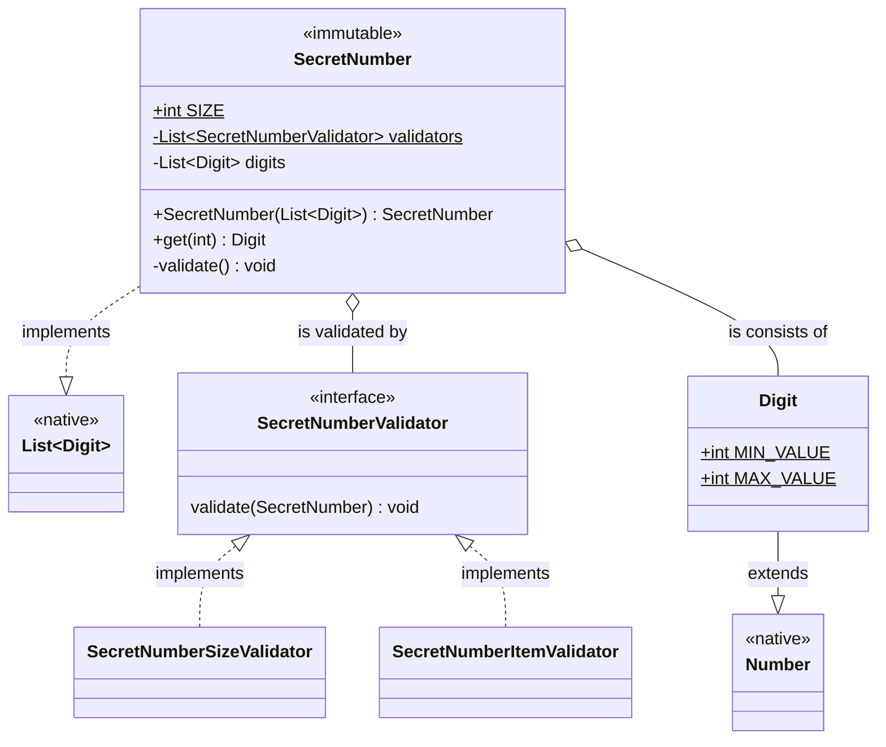

# 기능 요구사항 분석

- 숫자야구 게임을 구현한다.
- 숫자야구는 1~9까지 **서로 다른 수**로 이루어진 3자리의 수를 맞추는 게임이다.

# 구현할 기능 목록

- 숫자 (Digit)
    - 0~9의 숫자만 오는 것을 보장한다.
- 3자리의 수 (SecretNumber)
    - 3개의 숫자(Digit)로 이루어질 것을 보장한다.
    - 숫자의 순서를 기억할 것을 보장한다.
    - 서로 다른 숫자들로 이루어질 것을 보장한다.
- 게임 플레이어 (Player)
    - 플레이어는 두 명이다.
    - 플레이어 중 한 명은 사용자이다.
        - 사용자는 '3자리의 수'를 입력한다.
        - 사용자의 입력은 `camp.nextstep.edu.missionutils.Console`의 `readLine()` API를 통해 입력받아야 한다.
    - 플레이어 중 한 명은 컴퓨터이다.
        - 컴퓨터는 '3자리의 수'를 임의로 선택한다.
        - 컴퓨터가 고를 임의의 값은 `camp.nextstep.edu.missionutils.Random`의 `pickNumberInRange()` API를 통해 추출해야 한다.
- 게임의 진행 방식
    - 게임은 턴제 방식으로 진행된다.
        - 턴제 방식은 하나의 게임 속에 라운드가 있고, 라운드 속에 턴이 있는 진행 방식이다.
        - 각 라운드의 시작에서 컴퓨터는 임의의 3자리의 수를 생성한다.
        - 해당 라운드의 각 턴이 시작 될 때마다 사용자는 3자리의 수를 한 번 입력한다.
        - 하나의 턴이 종료되면 시스템은 사용자가 맞힌 숫자들에 대한 힌트를 스트라이크/볼의 형태로 사용자에게 전달한다.
        - 하나의 라운드가 종료되면 시스템은 사용자에게 게임을 계속할 것인지 묻는다.

# 목표 클래스 다이어그램

## Application 및 전반적인 게임 시스템

- 턴제 게임의 진행방식을 충실히 구현한 추상 클래스 AbstractTurnBasedGame을 정의한다.
- Application은 Game을 가져와 start() 메소드 호출을 통해 사용한다.
- Application은 Game의 동작과 흐름이 실제로 어떻게 진행되는지 알 수 없다.

## BullsAndCowsGame(숫자야구게임) 및 도메인 클래스

- Player는 서로 다른 3가지의 숫자(SecretNumber)를 갖고 있다.
- Player는 각자만의 SecretNumber를 생성하는 방식(SecretNumberResolver)이 있다.

### SecretNumber (3가지의 숫자)

- SecretNumber의 검증 책임은 SecretNumberValidator에게 위임한다.
- SecretNumber의 검증은 생성자에서 실시한다.
- Digit의 값은 MIN_VALUE(0) 이상 MAX_VALUE(9) 이하임을 Digit 객체에서 보장한다.
