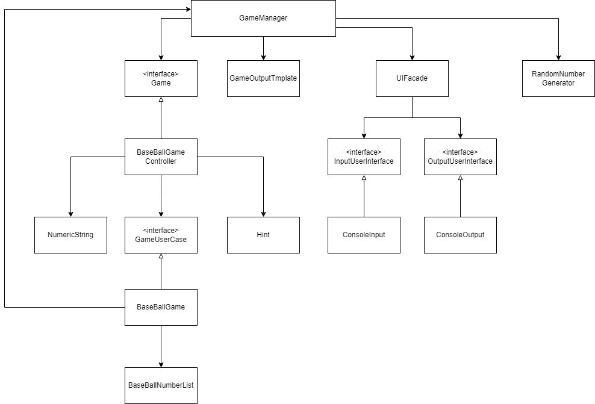

# BaseBallGame

## 룰 분석

* 1~9의 **서로 다른 3자리 수**를 맞춘다.
* 같은 수가 같은 자리에 있으면 스트라이크 힌트
* 다른 자리에 있으면 볼 힌트
* 같은 수가 전혀 없으면 낫싱 힌트
* 컴퓨터의 수를 맞추면 **승리**
* 컴퓨터는 임의의 수 3개를 선택한다.
* 컴퓨터가 선택한 3개의 숫자를 맞추면 게임 종료
* 게임 종료 후 게임을 다시 시작하거나 완전히 종료가능(1재시작 2종료)
* 사용자가 잘못된 값을 입력하는 경우 IllegalArgumentException 발생 후 애플리케이션 종료
    * 3자리의 숫자가 아닌경우
    * 숫자가 아닌 문자가 입력되는 경우

## 기본 설계

## 기능 목록 체크리스트

### GameManager

- [x] BaseBallGame 초기화 한다.
- [x] BaseBallGame에 play 요청한다.
- [x] 게임 종료 이벤트 발생 시 사용자에게 재시작 메시지 출력 요청 및 입력 요청 한다.
- [x] BaseBallGame의 play 결과를 출력 요청한다.
- [x] 사용자에게 숫자야구 숫자 3개를 입력을 요청한다.

### Command
- [x] 재시작 입력 검증(1,2가 아니라면 IllegalArgumentException 발생시킨다.)
- [x] 재시작 하는지 판단한다.

### BaseBallController
- [x] 같은 수가 같은 자리에 있으면 스트라이크 힌트 스트링을 생성한다.
- [x] 같은 수가 다른 자리에 있으면 볼 힌트 스트링을 생성한다.
- [x] 같은 수가 존재 하지 않는 다면 낫싱 힌트 스트링을 생성한다.

### application

#### BaseBallGame

- [x] 같은 수가 같은 자리에 있으면 스트라이크 힌트 처리한다.
- [x] 같은 수가 다른 자리에 있으면 볼 힌트 처리한다.
- [x] 숫자 3개가 같은 위치에 같은 숫자가 존재한 다면 게임 종료 이벤트 발생시킨다.

#### NumericString
- [x] 숫자가 아닌 문자 입력 시 IllegalArgumentException

#### BaseBallNumberList

- [x] 숫자 입력시 3자리 수가 아닐 시 IllegalArgumentException
- [x] 3개의 숫자중 같은 숫자 존재 시 IllegalArgumentException
- [x] 숫자는 1~9사이의 숫자가 아닐 시 IllegalArgumentException
- [x] 불변 리스트를 반환한다

### UI

#### ConsoleInput

- [x] 숫자야구 게임의 숫자 3개를 입력 받는다.
- [x] 재시작을 위한 커멘드를 입력 받는다.

#### ConsoleOutput

- [x] 숫자야구를 비교한 결과를 출력한다.
- [x] 숫자야구를 재시작 할지에 관한 내용을 출력한다.

