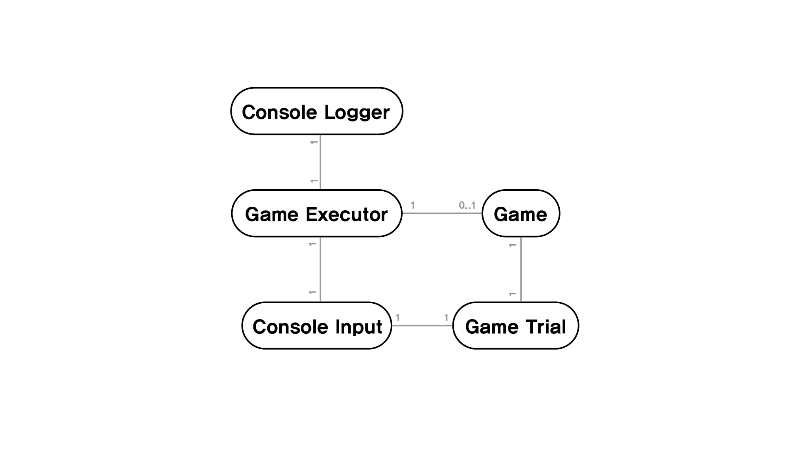
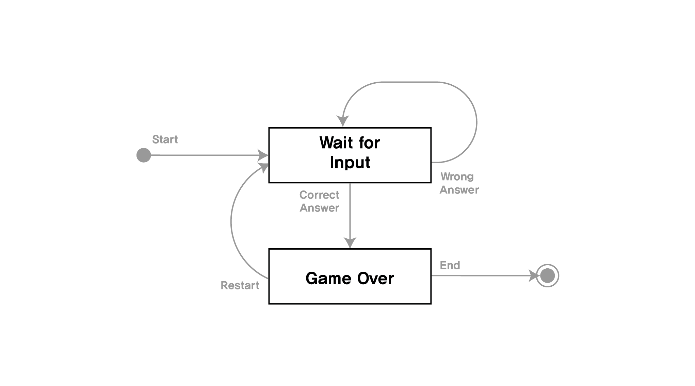
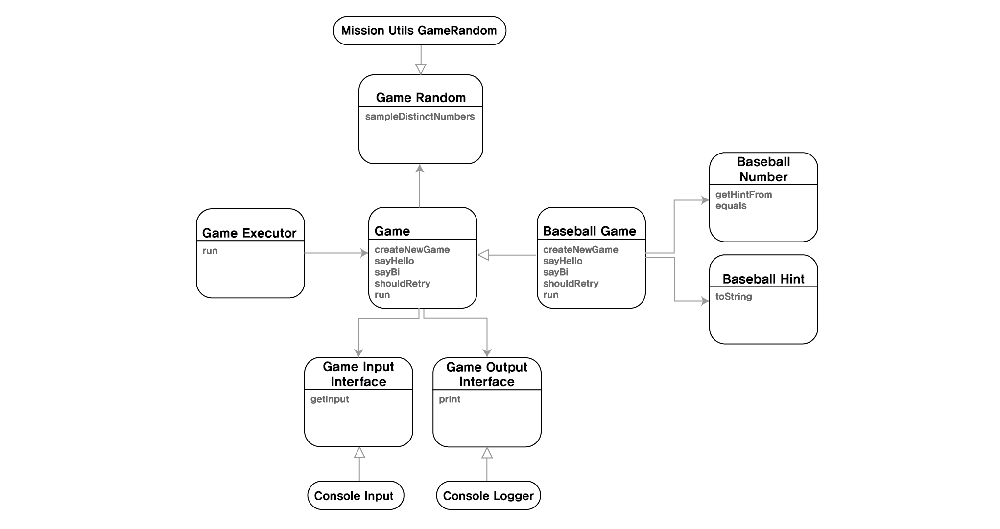

## 기능 목록
* 게임을 처음 시작하면 "숫자 야구 게임을 시작합니다"를 출력 
* 랜덤 3자리 값을 배정하여 야구 게임을 생성 
* 야구게임중 입력을 받기 전에 "숫자를 입력해주세요 :"를 출력한다
* 야구게임 중 입력값을 검증한다
* 야구게임이 종료하고 "게임을 새로 시작하려면 1, 종료하려면 2를 입력하세요."를 출력한다
* 야구게임이 종료하고 재시작 여부에 대한 입력값을 검증한다
* 입력값과 정답을 비교한다
* 입력값과 정답이 다르면, 힌트를 계산한다
* 힌트를 출력한다
* 정답을 맞추면, "3개의 숫자를 모두 맞히셨습니다! 게임 종료"를 출력한다
* 게임을 재시작한다

## 설계
### 초기 도메인 모델

* Console Input : 사용자에게 입력을 받음  
* Console Logger :  사용자에게 게임 시도 결과를 출력
* Game Executor : 게임을 실행
* Game : 게임 로직을 수행하는 역할
* GameTrial : 게임의 한 턴

### 초기 도메인 상태 모델

1. 상태
   * Wait For Input : 새로운 게임을 시작하고 사용자의 입력을 기다리는 상태
   * Game Over : 게임을 종료시키고, 새개임을 시작할지, 프로그램을 종료할지 입력을 기다리는 상태
2. 트리거
    * Wrong Answer : 사용자가 유효하지만 틀린 답을 입력한다  
    * Correct Answer : 사용자가 정답을 입력한다
    * Restart : 사용자가 게임을 다시 시작하는 것을 선택한다
    * End : 사용자가 종료를 선택

## 최종 구현

