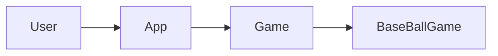
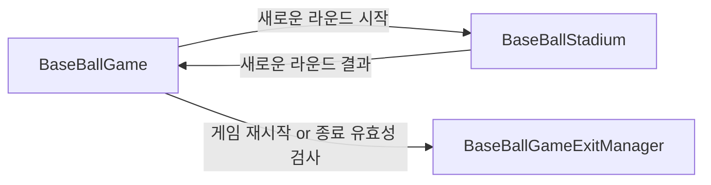
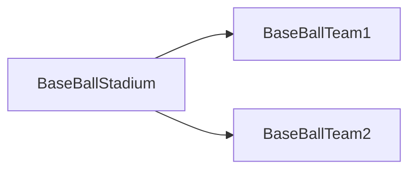
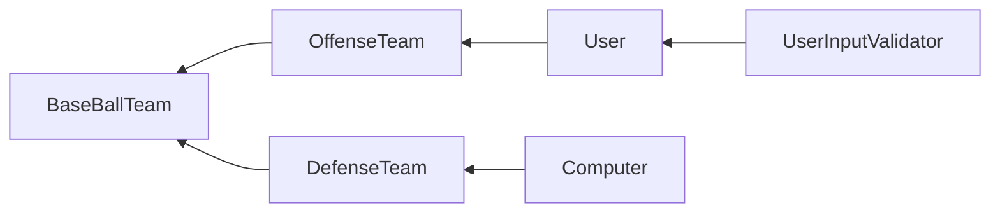
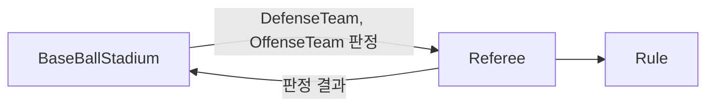

# 미션 - 숫자 야구

메인 도메인은 `Game` 이다. 
`User`는 우리의 `Application`을 통해 `Game`을 하게 된다. 
`Game` 의 실제 서비스는 `BaseBallGame` 이다. 

 

`BaseBallGame`

- 게임 진행을 담당한다.  
- 숫자 야구 게임을 진행할 경기장에게 새로운 라운드 시작 메시지를 보낸다. 

`BaseBallStadium`

- 새로운 라운드의 결과를 알려준다. 

`BaseBallGameExitManager`

- 유저가 입력하는 값이 재시작인지 종료인지 판단한다. 

 

`BaseBallStadium`

- 숫자 야구 게임을 매 라운드를 위해 참여하는 야구팀을 관리한다. 
- 정확히 어떤 구현체가 해당 팀에 있는지 모르지만, 중간 다리 역할을 수행한다. 

`BaseBallTeam1, 2`

- 게임에 참가할 팀을 추상화한 것이다. 
- 수비 팀, 공격 팀으로 나뉜다. 

 

`OffenseTeam(User)`

- 공격 팀의 구현체이다. 
- `User`가 공격 팀이 된다. 
- `User`는 콘솔에 입력하는 값을 통해 번호를 생성한다. 

`UserInputValidator`

- 유저가 입력하는 값의 유효성 검사를 한다. 
- 유효성 검사를 통과하지 못 하면 익셉션 호출도 여기서 진행. 

`DefenseTeam(Computer)`

- 수비 팀의 구현체이다. 
- `Computer`가 수비 팀이 된다. 
- `Computer`는 규칙에 맞게 무작위로 번호를 생성한다. 

 

`Referee`

- 두 팀의 번호를 비교해 결과를 알려준다. 
- `Rule`에게 판정 계산을 맡기고, 결과를 출력한다. 

`Rule`

- 실제 계산을 수행한다. 

 