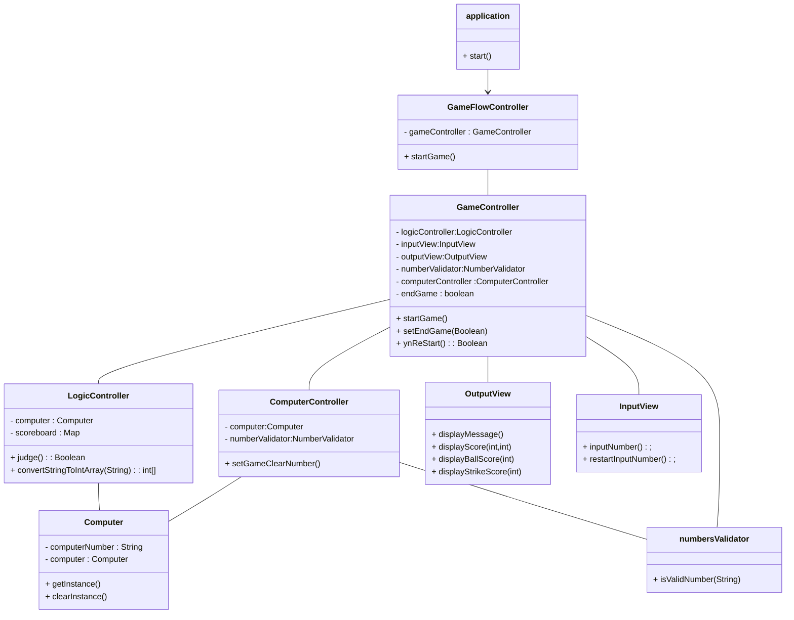

~~
~~
### 기능 명세서 작성 
문제에서 요구하는 기능을 다음처럼 작성해봤다. 

명세서를 작성해서 누락되는 요구사항은 없는 지 파악했다. 

### 클래스 다이어그램 작성 

```mermaid
classDiagram
    application --> GameFlowController
    GameController -- LogicController
    GameController -- ComputerController
    GameController -- OutputView
    GameController -- InputView
    GameController -- numbersValidator
    ComputerController -- numbersValidator
    GameFlowController -- GameController
    ComputerController -- Computer
    LogicController -- Computer
    
     class GameFlowController{
         - gameController : GameController
         + startGame()
     }      
            
      class application{ 
          + start()
      }
      class Computer{
          - computerNumber : String
          - computer : Computer
          + getInstance()
          + clearInstance()
      }
      
      class OutputView{
          + displayMessage()
          + displayScore(int,int)
          + displayBallScore(int)
          + displayStrikeScore(int)
      }
      class InputView{
            + inputNumber();
            + restartInputNumber();
        }
      class LogicController{
          - computer : Computer
          - scoreboard : Map<String,int>
          + judge() : Boolean
          + convertStringToIntArray(String) : int[]
      }
      class ComputerController{
          -  computer:Computer
          -  numberValidator:NumberValidator
          + setGameClearNumber()
      }
      class GameController{
          - logicController:LogicController
          - inputView:InputView
          - outputView:OutputView
          - numberValidator:NumberValidator
          - computerController :ComputerController
          - endGame : boolean
          + startGame()
          + setEndGame(Boolean)
          + ynReStart(): Boolean
      }
      class numbersValidator{
          + isValidNumber(String)
      }

```

