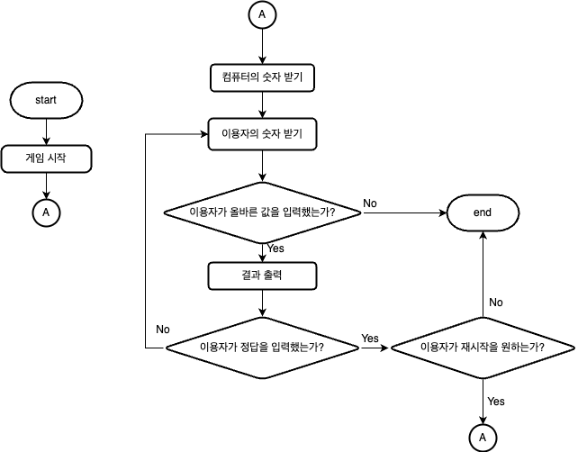

### 구현할 기능 목록
- 게임 시작
- 컴퓨터의 숫자 받기 (random)
- 이용자가 입력한 숫자 받기 (input)
- 이용자가 입력한 숫자 검증하기
- 컴퓨터의 숫자와 이용자의 숫자 비교하기
- 게임 재시작 및 종료

### 목록별 상세내용
1. `게임 시작`
   1. 게임 시작을 알리는 출력
   2. 게임 재시작 및 종료가 되기 전까지 반복

2. `컴퓨터의 숫자 받기`
   1. 제공된 라이브러리를 이용하여 random하게 3자리의 숫자 생성
   2. 게임 재시작 및 종료가 되기 전 1회 진행

3. `이용자가 입력한 숫자 받기`
   1. 제공된 라이브러리를 이용하여 입력한 문자열을 정수형으로 변환
   2. `이용자가 입력한 숫자 검증하기`
   3. `컴퓨터의 숫자와 이용자의 숫자 비교하기`
   4. 게임 재시작 및 종료가 되기 전까지 반복

4. `이용자가 입력한 숫자 검증하기`
   1. 3개의 숫자인지 검증
   2. 서로 다른 숫자인지 검증
   3. 1~9까지의 정수인지 검증
   4. 잘못 된 값 입력시 Exception 발생

5. `컴퓨터의 숫자와 이용자의 숫자 비교하기`
   1. 숫자만 같을 경우 ball의 카운트 증가
   2. 숫자와 자리도 같을 경우 strike의 증가
   3. ball, strike의 카운트 출력
   4. 정답을 맞출 경우 `게임 재시작 및 종료` 로 이동

6. `게임 재시작 및 종료`
   1. '1' 입력 시 재시작
   2. '2' 입력 시 종료

### Flow-Chart
