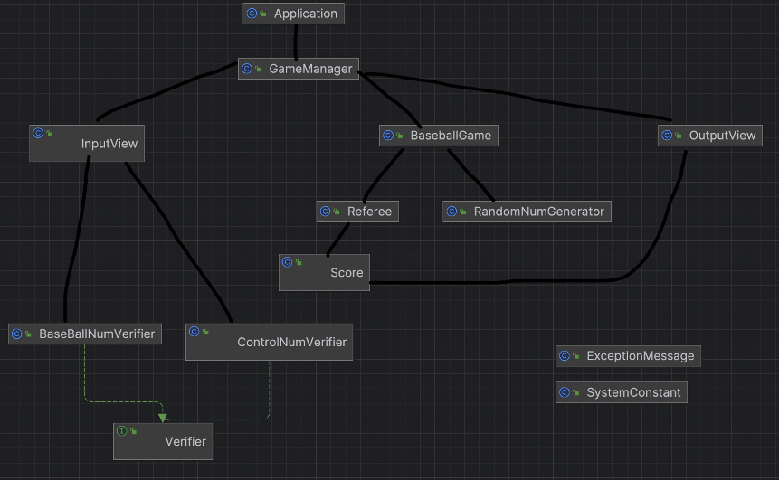

## 📝 구현 대상
### 숫자 야구
### - 클래스 다이어그램

### - 기능 목록 정리

- SystemConstant 클래스
    1. 시스템 관련 상수를 저장하는 기능
          
- ExceptionMessage 클래스
    1. 시스템 관련 에러 메시지를 저장하는 기능
         
- BaseBallNumVerifier 클래스
    1. 길이가 3인지 체크하는 기능
    2. 각각이 0이 아닌 1 - 9 사이의 수인지 체크하는 기능
    3. 서로 다른 3개의 수인지 체크하는 기능
         
- ControlNumVerifier 클래스
    1. 숫자인지 체크하는 기능
    2. 게임 재시작인지 체크하는 기능
    3. 게임 종료인지 체크하는 기능
         
- InputView 클래스
    1. 입력을 위한 출력 메시지를 화면에 나타내는 기능
    2. 게임종료 메세지를 출력하는 기능
    3. 사용자의 세 숫자를 입력받는 기능
    4. 재시작/종료 입력 받는 기능
         
- OutputView 클래스
    1. 스트라이크 메시지 만드는 기능
    2. 볼 메시지 만드는 기능
    3. 스트라이크/볼 메시지 종합해서 출력하는 기능
         
- Score 클래스
    1. 유저의 최종 점수를 저장하는 기능
    2. 유저의 최종 점수를 반환하는 기능
         
- BaseballGame 클래스
    1. 컴퓨터의 랜덤 수를 멤버변수로 가짐
    2. 계산된 유저의 최종 점수를 반환해주는 기능
         
- RandomNumGenerator 클래스
    1. 1 ~ 9 까지 서로 다른 임의의 수 3개를 조합하는 기능
    2. 1 ~ 9 까지 임의의 수를 생성하는 기능
         
- Referee 클래스
    1. 유저의 최종 점수를 반환하는 기능
    2. 유저가 몇 볼인지 계산하는 기능
    3. 유저가 몇 스트라이크인지 계산하는 기능
         
- GameManager 클래스
    1. 게임시작 메세지를 출력하는 기능
    2. 게임 실행 기능
    3. 게임 종료 여부 확인 기능
    4. 게임 루프 실행 기능
    5. 게임 루프 종료 확인 기능
    6. 한 라운드 실행 기능
         