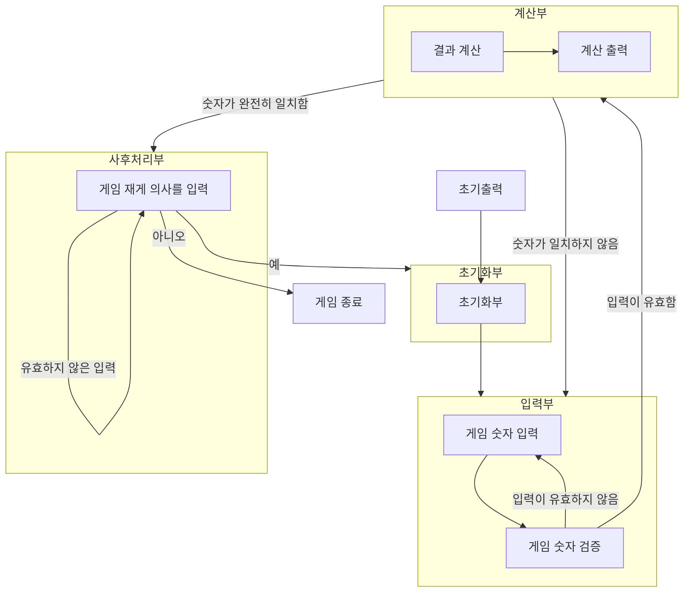

## 플로우 차트

## 기능 목록

1. 
2. 입력을 받는 입력부
   1. 숫자 3개가 오는지 확인을 해준다.
   2. 아니라면 입력을 다시 받는다.
3. 결과를 출력해주는 출력부
4. 게임이 종료되었을 때 출력을 해주는 게임 종료 출력부
5. 게임 재게 의사를 입력받는 입력부
   1. 숫자 1, 2가 오는지 확인해준다.
   2. 아니라면 입력을 다시 받는다.
6. 