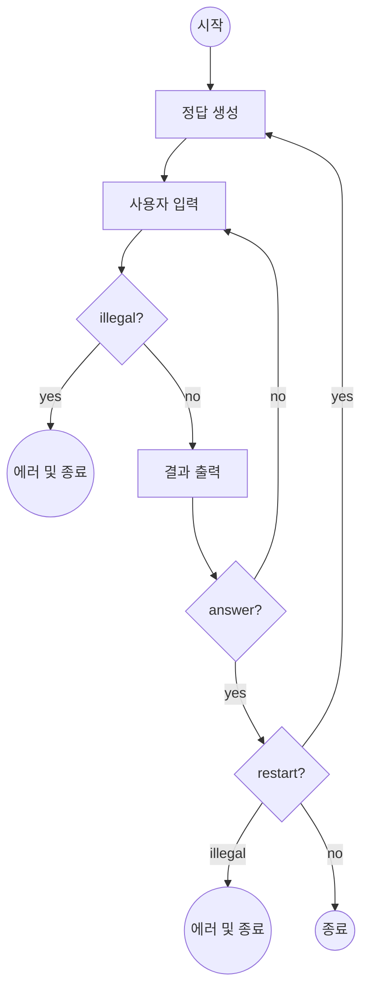

# 구현할 기능
1. 정답 숫자 생성
2. 유효한 입력 판단
3. 개별 결과 출력 (스트라이크, 볼)
4. 입력이 정답일 경우 재시작 여부 질문

# Flowchart

```mermaid
flowchart TB
START((시작)) --> A
A[정답 생성] --> B[사용자 입력] --> C
C{illegal?} --> |yes|D;
C --> |no|E;
D((에러 및 종료))
E[결과 출력] --> F{answer?}
F --> |no|B;
F --> |yes|G;
G{restart?} --> |yes|A;
G --> |illegal|I((에러 및 종료));
G --> |no|H((종료));
```

# 커스터마이징
1. 시간제한 만들기
    - 요구사항 및 테스트와 맞지 않아 어려워 보임
2. 클래스 분리하기