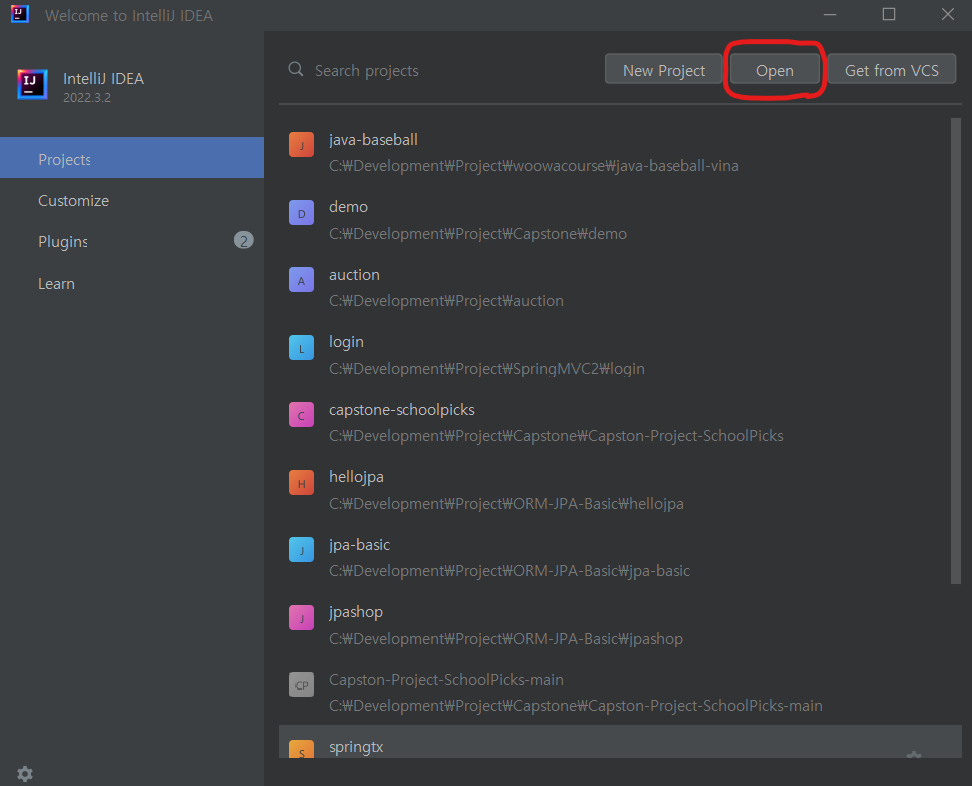
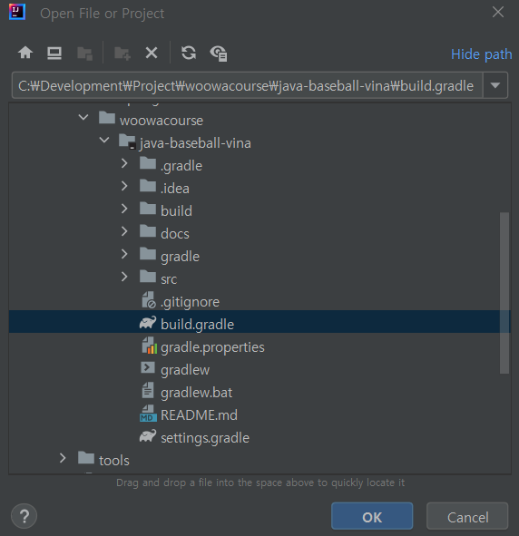
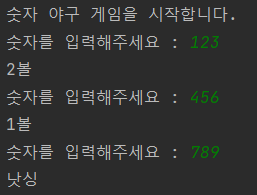
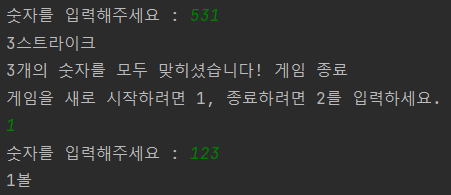
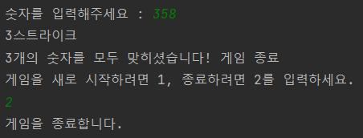
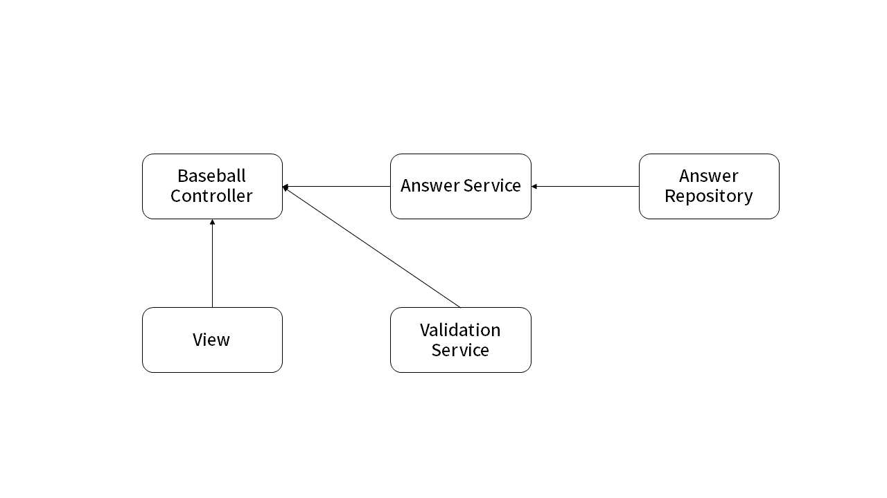
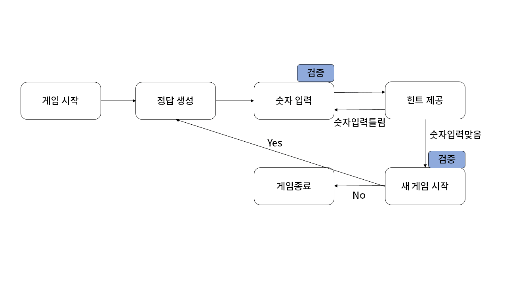

# 숫자 야구


## :book: 프로젝트 진행
- 우아한테크코스 웹 백엔드 6기 프리코스<br>
- 개발기간: 2023.10.19 ~ 2023.10.25<br>
- 개발자: 이재홍

<br>

## :baseball: 프로젝트 소개
숫자 야구 게임을 구현했습니다. 
숫자야구란 기본적으로 1부터 9까지 서로 다른 수로 이루어진 3자리의 수를 맞추는 게임입니다.

같은 수가 같은 자리에 있으면 스트라이크, 다른 자리에 있으면 볼, 같은 수가 전혀 없으면 낫싱이란 힌트를 얻고, 그 힌트를 이용해서 먼저 상대방(컴퓨터)의 수를 맞추면 승리하는 방식입니다.<br>
>예) 상대방(컴퓨터)의 수가 425일 때
>- 123을 제시한 경우: 1스트라이크
>- 456을 제시한 경우: 1볼 1스트라이크
>- 789를 제시한 경우: 낫싱

위 숫자 야구 게임에서 상대방의 역할은 컴퓨터가 합니다. 컴퓨터는 1에서 9까지 서로 다른 임의의 수 3개를 선택합니다.
게임 플레이어는 컴퓨터가 생각하고 있는 서로 다른 3개의 숫자를 입력하고, 컴퓨터는 입력한 숫자에 대한 결과를 출력합니다.

이 같은 과정을 반복하여 컴퓨터가 선택한 3개의 숫자를 모두 맞히면 게임이 종료됩니다.

게임이 종료된 후 게임을 다시 시작하거나 완전히 종료할 수 있습니다.

사용자가 잘못된 값을 입력할 경우에도 게임은 종료됩니다.<br>
>예) 게임 플레이어가 12345를 제시한 경우

<br>

## :rocket: 시작 가이드
### 프로그래밍 요구 사항
- 자바 [JDK-17](https://www.oracle.com/java/technologies/downloads/#java17) 버전에서 실행 가능합니다 

### 설치
```
$ git clone -b compasstar --single branch https://github.com/compasstar/java-baseball-vina.git
$ cd java-baseball-vina
```

### 실행
- IntelliJ 시작하고 Open 버튼을 눌러주세요<br>


- java-baseball-vina 폴더 에서 build.gradle 를 선택 후 OK 버튼을 눌러주세요<br>


- `Application`의 `main()`에서 실행`Run`합니다
<br>


## :school: 기술 스택


 

<br>

## :computer: 화면 구성


| 게임시작                      | 게임진행                     | 게임종료                      |
|---------------------------|--------------------------|---------------------------|
|  |  |  |


<br>

## :dart: 주요 기능

### 상대방(컴퓨터) 랜덤 숫자 생성
- 컴퓨터는 1에서 9까지 서로 다른 임의의 수 3개를 선택합니다

### 게임 플레이어 숫자 선택
- 게임 플레이어는 서로 다른 3개의 숫자를 입력합니다
- 게임 플레이어가 입력한 숫자에 따라 컴퓨터는 힌트를 제공합니다
- 만약 게임 플레이어가 잘못된 입력을 할 경우 게임을 종료합니다

### 힌트 제공 기능
- 같은 수가 같은 자리에 있는 수만큼 스트라이크 힌트를 제공합니다 (예: 1스트라이크)
- 같은 수가 다른 자리에 있는 개수만큼 볼 힌트를 제공합니다 (예: 2볼)
- 같은 수가 전혀 없으면 낫싱 힌트를 제공합니다 (예: 낫싱)

<br>

## :mag: 아키텍쳐 (추가 예정)
### 디렉토리 구조


### 작업 흐름
