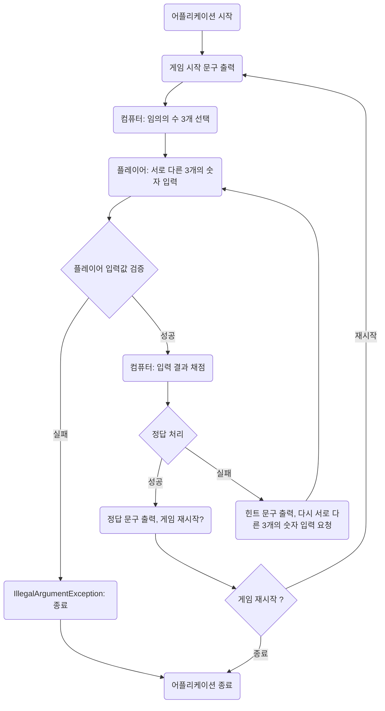

# 숫자 야구 개발 기획

# Todos

- [x] 컴퓨터가 임의의 수를 생성하는 기능
    - [x] 수를 저장하는 Numbers 클래스 생성
    - [x] 사용되는 상수를 저장하는 Enum 클래스 생성
- [x] 사용자가 입력을 받는 기능
    - [x] 사용자 입력을 검증하는 기능
    - [x] 검증기의 테스트 코드 작성
- [ ] 컴퓨터가 사용자 입력을 채점하는 기능
    - [ ] 사용자 입력을 채점하는 채점기 클래스 생성
    - [ ] 채점기의 테스트 코드 작성
- [ ] 게임을 관장하는 기능
    - [ ] 게임을 관장하는 클래스 생성
    - [ ] 문구를 출력하는 기능
    - [ ] 게임을 관장하는 클래스의 테스트 코드 작성