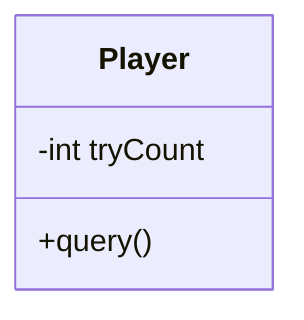

# 기능 요구사항 명세서

| RQ-ID  | 요구사항명 |         요구사항 내용         | 날짜 | 작성자 | 버전명 |
|--------|---------|----------------------------|-----|------|-------|
| RQ-001 | Player 입력 | Player는 0~9 까지의 수를 3개를 입력 할 수 있습니다. | 10/20 | 장기환 | 0.0.1 |

# 클래스

