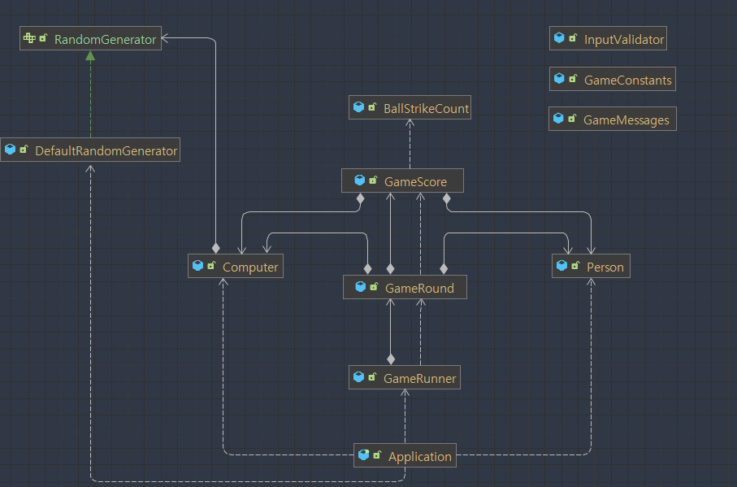

# 기능 명세 (최종)
- 완료한 기능은 기능 옆에 ✅ 이모지를 통해 반영한다.
- 기능 명세는 구현 중에 언제든 추가될 수 있다.
## 1. 시작 및 종료
1. 게임의 첫 시작 시 다음과 같은 문구를 출력한다. ✅
   >숫자 야구 게임을 시작합니다.

 

2. 게임을 새로 시작할 때, 컴퓨터는 1-9 사이의 중복되지 않는 랜덤 3개의 숫자를 새로 생성한다.
  ✅

 

3. 3개의 숫자를 모두 맞힐 경우 다음과 같은 문구를 출력하고 게임의 종료 및 재시작을 선택한다. ✅

    >3스트라이크  
   >3개의 숫자를 모두 맞히셨습니다! 게임 종료  
   >게임을 새로 시작하려면 1, 종료하려면 2를 입력하세요.
   
💡유의 사항 : `System.exit()`을 호출하여 프로그램을 종료하면 안된다. ✅

## 2. 라운드 진행
사용자의 3자리 입력값에 따라 라운드가 진행된다.

1. 사용자가 랜덤값의 숫자와 그 숫자의 자리를 맞춘 경우 ✅
   >1스트라이크

 

2. 사용자가 랜덤값의 숫자만 맞춘 경우 ✅
   >1볼

 

3. 사용자가 랜덤값의 어떤 숫자도 맞추지 못한 경우 ✅
   >낫싱

 

4. 사용자가 맞춘 갯수를 스트라이크, 혹은 볼 앞에 제공한다. ✅
   >2볼 1스트라이크
 
 

5. 입력값을 판단하여 출력이 발생한 후에는 사용자의 입력값을 초기화 하고 다시 입력받는다. ✅

## 3. 예외 처리
1. 숫자가 아닌 값이 들어올 때 ✅

   > 예외 메시지: "입력 형태가 숫자가 아닙니다."

 

2. 입력한 숫자가 3개가 아닌 경우 ✅

   > 예외 메시지: "입력 길이가 올바르지 않습니다."

 

3. 중복된 숫자가 입력될 경우 ✅

   >예외 메시지: "중복된 숫자가 입력되었습니다."

 

4. 숫자의 범위가 1-9가 아닐 경우 ✅

   > 예외 메시지: "숫자의 범위가 유효하지 않습니다."

 

5. 앞에서의 예외를 처리하고 나면 프로그램은 문제의 요구사항에 따라 종료된다.

## 4. 추가 예외 사항
1-3 과정 이후(3스트라이크 이후) 사용자 입력값 선택에 대한 예외처리

1. 숫자가 1, 2가 아닌 입력이 들어온 경우 ✅
   > 예외 메시지: "유효한 선택이 아닙니다."

 

2. 정수 이외의 값이 들어온 경우 ✅
   > 예외 메시지: "입력 형태가 숫자가 아닙니다."

## 5. 참고) 객체 간 연관관계

### 객체에 대한 자세한 설명은 코드의 클래스 상단에 달아두었습니다.
