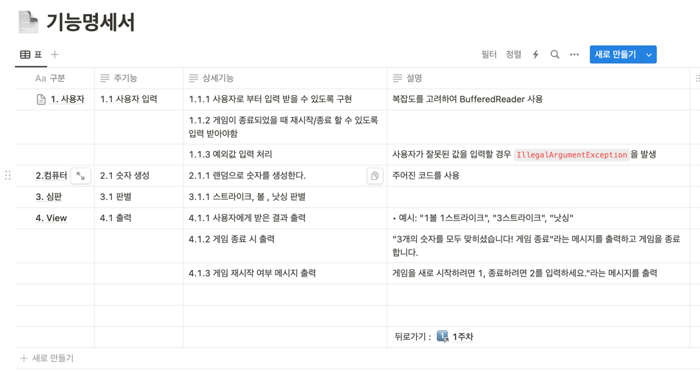
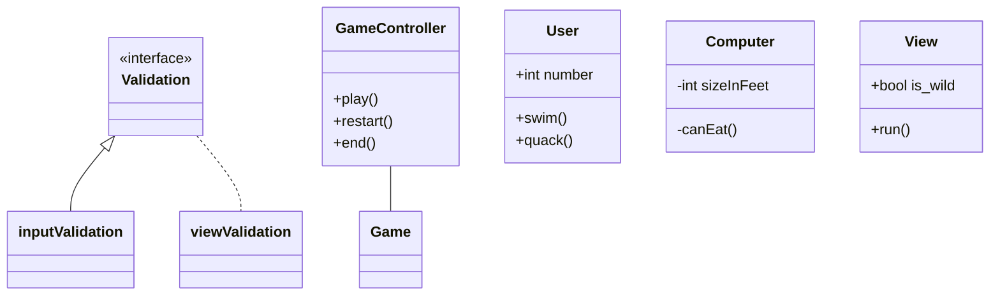

### 기능 명세서 작성 
문제에서 요구하는 기능을 다음처럼 작성해봤다. 

명세서를 작성해서 누락되는 요구사항은 없는 지 파악했다. 

### 클래스 다이어그램 작성 

```mermaid
classDiagram
    Validation <|-- inputValidation
    Validation .. viewValidation
    
    GameController -- Game
    
      class User{
          +int number
          +swim()
          +quack()
      }
      class Computer{
          -int sizeInFeet
          -canEat()
      }
      class View{
          +bool is_wild
          +run()
      }
      
      class Game{
          
      } 
      class GameController{
          +play()
          +restart()
          +end()
      }
      class Validation{
          <<interface>>
      }
      class inputValidation{
      }
      class viewValidation{
      }

```

