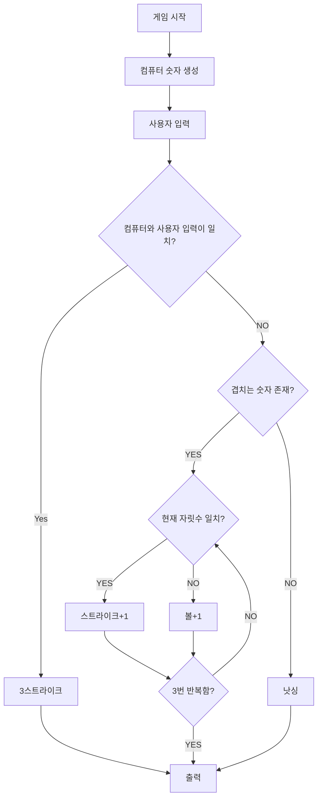
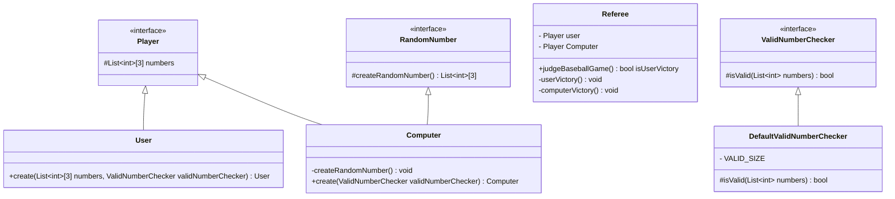

## 플로우차트

 

## 클래스 다이어그램

 

## 기능 목록

### 플레이어 `Player`
#### 플레이어[컴퓨터] `Computer`
- [ ] 1~9 사이의 서로 다른 랜덤한 숫자 3개를 가진 새로운 컴퓨터 객체 생성

#### 플레이어[사용자] `User`
- [ ] 1~9 사이의 서로 다른 수 3개를 입력 받아서 새로운 사용자 객체 생성

 

### 심판 `Referee`
- [ ] 플레이어가 컴퓨터의 숫자를 맞췄는지 판단, 아무것도 포함되지 않다면 낫싱
- [ ] 두 숫자가 같다면 스트라이크 +1, 다르다면 볼 + 1

 

### 시스템 `GameSystem`
#### 게임시작 담당 `BaseballGameStarter`
- [ ] 숫자 야구를 시작

#### 게임종료 판단 `BaseballGameTerminator`
- [ ] 숫자 야구가 끝났는지 판단

#### 게임의 흐름을 관리 `GmaeController`
- [ ] 전체적인 게임의 흐름을 담당

 

### 부가 기능
#### 랜덤한 숫자 생성 `RandomNumber`
- [ ] 1~9 사이의 서로 다른 수 3개를 생성

#### 올바른 숫자인지 판단 `ValidNumberChecker`
- [ ] 숫자의 길이가 올바른지 확인

#### 입력 담당 `Writer`
- [ ] 입력받은 값을 전달

#### 출력 담당 `Printer`
- [ ] 입력받은 값을 출력

 

### 목표
- [ ] 객체지향적인 개발
- [ ] SOLID 적용
- [ ] MVC 패턴 적용
