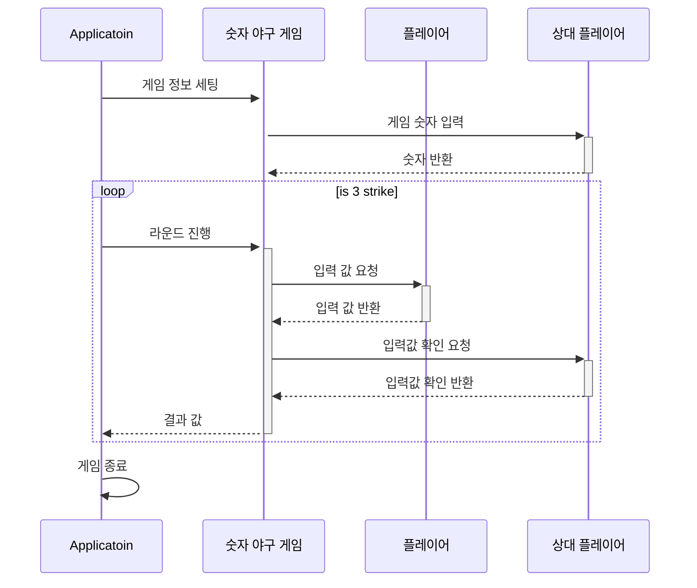
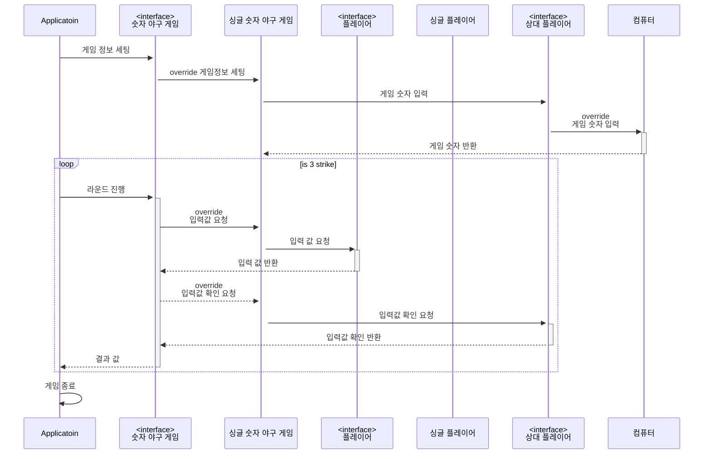

# 💻 기능 목록 정리


## 📝기능 목록 정의 과정
> 1. 문제 해결에 참여할 객체 관계 생각

```text
- 위 숫자 야구 게임에서 상대방의 역할을 컴퓨터가 한다. 
  컴퓨터는 1에서 9까지 서로 다른 임의의 수 3개를 선택한다. 
  게임 플레이어는 컴퓨터가 생각하고 있는 서로 다른 3개의 숫자를 입력하고, 
  컴퓨터는 입력한 숫자에 대한결과를 출력한다.
  
- 이 같은 과정을 반복해 컴퓨터가 선택한 3개의 숫자를 모두 맞히면 게임이 종료된다.
```
위 요구 사항을 바탕으로 필요한 역할 정리

[상대 플레이어]
<br>
3개의 숫자를 선택할 수 있다.

[컴퓨터]
<br>
상대 플레이어 역할로 1~9까지 서로 다른 임의의 수 3개를 선택한다.

[플레이어]
<br>
서로 다른 숫자 3개를 입력하면 그 결과를 볼 수 있다.

[숫자 야구 게임]
<br>
상대 플레이어가 생각한 3개의 숫자를 플레이어가 모두 맞추면 게임이 종료된다.
---
> 2. 문제 해결 과정에서 역할의 소통 정리

---
> 3. 문제 해결에 필요한 역할과 책임 정의




