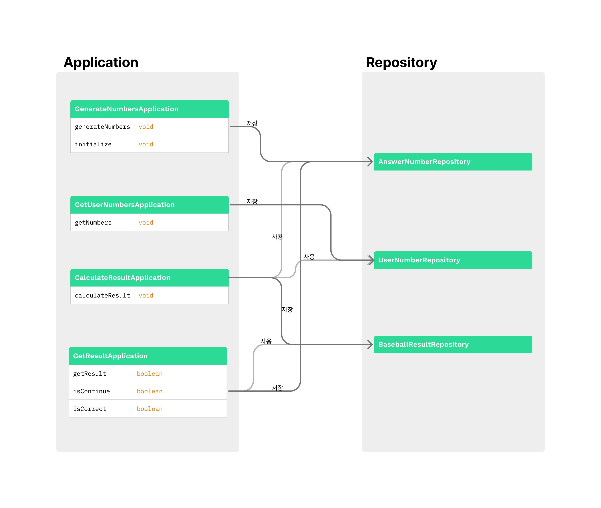

### 💡 기능을 구현하기 전 `docs/README.md`에 구현할 **기능 목록을 정리**해 추가한다

## 요구사항 분석

* 야구게임 도메인 모델
    * 숫자 (세자리 숫자)
    * 결과 (스트라이크, 볼)

* 게임 기능
    * 정답 생성 --> 랜덤값
    * 사용자 가답 입력
    * 정답과 가답 비교
    * 비교에 따른 출력

## 로직 흐름

