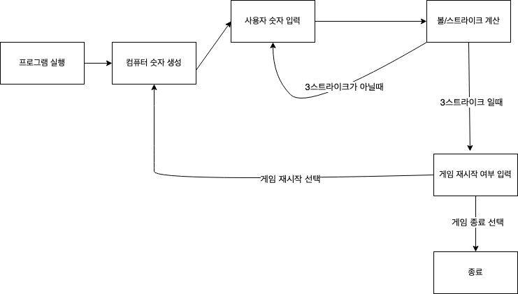

# ⚾ 숫자 야구 미션

## 🎯 기능 구현 목록

**[ 컴퓨터 기능 ]**
- 1부터 9까지의 서로 다른 3개의 숫자를 생성한다.

**[ 사용자 기능 ]**
- 3자리 숫자를 입력받는다.
  - 숫자가 아닌 경우 예외처리를 한다.
  - 공백을 입력했을 경우 예외처리를 한다.
- 게임 재시작 여부를 입력받는다.
  - 숫자가 아닌 경우 예외처리를 한다
  - 1 또는 2를 입력했는지 검증한다.
  - 공백을 입력했을 경우 예외처리를 한다.

**[ 숫자 기능 ]**
- 숫자가 3자리 수가 아닌 경우 예외처리를 한다.
- 3자리 수에서 중복되는 숫자가 있으면 예외처리를 한다.
- 각 자리의 숫자가 1부터 9까지의 범위를 벗어나면 예외처리를 한다.

**[ 결과 기능 ]**
- 사용자 숫자와 컴퓨터 숫자를 비교해 "볼" 개수를 계산한다.
- 사용자 숫자와 컴퓨터 숫자를 비교해 "스트라이크" 개수를 계산한다.
- 사용자 숫자와 컴퓨터 숫자를 비교해 "낫싱"임을 판별한다.
- 비교한 값이 3스트라이크인지 판별한다.
- 게임 결과를 출력한다.

**[ 게임 기능 ]**
- 컴퓨터, 사용자, 결과를 설정한다.
- 3스트라이크가 아닌 경우 게임은 계속 진행된다.
- 사용자의 게임 재시작 여부를 판별한다.
- 게임을 재시작한다.
- 게임을 종료한다.

## 🖥️ 프로그램 동작 순서

## 🧑‍💻 나만의 설계 원칙

- 가장 먼저 프로그램의 흐름을 구상하자.
- Java를 사용하는 만큼 "객체"에 집중하자.
- 커밋 컨벤션을 준수하자.

## 1주차 회고

[1주차 회고](https://comumu.tistory.com/55)