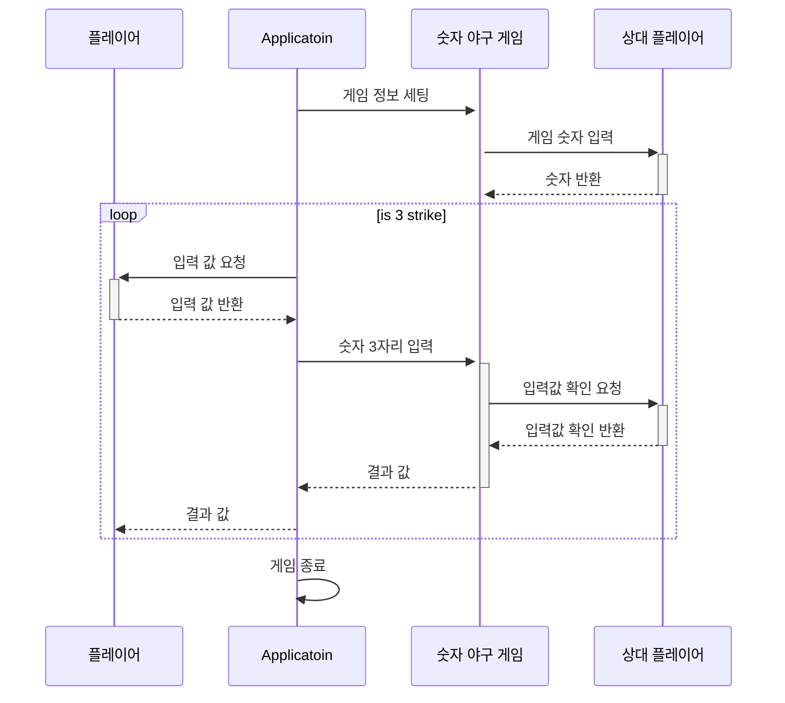
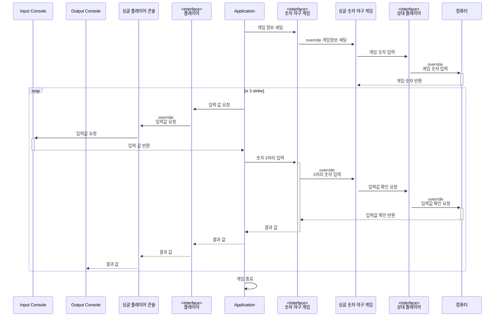

# 💻 기능 목록 정리
**(interface) 숫자 야구 게임**
- 게임에 필요한 정보를 준비한다.
- 3자리의 숫자를 입력 받아 결과를 반환한다.
    - 자리와 숫자 2가지가 맞은 경우 스트라이크로 카운트 한다.
    - 숫자는 맞지만 자리가 틀린 경우 볼로 카운트 한다.
    - 자리와 숫자 모두 틀린 경우는 낫싱으로 처리한다.

**싱글 숫자 야구 게임 implement 숫자 야구 게임**
- 생성시 상대 플레이어를 초기화 한다
- override 상대 플레이어에 부터 3자리 수를 만들어 게임을 준비한다.
- override 라운드를 진행시켜 입력 받은 3자리의 숫자에 따라 결과를 반환한다.
    - 자리와 숫자 2가지가 맞은 경우 스트라이크로 카운트 한다.
    - 숫자는 맞지만 자리가 틀린 경우 볼로 카운트 한다.
    - 자리와 숫자 모두 틀린 경우는 낫싱으로 처리한다.
- 입력 받은 3자리 숫자가 3자리가 맞는지 검증한다.
- 입력 받은 3자리 숫자에 문자는 없는지 검증한다.
- 입력 받은 3자리 숫자에 중복이 없는지 검증한다.

**(interface) 상대 플레이어**
- 게임에 필요한 3자리 숫자를 생성한다.
- 생성된 3자리 숫자와 입력받은 값을 비교한다.

**컴퓨터 implement 상대 플레이어**
- 생성시 숫자를 생성할 생성기를 초기화 한다.
- override 게임의 필요한 3자리 숫자를 생성기를 통해 생성한다.
- override 생성된 숫자와 입력받은 값을 비교한다.
    - 자리와 숫자 2가지가 맞은 경우 스트라이크로 카운트 한다.
    - 숫자는 맞지만 자리가 틀린 경우 볼로 카운트 한다.
    - 자리와 숫자 모두 틀린 경우는 낫싱으로 처리한다.

**(interface) 플레이어**
- 입력을 요청받으면 입력을 받는다.
- 출력을 요청 받으면 출력을 한다.

**싱글 플레이어 콘솔 implement 플레이어**
- override 입력을 요청 받으면 입력 콘솔에 입력을 요청한다.
- override 출력을 요청 받으면 출력 콘솔에 출력을 요청한다.


## 📝기능 목록 정의 과정
> 1. 문제 해결에 참여할 객체 관계 생각

```text
- 위 숫자 야구 게임에서 상대방의 역할을 컴퓨터가 한다. 
  컴퓨터는 1에서 9까지 서로 다른 임의의 수 3개를 선택한다. 
  게임 플레이어는 컴퓨터가 생각하고 있는 서로 다른 3개의 숫자를 입력하고, 
  컴퓨터는 입력한 숫자에 대한결과를 출력한다.
  
- 이 같은 과정을 반복해 컴퓨터가 선택한 3개의 숫자를 모두 맞히면 게임이 종료된다.
```
위 요구 사항을 바탕으로 필요한 역할 정리

[상대 플레이어]
<br>
3개의 숫자를 선택할 수 있다.

[컴퓨터]
<br>
상대 플레이어 역할로 1~9까지 서로 다른 임의의 수 3개를 선택한다.

[플레이어]
<br>
서로 다른 숫자 3개를 입력하면 그 결과를 볼 수 있다.

[숫자 야구 게임]
<br>
상대 플레이어가 생각한 3개의 숫자를 플레이어가 모두 맞추면 게임이 종료된다.
---
> 2. 문제 해결 과정에서 역할의 소통 정리

---
> 3. 문제 해결에 필요한 역할과 책임 정의


---
> 4. 기능 목록 정의

**(interface) 숫자 야구 게임**
- 게임에 필요한 정보를 준비한다.
- 3자리의 숫자를 입력 받아 결과를 반환한다.
    - 자리와 숫자 2가지가 맞은 경우 스트라이크로 카운트 한다.
    - 숫자는 맞지만 자리가 틀린 경우 볼로 카운트 한다.
    - 자리와 숫자 모두 틀린 경우는 낫싱으로 처리한다.

**싱글 숫자 야구 게임 implement 숫자 야구 게임**
- 생성시 상대 플레이어를 초기화 한다
- override 상대 플레이어에 부터 3자리 수를 만들어 게임을 준비한다.
- override 라운드를 진행시켜 입력 받은 3자리의 숫자에 따라 결과를 반환한다.
    - 자리와 숫자 2가지가 맞은 경우 스트라이크로 카운트 한다.
    - 숫자는 맞지만 자리가 틀린 경우 볼로 카운트 한다.
    - 자리와 숫자 모두 틀린 경우는 낫싱으로 처리한다.
- 입력 받은 3자리 숫자가 3자리가 맞는지 검증한다.
- 입력 받은 3자리 숫자에 문자는 없는지 검증한다.
- 입력 받은 3자리 숫자에 중복이 없는지 검증한다.

**(interface) 상대 플레이어**
- 게임에 필요한 3자리 숫자를 생성한다.
- 생성된 3자리 숫자와 입력받은 값을 비교한다.

**컴퓨터 implement 상대 플레이어**
- 생성시 숫자를 생성할 생성기를 초기화 한다.
- override 게임의 필요한 3자리 숫자를 생성기를 통해 생성한다.
- override 생성된 숫자와 입력받은 값을 비교한다.
    - 자리와 숫자 2가지가 맞은 경우 스트라이크로 카운트 한다.
    - 숫자는 맞지만 자리가 틀린 경우 볼로 카운트 한다.
    - 자리와 숫자 모두 틀린 경우는 낫싱으로 처리한다.

**(interface) 플레이어**
- 입력을 요청받으면 입력을 받는다.
- 출력을 요청 받으면 출력을 한다.

**싱글 플레이어 콘솔 implement 플레이어**
- override 입력을 요청 받으면 입력 콘솔에 입력을 요청한다.
- override 출력을 요청 받으면 출력 콘솔에 출력을 요청한다.


