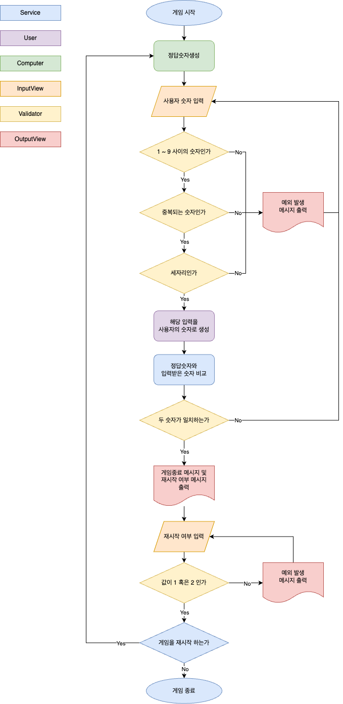

## 📝 구현할 기능 목록

---
### 랜덤으로 세자리 수 생성하기
- 1에서 9까지의 숫자들만 포함되어야 한다
- 중복되는 수는 생성될 수 없다
- 세자리여야만 한다

### 사용자에게 수 입력 받기
- 1에서 9까지의 숫자들만 포함되어야 한다 (예외처리)
- 중복되는 수는 생성될 수 없다 (예외처리)
- 세자리여야만 한다 (예외처리)

### 게임의 결과 계산 로직 구현하기
- 볼, 스트라이크, 낫싱 세가지 결과가 필요
- 생성된 숫자와 입력 받은 숫자를 비교한다
    - 같은 위치에 있는 같은 숫자이면 스트라이크
    - 다른 위치에 숫자만 같다면 볼
    - 세가지 숫자가 아무것도 일치하지 않으면 낫싱
- 3스트라이크일 경우를 정답으로 체크한다

### 계산 로직에 따라 결과를 화면에 출력하기
- 숫자가 먼저 표시되고, 그 뒤에 결과를 표시한다 
- 볼과 스트라이크가 결과에 함께 표시되어야는 하는 경우, 볼 - 스트라이크 순서로 표시되도록 한다

### 게임 지속 여부 확인하기
- 사용자에게 1 또는 2를 입력받는다 
- 1 또는 2 이외의 값은 입력될 수 없다 (예외처리)
- 1을 입력받아 게임을 계속하는 경우 사용자에게 수 입력받기부터 다시 시작
- 2를 입력받아 그만두는 경우 게임을 종료해야 한다

## 💡 어플리케이션 설계 플로우차트로 정리해보기

---

