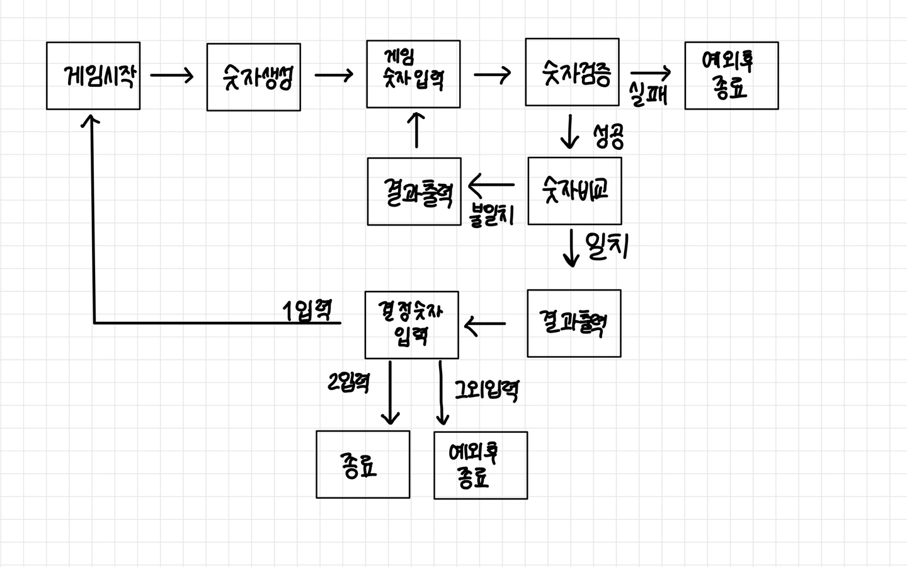

## :heavy_check_mark: 조건

### 규칙 
- 컴퓨터 숫자 세 개
    - 1-9 사이의 임의의 수
    - 서로 다른 숫자
    - amp.nextstep.edu.missionutils 랜덤값 추출 API 사용
- 유저 숫자 세 개
    - 1-9 사이의 임의의 수
    - 서로 다른 숫자
- 게임 진행
    - 해당하는 숫자가 있을 때, 같은 자리면 스트라이크 다른 자리면 볼
    - 해당하는 숫자가 모두 없다면 낫싱
    - 결과 출력 후 모두 맞히면 종료, 아니면 반복
    - 게임 종료 후 다시 시작 혹은 완전 종료 선택
    - 잘못된 값 입력 시 IllegalArgumentException 후 완전 종료
 
  
### 입출력
- 입력
    - 서로 다른 3자리의 수만 허용
    - 게임이 끝난 경우 1과 2 입력만 허용
    - amp.nextstep.edu.missionutils 콘솔 API 사용
- 출력
    - 하나도 없는 경우, 낫싱
    - 위 경우가 아니되 모두 맞히지 않은 경우, 볼과 스트라이크 표기
    - 모두 맞힌 경우, 3스트라이크 후 게임 종료 문구
    - 게임 시작 문구
      
## :heavy_check_mark: 플로우 차트

## :heavy_check_mark: 구현

- InputView
    - 게임 숫자 입력
    - 게임 숫자 유효 체크
    - 결정 숫자 입력
    - 결정 숫자 유효 체크
- OutputView
    - 낫싱 출력
    - 볼 스트라이크 출력
    - 3 스트라이크 후 종료 출력
    - 게임 시작 출력
- GameController
    - 게임 시작
    - 게임 진행
    - 게임 반복
    - 게임 종료
- baseball
    - 숫자 생성
    - 숫자 비교
- InputException
    - 게임 숫자가 숫자가 아닐 경우
    - 게임 숫자가 세 개가 아닐 경우
    - 게임 숫자가 모두 다르지 않을 경우
    - 결정 숫자가 1 혹은 2가 아닐 경우
