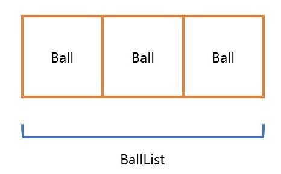

<p align="center">
  
</p>

# 프리코스 1주차 미션 - 숫자 야구 게임

---


> 우아한테크코스 6기 프리코스 1주차 미션 <숫자 야구 게임>을 구현한 저장소입니다.

<p align="center">
  
</p>


# 목차
---
- [흐름](#흐름)
- [기능 목록](#기능-목록)
- [클래스 목록](#클래스-목록)
- [프로그래밍 요구 사항](#프로그래밍-요구-사항)
- [과제 제출 전 체크리스트](#과제-제출-전-체크리스트)


## 흐름
1. 랜덤으로 1~9짜리 서로 다른 3개의 수를 생성한다.
2. 사용자에게 수를 입력받는다.
3. 입력받은 수를 검증한다.
4. 입력받은 3자리 수에서 볼, 스트라이크 개수를 구해서 반환한다.
5. 볼, 스트라이크 값을 통해 출력값을 결정한다.
     - 스트라이크 0개, 볼 0개 : "낫싱"
     - 스트라이크 0개 초과, 볼 0개 : "n스트라이크"
     - 스트라이크 0개, 볼 0개 초과 : "n볼"
     - 스트라이크 0개 초과, 볼 0개 초과 : "n볼 n스트라이크"
     - 스트라이크 3개 : "3스트라이크"
        - 정답 문구 출력 : "3개의 숫자를 모두 맞히셨습니다! 게임 종료"
        - 재진행/종료 여부 묻기 : "게임을 새로 시작하려면 1, 종료하려면 2를 입력하세요."
          - 1 입력 : 처음으로 돌아간다.
          - 2 입력 : 프로그램을 종료한다.
6. 스트라이크 3개가 나올 때까지 2~5 과정을 반복한다.


## 기능 목록
1.컴퓨터 숫자 랜덤 생성 기능
2.플레이어 숫자 입력 기능
  - String 입력 값을 List로 변경
  - 입력 값의 길이가 3인지 확인
  - 입력 값 내 중복이 없는지 확인
3. 숫자 비교 기능
  - 같은 수가 같은 자리에 있으면 strike++
  - 같은 수가 다른 자리에 있으면 ball++
4. 결과 출력 기능
  - ball == 0 strike == 0 이면 "낫싱" 출력
  - ball == 0 strike > 0 이면 "n 스트라이크" 출력
  - ball > 0 strike == 0 이면 "n 볼" 출력
  - ball > 0 strike > 0 이면 "n 볼 n 스트라이크" 출력 
  - 3 스트라이크면 "3 스트라이크\n 3개의 숫자를 모두 맞히셨습니다! 게임 종료" 출력
5. 3 스트라이크 시, 게임 재시작 혹은 종료 입력 기능
  - "게임을 새로 시작하려면 1, 종료하려면 2를 입력하세요." 출력
  - 1 입력 : 재시작
  - 2 입력 : 종료
  - 입력 값이 1 또는 2인지 확인


## 클래스 목록
### Application.java
- main()에서 프로그램을 실행시킨다.

### Ball.java
<p align="center">
  
</p>

- 수의 범위를 확인한다. (1~9 사이의 자연수)
- char형이 들어올 경우 char형을 String형으로 바꾼 후 다시 int형으로 바꾸어준다.

### BallList.java
- BallList 내 중복 여부를 검사한다.
- RandomBallList() 함수를 작성한다.
- String형을 BallList로 변경하는 함수를 작성한다.

### Result.java
- checkBallList(BallList comBallList, BallList userBallList) 함수를 사용하여 strike와 ball의 개수를 파악한다.
- getResultMessage() 함수를 사용하여 결과값을 출력한다. (ex. 1볼 2스트라이크)
- isAllSrikes() 함수를 사용하여 strike가 3이면 종료 메시지를 출력한 후 true를, strike가 3이 아니면 false를 리턴한다.
 

### Game.java
- play() 함수에 do-while문을 사용하여 game() 함수가 무조건 한 번은 실행되게 한다. 조건으로는 reGame() 함수를 넣는다.
- game() 함수는 makeRandomBallList()를 통해 만들어진 computerBallList와 makeUserBallList()를 통해 만들어진 userBallList를 Result.checkBallList 함수를 사용하여 비교한 후 결과를 출력한다. do-while문을 사용하여 strike가 3이 될 때까지 반복한다.
- reGame() 함수는 String input을 입력받아 1이면 true값을 리턴하여 재시작을 하게 하고, 2이면 false값을 리턴하여 게임을 종료시킨다.


## 프로그래밍 요구 사항
- JDK 17버전에서 실행 가능해야 함
- 프로그램 실행의 시작점은 `Application`의 `main()`
- `build.gradle` 파일 변경 금지
- 외부 라이브러리 사용 금지
- Java 코드 컨벤션 가이드 준수
- 프로그램 종료 시 `System.exit()` 호출 금지
- 프로그램 구현이 완료되면 `ApplicationTest`의 모든 테스트가 성공해야 함
- 프로그래밍 요구 사항에서 달리 명시하지 않는 파일, 패키지 이름 수정 및 이동 금지

### 라이브러리
- `camp.nextstep.edu.missionutils`에서 제공하는 `Randoms` 및 `Console` API를 사용하여 구현
  - Random 값 추출은 `camp.next.edu.missionutils.Randoms`의 `pickNumberInRange()` 활용
  - 사용자가 입력하는 값은 `camp.next.edu.missionutils.Console`의 `readLine()` 활용


## 과제 제출 전 체크리스트
- 기능 구현을 모두 정상적으로 했더라도 **요구 사항에 명시된 출력값 형식을 지키지 않을 경우 0점 처리**
- 기능 구현을 완료한 뒤 아래 가이드에 따라 테스트를 실행했을 때 모든 테스트가 성공하는지 확인
- **테스트가 실패할 경우 0점 처리**
  
### 테스트 실행 가이드
- 터미널에서 `java -version`을 실행하여 Java 버전이 17인지 확인
- Windows 사용자의 경우 `gradlew.bat clean test` 또는 `./gradlew.bat clean test` 명령을 실행할 때 모든 테스트가 아래와 같이 통과하는지 확인
```
BUILD SUCCESSFUL in 0s
```
