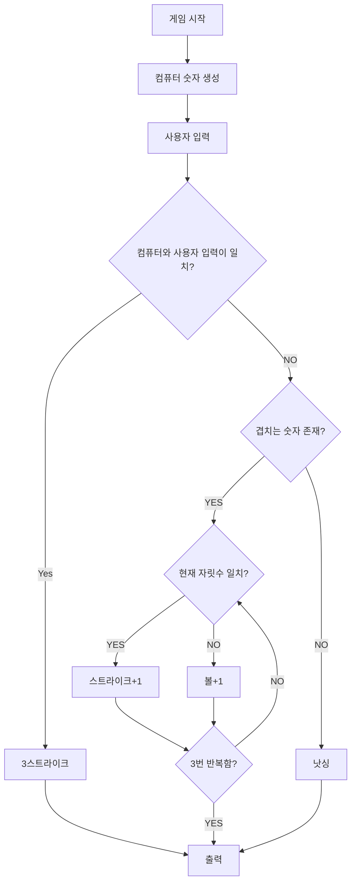
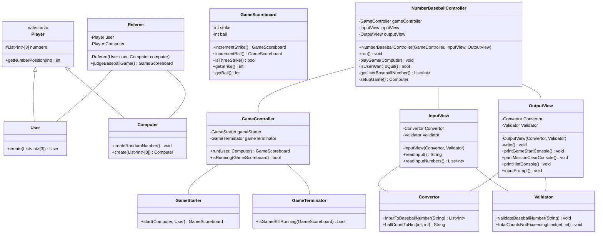

## 플로우차트

 

## 클래스 다이어그램

 

## 기능 목록

### 플레이어 `Player`
- [x] 지정된 위치의 숫자를 가져오기

#### 플레이어[컴퓨터] `Computer`
- [x] 주어진 숫자 리스트로 컴퓨터 객체를 생성
- [x] 해당 숫자가 컴퓨터의 숫자 리스트에 포함되어 있는지 확인

#### 플레이어[사용자] `User`
- [x] 주어진 숫자 리스트로 사용자 객체를 생성

 

### 판정
#### 게임 점수판 `GameScoreboard`
- [x] 스트라이크와 볼 수 증가 
- [x] 3스트라이크 확인
- [x] 스트라이크와 볼의 현재 값 조회

#### 심판 `Referee`
- [x] 사용자와 컴퓨터의 숫자를 바탕으로 게임 결과 판단
- [x] 스트라이크와 볼 판정

 

### 시스템
#### 게임 컨트롤러 `GameController`
- [x] 게임 시작 종료 컨트롤
- [x] 게임 진행 중 여부 판단

#### 게임 시작 담당 `GameStarter`
- [x] 숫자 야구 게임 시작하여 결과 반환

#### 게임 종료 판단 `GameTerminator`
- [x] 게임 종료 여부 판단

 

### 입출력
#### 입력 담당 `InputView`
- [x] 사용자 메시지 입력

#### 출력 담당 `OutputView`
- [x] 시작,종료 등 메시지 출력

 

### 데이터
#### 데이터 검증 `Validator`
- [x] 숫자 야구 번호 검증
- [x] 스트라이크, 볼 합계 검증

#### 데이터 변환 `Convertor`
- [x] 문자열 입력을 숫자 야구 번호로 변환
- [x] 스트라이크, 볼 카운트를 힌트 메시지로 변환

 

### 유틸리티
#### 랜덤한 숫자 생성 `BaseballNumberUtils`
- [x] 1~9 사이의 서로 다른 수 3개를 생성

 

### 목표
- [x] 객체지향적인 개발
- [x] SOLID 최대한 지키기
- [x] MVC 패턴 적용

