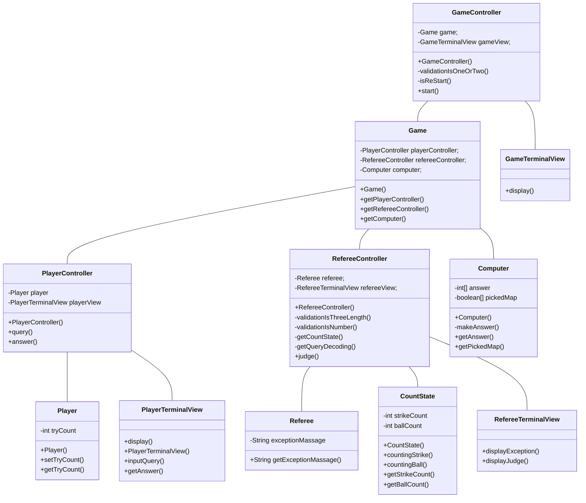

# 기능 요구사항 명세서

| RQ-ID  | 요구사항명 |         요구사항 내용         | 날짜 | 작성자 | 버전명 |
|--------|---------|----------------------------|-----|------|-------|
| RQ-001 | Player 입력 | Player는 서로 다른 1~9 까지의 수를 3개를 터미널을 통하여 입력 할 수 있습니다. | 10/20 | 장기환 | 0.0.1 |
| RQ-002 | Computer 정답 생성 | Computer는  서로 다른 1~9 까지의 수 3개로 이루어진 정답을 생성 할 수 있습니다. | 10/20 | 장기환 | 0.0.1 |
| RQ-003 | Referee 판정 | Referee는 Player의 질의를 받고 상태를 판단합 할 수 있습니다. | 10/20 | 장기환 | 0.0.1 |
| RQ-004 | Referee 입력 예외 검출 | Referee는 Player가 잘못된 값을 질의할 경우 IllegalArgumentException을 발생시킬 수 있습니다. | 10/20 | 장기환 | 0.0.1 |
| RQ-005 | Game 재시작 | Player가 답을 맞히면 재시작 여부를 물어보고 1이면 재시작, 2이면 종료를 합니다. | 10/20 | 장기환 | 0.0.1 |
| RQ-006 | Game 재시작 예외 검출 | Player가 재시작 여부를 답했을 경우 1 또는 2가 아닌 경우 예외를 발생합니다. | 10/20 | 장기환 | 0.0.1 |

# 클래스

