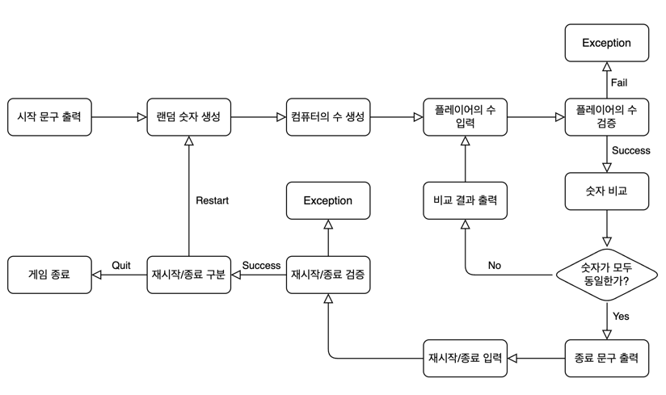

# 🔢 숫자 야구 ⚾

## 기능 목록

### Baseball
- [ ] 볼카운터를 초기화한다.
- [ ] 플레이어가 입력한 숫자에 따라 게임을 재시작/종료한다.

### RandomNumberGenerator
- [x] 1 이상 9 이하 임의의 수 하나를 생성한다.

### ComputerNumbers
- [ ] 플레이어의 수를 체크한다.
  - 같은 수가 같은 자리에 있으면 스트라이크 
  - 같은 수가 다른 자리에 있으면 볼 
  - 같은 수가 전혀 없으면 낫싱

### 입력
- [ ] 플레이어의 수를 입력 받는다.
- [ ] 재시작/종료를 구분하는 숫자를 입력 받는다.

### 출력
- [ ] 게임 시작 문구를 출력한다.
- [ ] 컴퓨터의 수와 플레이어의 수를 비교한 결과를 출력한다.
- [ ] 게임 종료 문구를 출력한다.

### 검증
- [ ] 플레이어의 수를 검증한다.
  - 숫자의 개수는 게임에서 지정한 자릿수와 일치해야 한다.
  - 각 숫자는 1 이상 9 이하여야 한다.
  - 각 숫자는 서로 달라야 한다.
- [ ] 재시작/종료를 구분하는 숫자를 검증한다.
  - 1 또는 2만 가능하다.

## 흐름도

## 체크리스트
- [ ] 사용자가 잘못된 값을 입력할 경우 `IllegalArgumentException`을 발생시킨 후 애플리케이션은 종료되어야 한다.
- [ ] JDK 17 버전에서 실행 가능해야 한다.
- [ ] 프로그램 종료 시 System.exit()를 호출하지 않는다.
- [ ] Java 코드 컨벤션 가이드를 준수하며 프로그래밍한다.
- [ ] 프로그램 구현이 완료되면 ApplicationTest의 모든 테스트가 성공해야 한다.
- [ ] `camp.nextstep.edu.missionutils`에서 제공하는 `Randoms` 및 `Console` API를 사용하여 구현해야 한다.
- [ ] 프로그래밍 요구 사항에서 달리 명시하지 않는 한 파일, 패키지 이름을 수정하거나 이동하지 않는다.
