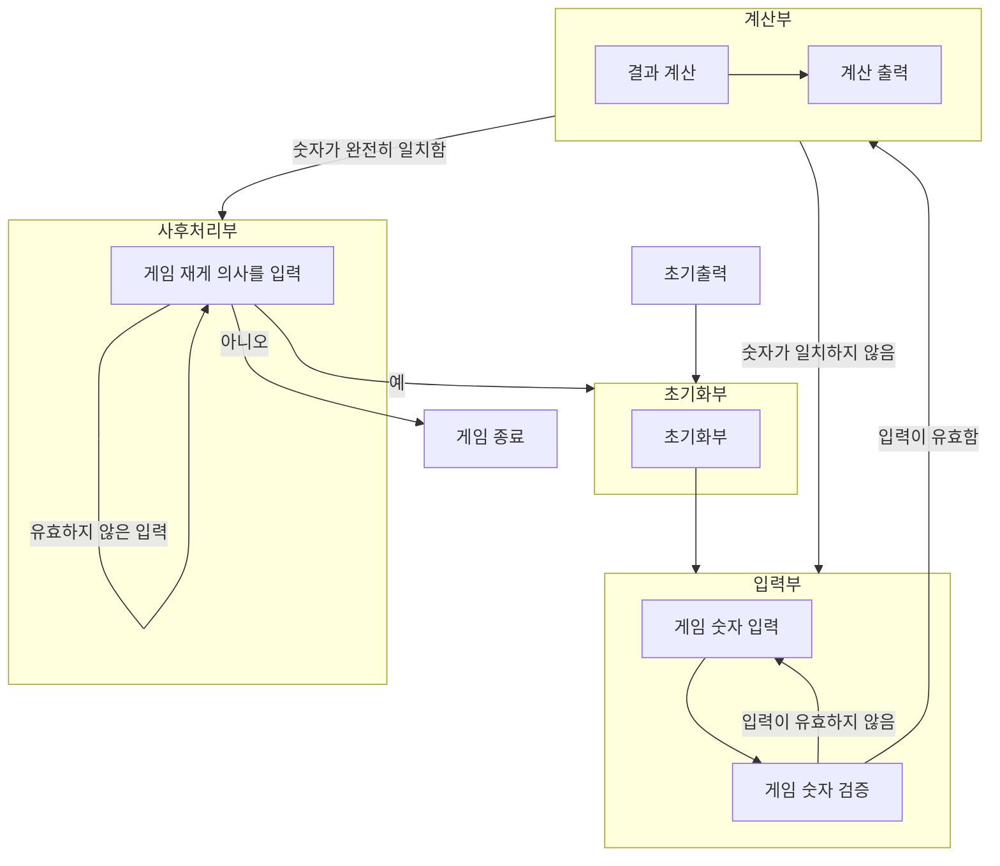

## 플로우 차트

## 기능 목록

1. 초기 출력을 하는 초기 출력
2. 초기화를 진행 하는 초기화부
   1. 숫자를 초기화한다.
      * 이 때 서로 다른 3자리의 숫자를 설정한다.
   2. 기타 변수를 초기화
3. 입력을 받는 입력부
   1. 1~9 사이의 서로 다른 숫자 3개가 오는지 확인을 해준다.
   2. 아니라면 입력을 다시 받는다.
4. 입력을 계산해 주는 계산부
   1. 올바른 입력을 계산해 주는 결과 계산 메서드
   2. 계산 결과를 출력해 주는 메서드
5. 게임 지속 여부를 확인 하는 사후처리부
   1. 숫자 1, 2가 오는지 확인해 준다.
   2. 아니라면 입력을 다시 받는다.
6. 게임종료