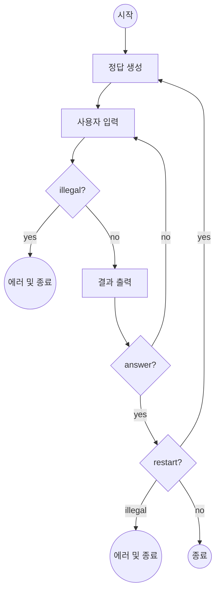
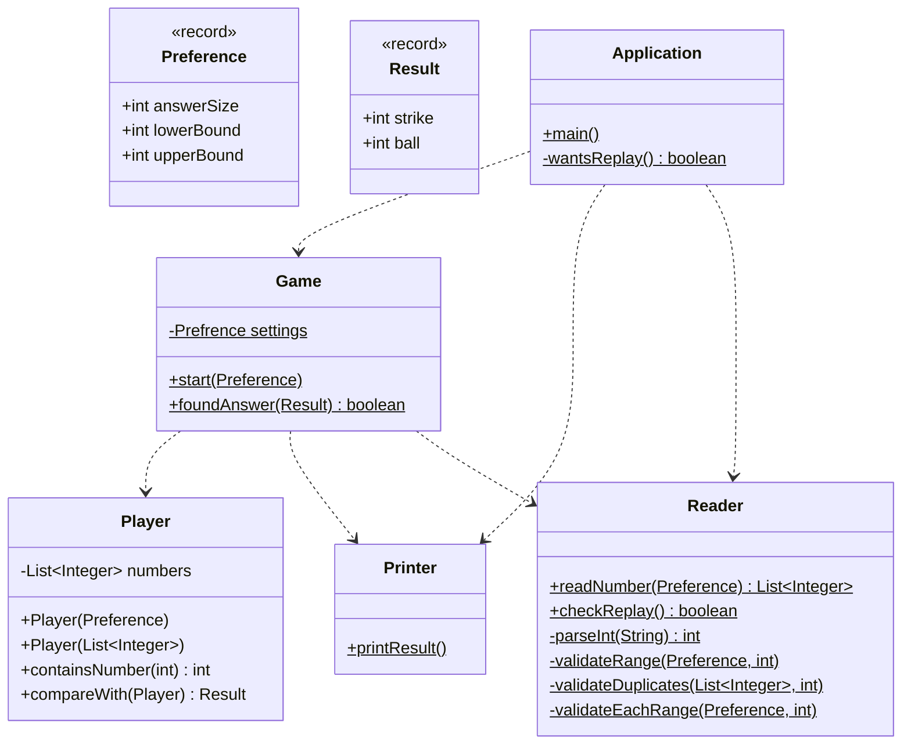

# 구현 아웃라인

1. 정답 숫자 생성
2. 유효한 입력 판단
3. 개별 결과 출력 (스트라이크, 볼)
4. 입력이 정답일 경우 재시작 여부 질문

# 구현한 기능 목록

1. class Application

- [x] 전체 게임의 설정 관리 (정답 길이, 개별 숫자 범위)
- [x] 전체 게임 실행 (즉, 개별 게임 반복)
- [x] 재시작 여부 질문

2. class Game

- [x] 개별 게임 시작
- [x] 정답 객체 생성
- [x] 사용자 입력 객체 생성
- [x] 정답 확인 시 게임 종료

3. class Player

- [x] List\<Integer>를 포장하는 Player 클래스 정의
- [x] 무작위 객체 (컴퓨터, 투수) 생성하기
- [x] 주어진 입력에 맞는 객체 (사용자, 타자) 생성하기
- [x] 두 객체 비교하기

4. class Result

- [x] strike, ball 결과값을 담는 DTO 정의.

5. class Preference

- [x] Application 클래스에서 Player 클래스로 게임 설정을 전달하기 위한 DTO 정의.

6. class Reader

- [x] 사용자 입력 받기
- [x] 입력값 검증
- [x] 잘못된 입력일 경우 에러 던지기

7. class Printer

- [x] 프로그램 전역에서 사용하는 문자열 포장
- [x] 게임 결과 출력

# Flowchart

# Class Diagram

