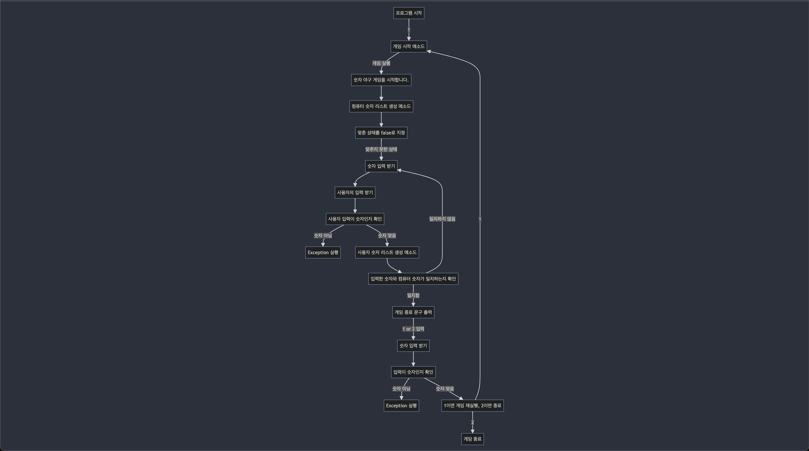

# 숫자 야구 게임 프로그램

## 프로그램 시작

- `main` 메소드가 실행되고 `gameStart(1)`이 호출됨.

## 게임 시작 메소드 (`gameStart` 메소드)

- `status`가 1인 경우에만 게임이 실행됨.
- "숫자 야구 게임을 시작합니다." 문구 출력.
- `computerNumber` 메소드를 통해 컴퓨터 숫자 생성.
- `isCorrect` 변수를 false로 초기화.
- 사용자가 맞출 때까지 반복.
    - 사용자에게 숫자 입력 받음.
    - 입력 받은 숫자를 리스트로 변환 (`numberList` 메소드).
    - 입력한 숫자와 컴퓨터 숫자 비교 (`equals` 메소드).
- 게임이 종료되면 "게임을 새로 시작하려면 1, 종료하려면 2를 입력하세요." 문구 출력.
- 숫자 입력 받음.
- 입력이 유효한지 확인 (`isNumber` 메소드).
    - 1이면 `gameStart(1)` 호출, 2이면 "게임 종료" 출력.

## 숫자 비교 메소드 (`equals` 메소드)

- 스트라이크와 볼 변수 초기화.
- 입력한 숫자와 컴퓨터 숫자 비교하며 스트라이크와 볼 갯수 계산.
- 갯수에 따라 출력 내용 결정.
- 3개를 모두 맞추면 "3개의 숫자를 모두 맞히셨습니다! 게임 종료" 출력 및 true 반환.

## 컴퓨터 숫자 리스트 랜덤 생성 메소드 (`computerNumber` 메소드)

- 랜덤으로 1에서 9까지 숫자를 생성하여 리스트에 추가.
- 중복된 숫자가 없도록 확인하여 추가.

## 사용자 숫자 리스트 생성 메소드 (`numberList` 메소드)

- 사용자가 입력한 숫자를 숫자로 변환하여 리스트에 추가.
- 길이가 3이 아니거나 숫자가 아닌 경우 예외 처리.

## 입력값이 숫자인지 확인하는 메소드 (`isNumber` 메소드)

- 입력한 문자열을 숫자로 변환해보고, 변환이 되면 true 반환, 그렇지 않으면 false 반환.

## 프로그램 종료

# 숫자 야구 게임 순서도
