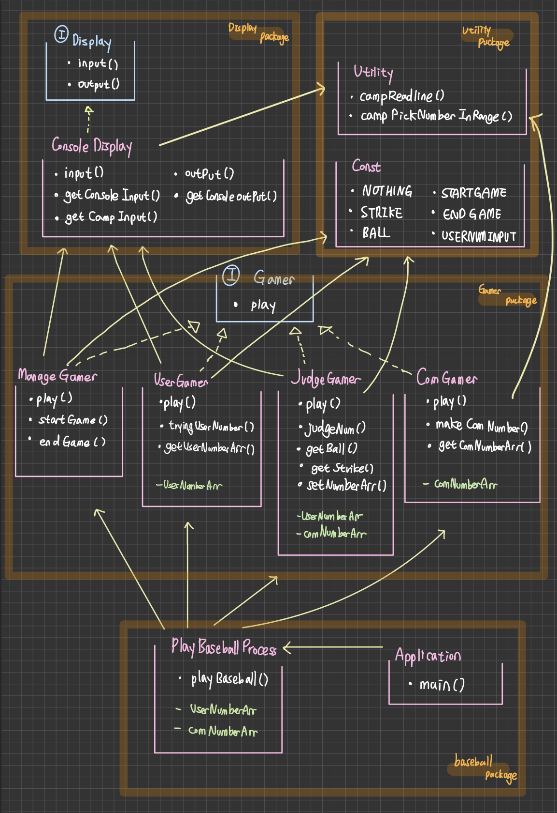

# **🪐1주차 미션🪐 - 숫자 야구 ⚾️**

###### 정은채

`간단한 클래스 UML입니다.`
------

### <u>🗂 utility package</u>

##### 🟢 Utility class

`camp.nextstep.edu.missionutils`에서 제공하는 `Randoms` 및 `Console` API를 이용하는 class입니다. api가 필요한 부분마다 이 클래스를 이용합니다. static 메서드로 구현하여 빈번한 사용이 용이하게 했습니다.

###### campReadline() 함수 : camp.nextstep.edu.missionutils.Console의 readLine() 을 활용하여 Random 값 추출함

###### campPickNumberInRange() 함수 : camp.nextstep.edu.missionutils.Randoms의 pickNumberInRange() 을 활용하여 사용자가 입력하는 값 받음

##### 🟢 Const class

하드코딩 방지 문자열 상수용 클래스입니다.

###### NOTHING 상수 : JudgeGamer클래스용 상수

###### STRIKE 상수 : JudgeGamer클래스용  상수

###### BALL 상수 : JudgeGamer클래스용 상수

###### STARTGAME 상수 : ManageGamer클래스용 상수

###### ENDGAME 상수 : ManageGamer클래스용 상수

###### USERNUMINPUT  상수 : UserGamer클래스용 상수

------

### <u>🗂 display package</u>

##### 🔵 Display interface

다양한 display에 프로그램을 적용하여 입출력을 다룰 수 있도록 구현한 인터페이스입니다.

###### input() 함수 : String 입력받음

###### Output() 함수 : String 출력함

##### 🟢 ConsoleDisplay class (Display 구현)

콘솔용 입출력을 가능하게 하는 클래스입니다.

###### Input(),output() 함수 구현

###### getConsoleInput() 함수 : Scanner 클래스의 readline()으로 입력받음

###### getCampInput() 함수 : Utility class의 campReadline()으로 입력받음

###### getConsoleOutput() 함수 : System.out 스트림으로 출력함

------

### <u>🗂 gamer package</u>

##### 🔵 Gamer interface

숫자야구게임을 기능별로 나누어 각 부분을 게임 참가자로 설정했습니다. 모든 게임 참가자가 공통적으로 수행하는 게임 play()함수를 가진 인터페이스입니다.

###### Play() 함수 : 게임 참여자가 수행하는 게임 플레이 부분

##### 🟢 ManageGamer class (Gamer 구현)

숫자야구게임의 전체적인 진행, 즉 게임 시작과 끝, 재진행 여부를 관리하는 *게임매니저 역할 수행 클래스입니다.*

###### Play() 함수 구현

###### startGame() 함수 : 게임 시작 문구를 출력함

###### endGame() 함수 : 게임 끝 문구를 출력하고, 게임 재진행 여부를 입력받아 게임 진행함

###### errorGame 함수 : 사용자가 제시한 숫자야구 숫자가 이상할 때 IllegalArgumentException 에러를 던집니다.

###### isInteger 함수 : 사용자가 제시한 숫자야구 숫자가 정수가 맞는지 검사합니다.

##### 🟢 ComGamer class (Gamer 구현)

랜덤 숫자야구 정답 숫자를 생성하여 *컴퓨터(상대방) 역할을 수행하는 클래스입니다.*

###### Play() 함수 구현

###### makeComNumberArr() 함수 : Utility class의 campPickNumberInRange()으로 랜덤 수 3개 받아 숫자야구 정답수 생성

###### getComNumberArr() 함수 : 생성된 숫자야구 정답수 리스트 반환

###### comNumberArr 변수 : 생성된 숫자야구 정답수 리스트 저장

##### 🟢 UserGamer class (Gamer 구현)

숫자 야구 예상 수를 입력하는 *사용자의 역할을 수행하는 클래스입니다.*

###### Play() 함수 구현

###### tryingUserNumber() 함수 : ConsoleDisplay 클래스로 사용자의 숫자 야구 예상 수를 입력받음

###### setUserNumberArr() 함수 : 검사가 완료된 사용자의 숫자 야구 예상 수를 저장함

###### getUserNumberArr() 함수 : 사용자의 숫자 야구 예상 수 리스트 반환

###### UserNumberArr 변수 : 검사가 완료된 사용자의 숫자 야구 예상 수 리스트 저장

###### UserNumbers 변수 :  검사 전의 사용자의 숫자 야구 예상 수 저장

##### 🟢 JudgeGamer class (Gamer 구현)

컴퓨터의 숫자야구 정답 리스트와 사용자가 입력한 숫자야구 정답 리스트를 비교하여 스트라이크, 볼, 낫싱의 힌트를 주고, 정답을 맞혔는지를 알려주는 *판단자 역할 수행 클래스입니다.*

###### Play() 함수 구현

###### judgeNum() 함수 : ConsoleDisplay 클래스로 사용자가 입력한 숫자야구 정답 리스트의 판정 결과를 출력함

###### getBall() 함수 : ball 개수 계산하여 반환

###### getStrike() 함수 : Strike 개수 계산하여 반환

###### setNumberArr() 함수 : 컴퓨터의 숫자야구 정답 리스트, 사용자가 입력한 숫자야구 정답 리스트 받아옴

###### comNumberArr 변수 : 컴퓨터의 숫자야구 정답 리스트 저장

###### UserNumberArr 변수 : 사용자가 입력한 숫자야구 정답 리스트 저장

------

### <u>🗂 Baseball package</u>

##### 🟢 PlayBaseballProcess class

퍼사드 패턴으로 다른 사용자 클래스들 등의 코드 부분에 대한 간략화된 프로세스를 제공하는 클래스입니다.

###### playBaseball() 함수 : 사용자 객체들을 이용하여 숫자 야구 게임을 진행합니다.

###### userNumberArr 변수 : 생성된 숫자야구 정답수 리스트 저장

###### comNumberArr 변수 : 생성된 숫자야구 정답수 리스트 저장

##### 🟢 Application class

###### main() 함수 : PlayBaseballProcess 클래스의 playBaseball 함수를 호출합니다.