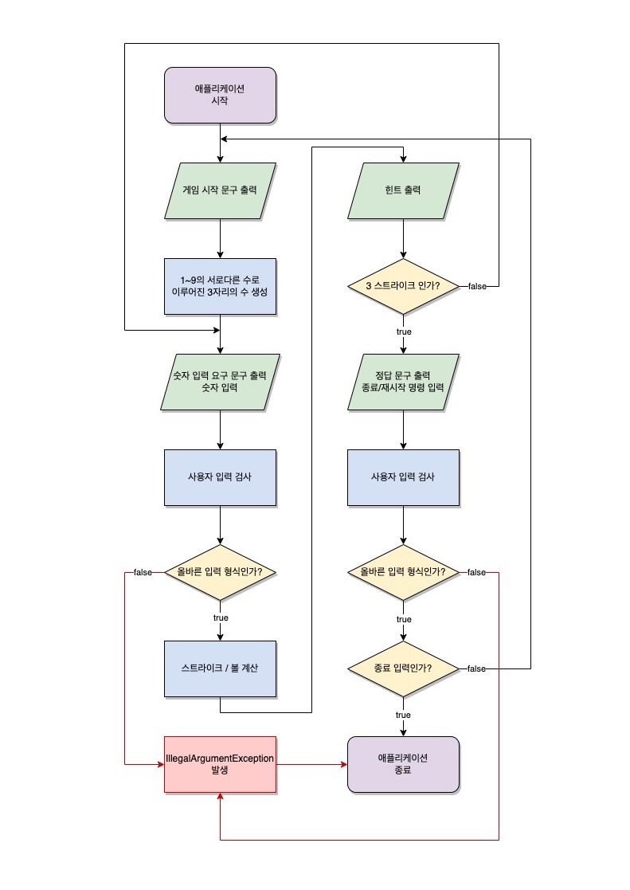

# 숫자 야구 게임

## 요구사항 분석

- [ ] 1~9의 서로 다른 수로 이루어진 3자리 수를 맞추는 게임을 만든다.
  - [ ] 컴퓨터가 1~9의 서로 다른 수로 이루어진 3자리 수를 만든다.
  - [ ] 숫자를 입력받는다.
  - [ ] 사용자의 입력에 따라 스트라이크, 볼의 갯수를 계산한다.
    - [ ] 숫자와 위치가 모두 맞은경우 스트라이크로 처리한다. 
    - [ ] 숫자가 맞았지만 위치가 다른경우 볼로 처리한다.
    - [ ] 아무것도 맞지 않은경우 낫싱으로 처리한다.
  - [ ] 결과를 처리한다.
    - [ ] 힌트를 출력한다.
    - [ ] 정답인 경우 프로그램을 종료할지 다시 시작할 지 입력받는다.
    - [ ] 입력에 의한 종료/재시작을 한다.
  - [ ] 사용자의 입력을 검사한다..
    - [ ] 입력한 숫자를 검사한다.
    - [ ] 정답인 경우 종료 또는 재시작 옵션을 검사한다.
    - [ ] 잘못된 입력하면 IllegalArgumentException을 발생시키고 에플리케이션을 종료시킨다.

## 플로우 차트

## 객체 설계
- MVC 패턴에 맞춰 개발하는것을 목표로 했다. 먼저 각 요소들의 구성 및 할일을 나눴다. 할일을 바탕으로 객체를 분리했다. 

### 역할 나누기
- Model :
  - 게임이라는 모델이 필요하다.
  - 3개의 숫자를 가지고 있을 모델이 필요하다.
  - 점수를 기록할 모델이 필요하다.
- View : 
  - 사용자의 입력을 받아야 한다.
  - 사용자에게 적절한 문구를 출력해야한다.
- Controller
  - 게임의 시작 종료를 제어해야한다.
  - 조건에 맞는 3자리수를 만들어야한다.
  - 사용자의 입력을 검사해야한다.
    - 사용자의 3자리수를 검사
    - 종료 혹은 재시작 입력을 검사
  - 사용자의 입력에서 숫자 3개를 파싱해야한다.
  - 스트라이크와 볼을 계산해야한다.

### 객체 분리
- Model
  - Game
    - 게임을 모델링한 객체다.
      - 역할 : 게임의 전체적인 로직과 생태를 관리한다.
      - 책임 : 게임의 진행상태와 결과를 저장하고 관리한다. 
  - GameNumbers
    - 컴퓨터가 만들어낸 수 또는 사용자가 입력한 3자리 수를 저장하는 객체다.
      - 역할 : 3자리 수를 관리
      - 책임 : 컴퓨터가 생성한 정답 또는 사용자가 입력한 수를 저장하고 관리한다.
  - Score
    - 점수를 저장하는 객체다.
      - 역할: 게임의 점수 상태를 관리한다.
      - 책임: 스트라이크와 볼의 갯수를 저장한다.
- View
  - InputView
    - 사용자의 입력을 받는 객체다.
      - 역할: 사용자 입력을 받는다.
      - 책임: 사용자 입력을 받는다.
  - OutputView
    - 사용자에게 보여줄 문구를 출력하는 객체다.
      - 역할: 사용자에게 문구를 출력한다.
      - 책임: 사용자에게 문구를 출력한다.
- Controller
  - GameController
    - 게임의 시작 종료 재시작을 제어하는 객체다.
      - 역할: 게임의 시작과 종료를 제어한다.
      - 책임: 게임의 시작, 종료, 재시작 등의 흐름을 관리
  - AnswerGenerator
    - 게임의 정답을 만드는 객체다.
      - 역할: 게임의 정답을 생성한다.
      - 책임: 1~9의 서로 다른 숫자로 이루어진 3자리 수를 생성한다.
  - InputValidator
    - 사용자의 입력을 검사하는 객체다. 3자리수, 종료/재시작 입력 모두 검사한다.
      - 역할: 사용자의 입력을 검증한다.
      - 책임:
        - 사용자가 입력한 3자리 수를 검사한다.
        - 사용자의 종료/재시작 입력을 검사
  - InputParser
    - 사용자의 3자리수 입력을 파싱한다.
      - 역할: 사용자 입력을 파싱한다.
      - 책임: 사용자의 입력을 3개의 숫자로 파싱한다.
  - ScoreCalculator
    - 스트라이크와 볼을 계산한 결과를 보여준다.
      - 역할: 스트라이크와 볼의 갯수를 계산
      - 책임: 정답과 사용자의 입력을 사이의 스트라이크와 볼 갯수를 계산한다.

