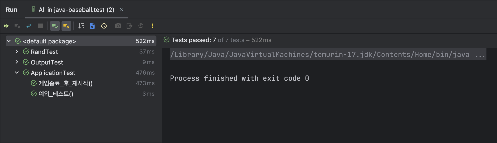

## 기능 요구 사항

- 분석
  - 상대방 즉 추론해야 하는 수를 제시하는 역할 - 컴퓨터
  - 제시하는 수를 추론해야 하는 역할 - 사용자
  - 입력
    - **제출하고자 하는 정답**: 서로 다른 3자리로 이루어진 수
    - **재시작 커맨드**: 1(재시작), 2(종료)
  - 정답 검증 로직
    - 같은 수가 같은 자리에 있으면 스트라이크
    - 다른 자리에 있으면 볼
    - 같은 수가 전혀 없으면 낫싱

## 구현할 기능 목록

- 시작 문구 출력

  - 애플리케이션이 처음 실행될 때 아래와 같은 시작 문구를 출력해야 한다

    ```
    숫자 야구 게임을 시작합니다.
    ```

- 난수 생성 기능

  - `camp.nextstep.edu.missionutils`에서 제공하는 `Randoms` API를 통해 생성한 난수를 변수 공간을 생성해 저장
    - 난수 값 추출은 `camp.nextstep.edu.missionutils.Randoms`의 `pickNumberInRange()` 사용

- 사용자에게 입력을 받는 기능

  - `camp.nextstep.edu.missionutils`에서 제공하는 `Console` API를 통해 생성한 난수를 변수 공간을 생성해 저장

  - 시작 문구가 출력된 이후와 입력한 숫자가 정답이 아닐 경우에는 아래와 같은 입력 안내 메세지가 나온다.

    ```
    숫자를 입력해주세요 : 
    ```

- 사용자의 입력을 생성된 난수와 비교하는 기능

  - 사용자의 입력과 생성된 난수를 비교하여

    - **같은 수**가 **같은 자리**에 있으면 **스트라이크** ex) randNum = 953, usersInput = 157 ➔ 1스트라이크
    - **같은 수**가 **다른 자리**에 있으면 **볼** ex) randNum = 162, usersInput = 791 ➔ 1볼

    도출된 결과를 반환

- 결과 출력

  - 볼과 스트라이크의 개수가 0보다 많을 경우 아래와 같은 형식으로 볼, 스트라이크 개수 표시

    ```
    1볼 1스트라이크
    ```

  - 그렇지 않을 경우

    ```
    낫싱
    ```

  - 3개의 숫자를 모두 맞힐 경우

    ```
    3스트라이크
    3개의 숫자를 모두 맞히셨습니다! 게임 종료
    ```

- 재시작 여부 확인

  - 사용자가 모든 숫자를 추론하여 게임이 끝날 경우 (1과 2) 두 커맨드를 사용하여 재시작 또는 종료 여부를 결정할 수 있음

    - 게임 종료 후 아래와 같은 메세지 출력

      ```
      게임을 새로 시작하려면 1, 종료하려면 2를 입력하세요.
      ```

    - 만일 사용자의 입력이 1일 경우 게임을 다시 시작하고, 2일 경우에는 종료해야 한다.

- 에러 처리

  - 사용자가 잘못된 값을 입력할 경우 `IllegalArgumentException`을 발생시킨 후 애플리케이션 종료


## MVC 패턴으로 생각해본다면?

- Model
  - [x] 컴퓨터가 생성한 3자리의 난수로 이루어진 정답
    - [x] 사용자의 입력과 생성된 난수를 비교하는 기능
  - [x] 사용자의 입력과 정답을 비교하여 계산된 게임 점수
  
- View
  
  - [x] 입력 뷰
    - [x] 시작 문구 출력
    - [x] 입력 안내 메세지
    - [x] 재시작 여부 확인
    - [x] 사용자에게 입력을 받는 기능
      - [x] 사용자의 입력이 잘못됐을 경우 에러 발생 후 종료
        - [x] 3자리의 숫자가 아닐 경우
        - [x] 입력에 숫자외에 다른 문자가 있는 경우
        - [x] 입력에 중복되는 숫자가 존재하는 경우
  
  - [x] 출력 뷰
    - [x] 결과 출력 
      - [x] 볼 또는 스트라이크가 있을 때
      - [x] 아무것도 적중하지 못했을 때
      - [x] 모두 맞혔을 때
    - [x] 게임 종료 메세지
  
- Controller

- util

  - [x] 난수 생성 기능
  - [x] 중복 숫자 생성 방지 기능

## 개발 진행 상황

1. 모델(컴퓨터가 생성한 3자리의 난수로 이루어진 정답)을 먼저 구현하기로 하였다.

   정답은 3개의 숫자로 이루어져 있다 ➔ 배열을 이용할까? 각기 다른 변수에 저장할까?

   **ArrayList**를 이용하기로 결정

2. 시작 문구와 입력 안내 메세지를 출력하는 메서드를 InputView 클래스에 구현

3. 3자리로 이루어진 난수를 생성하는 createAnswer 메서드를 NumberGenerator 클래스에 구현

   중복된 숫자가 나오는 것을 방지하도록 이를 방지하는 로직을 구현

4. 사용자의 입력과 컴퓨터가 생성한 난수를 비교 후 결과를 계산하는 메서드를 Answer 클래스에 구현 해당 메서드는 GameScore 객체를 반환한다.

5. 비교 결과를 저장하는 GameScore 클래스를 생성하였다. 해당 클래스는 int형 변수 strike와 ball을 가지고 있다. 객체 내부 값을 getter로 참조하지 않고 객체 내부에서 동작이 이루어지도록 하였다.

   메서드를 통해 객체를 참조 및 수정할 수 있게 함으로써 객체에 대한 무분별한 접근을 방지하였다.

6. 생성된 GameScore를 통해 결과를 출력하는 InputView 클래스를 작성하였다.

7. 기존에 작성한 NumberGenerator에서 반복문을 잘못 작성하여 난수가 2개나 1개만 생성되는 치명적인 오류를 발생하여 이를 수정하였다.

8. GameScore 클래스에 게임 종료 여부를 확인하는 isUserFindAnswer 메서드를 추가하였다.

9. 문자의 길이만을 검증하던 기존의 입력 검사 로직을 확장하여 숫자 외 다른 문자 포함 여부와 중복된 숫자 포함 여부를 검사하도록 하였다.

10. 재시작 여부를 확인하기 위한 로직을 구현하여 Controller 클래스를 완성하였다.

11. Application 클래스에서 Controller 객체를 생성 후 사용하도록 하여 Controller 내부의 메서드 및 객체들을 non-static으로 변경하였다.

12. 기존에 코드에 존재하던 하드 코딩 된 값들을 상수로 변경하였다.

13. View에서 출력하는 메세지들을 enum으로 이동시켜 메세지 변경을 용이하게 하였다.

14. 체크리스트를 확인하며 인스턴스 변수의 개수를 줄였다.

15. GameScore 클래스의 getter를 삭제한 후 결과 출력 역할을 GameScore 클래스로 이동시켰다.

## 테스트 케이스

### 목록

- `OutputTest`: `OutputView`클래스에 대한 테스트
  
  - 스트라이크 3개, 적중X, 그 외의 경우에 올바른 메세지가 출력되는지 테스트하여 통과하였다.
  - 스트라이크를 모두 맞추었을 경우 게임종료 메세지가 출력되는지 테스트하여 통과하였다.
  
- `RandTest`: `NumberGenerator`클래스의 메서드 `createAnswer`에 대한 단위 테스트

  - 해당 메서드는 Randoms API를 이용해 3자리의 난수를 생성하여 이를 Answer객체 반환한다.
    - `RandTest`의 메서드 `난수_생성_여부_확인`에서 `createAnswer`이 정확히 3자리의 수를 반환하는지 테스트하여 통과하였다.

    - 추가사항: 기존 NumberGenerator클래스의 반환형이 List<Integer>에서 Answer 객체로 바뀐 데 따라 기존의 방식으로 코드의 유효성을 검증할 수 없었다.

      이에 따라 mock데이터를 생성한 후 이것과 Answer를 비교하게 함으로써 간접적으로 난수가 정상적으로 생성된다는 것을 검증했다.

- `CompareTest`: Answer 클래스의 `calcScore`에 대한 단위 테스트

  - 각각의 케이스에 따른 Mock데이터를 생성하여 입력과 정답을 비교하는 로직이 잘 동작하는지 테스트하여 통과하였다.

### 결과

