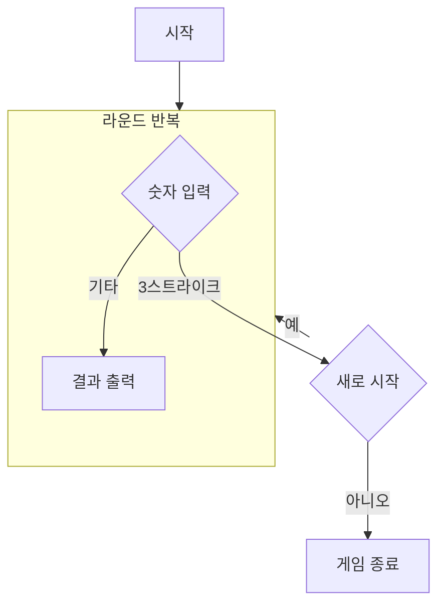

## 순서도

## 구현할 기능 목록

### Model

#### Number Class
- 각 자리의 숫자 보유
- 목표 숫자 랜덤 생성
- 점수를 계산하여 반환

#### Message Enum Class
- 출력할 텍스트들을 정의해두는 열거형 클래스

### View

#### InputView Class
  - 각 라운드 숫자 입력
  - 재시작 여부 입력

#### OutputView Class
  - 게임 시작 메시지 출력
  - 각 라운드 숫자 입력 메시지 출력
  - 각 라운드 결과 메시지 출력
  - 게임 종료 메시지 출력
  - 재시작 질문 메시지 출력

### Controller
- 게임 시작
- 숫자 입력 후 결과 출력
- 재시작
