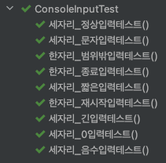
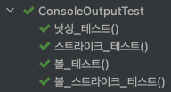
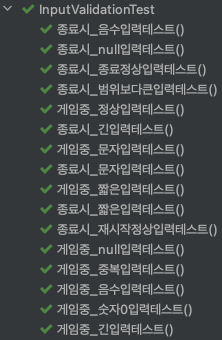
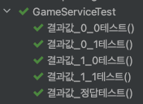
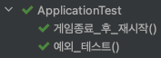

미션 - 숫자 야구 ⚾
=

# 🎯 진행 방식

### 게임 규칙
- 같은 수가 같은 자리 = "스트라이크"
- 다른자리 = "볼"
- 전혀 없을 경우 = "낫싱"

### 예시
- 상대방(컴퓨터)의 수가 425일 때
  - 123을 제시한 경우 : "1스트라이크"
  - 456을 제시한 경우 : "1볼 1스트라이크"
  - 789를 제시한 경우 : "낫싱"

### 게임 진행
- 상대방의 역할을 컴퓨터가 한다.
- 컴퓨터는 1~9까지 <U>"서로 다른 임의의 수 3개"</U>를 선택한다.
- 이 같은 과정을 반복하여 컴퓨터가 선택한 3개의 숫자를 모두 맞히면 게임이 종료된다.
- 게임을 종료한 후 게임을 다시 시작하거나 완전히 종료할 수 있다.
- 사용자가 잘못된 값을 입력할 경우 `IllegalArgumentException` 발생 후 종료되어야 한다.

### 입력
- <U>서로 다른 3자리의 수</U>를 입력한다.
- 게임이 (정상적으로)끝난 경우에는 재시작/종료를 구분하는 1과 2 중 하나의 수를 입력할 수 있다.

### 출력
- 게임시작
  - `숫자 야구 게임을 시작합니다.` 출력
- 입력한 수에 대한 결과를 "볼"과 "스트라이크" 개수로 출력한다.
  - 출력 순서는 볼 -> 스트라이크 이다.
  - ex) `1볼 1스트라이크`
- 아무것도 맞추지 못했을 경우에는 `낫싱`을 출력한다.
- 3개의 숫자를 모두 맞힐 경우 (정상 종료)
  - `3스트라이크` 출력
  - `3개의 숫자를 모두 맞히셨습니다! 게임 종료` 출력

### 요구사항
- 프로그램 종료 시 `System.exit()`으로 강제 종료를 하지 않는다.
- 구현이 완료되면 `ApplicationTest`의 모든 테스트를 성공해야한다.
- <U>입력은 Console을 활용하여 받도록 한다.</U>
- <U>랜덤 함수의 경우 제공되는 라이브러리를 활용한다.</U>

---

# 🛠️ 기능 목록

## 💡 Main Class
### Application
- [x] `run()` 메서드를 실행한다.
  

## 💡 Service

### NumberConstant
- 매직넘버들을 상수로 처리한 Enum 클래스이다.
- [x] MIN_NUMBER : 1
- [x] MAX_NUMBER : 9
- [x] PICK_COUNT : 3

### PlayConstant
- 게임 실행 관련 상수들을 담은 Enum 클래스이다.
- [x] RESTART : `1`
- [x] FINISH : `2`

### RandomNumberGenerator
- 난수 생성 역할을 하는 유틸 클래스이다.
- [x] 난수 생성 메서드

### GameService
- 메인 로직을 담당하는 클래스로, 게임 진행에 필요한 주요 메서드들이 담긴다.
- [x] 게임 실행 메서드를 생성한다.
  - 게임을 시작하고, 종료 후 재실행 여부까지 파악하여 반복한다.
- [x] 게임 진행 메서드를 생성한다.
  - 숫자 생성 후 `while`문을 통해 입력값과 지속적으로 비교한다.
  - 게임 종료 후 리턴한다.
- [x] 결과 값을 도출하는 메서드를 생성한다.
  - 입력된 숫자를 기반으로 어떤 결과가 나왔는지 리턴한다.
  

## 💡 Console

### OutputConstant
- 출력에 필요한 상수들을 담은 Enum 클래스이다.
- [x] GAME_INIT : `숫자 야구 게임을 시작합니다.`
- [x] INPUT_REQ : `숫자를 입력해주세요 : `
- [x] BALL : `볼`
- [x] STRIKE : `스트라이크`
- [x] SUCCESS : `3개의 숫자를 모두 맞히셨습니다! 게임 종료`
- [x] GAME_END : `게임을 새로 시작하려면 1, 종료하려면 2를 입력하세요.`

### InputValidation
- 입력의 유효성을 판단하는 클래스이다.
- [x] 게임 진행 중 유효성 판단 메서드
  - "숫자" 3자리 여부 판단
  - 중복 여부 판단
- [x] 게임 종료 후 유효성 판단 메서드
  - "숫자" 1자리 여부 판단
  - 1, 2 여부 판단

### ConsoleInput
- 입력을 담당하는 클래스이다.
- [x] `Console.readLine()`를 통해 입력을 받는다.
- [x] try-catch를 통해 `InputValidation`으로 유효성을 판단한다.
- [x] 유효하지 않은 입력의 경우 `IllegalArgumentException`를 발생시킨다.
  - RuntimeException의 하위클래스이므로 exception 발생 시 게임은 그대로 종료되어야 한다.

### ConsoleOutput
- 출력을 담당하는 클래스이다.
- [x] `ConsoleConstant`를 활용하여 `System.out.println()`을 통해 출력을 한다.
  

## 💡 DTO

### GameResult
- 게임 결과를 담을 dto이다.
- [x] 볼 카운트와 스트라이크 카운트를 담는다.
  

## 💡 Exception

### ErrorMessage
- 에러메세지들을 담을 Enum 클래스이다.
- [x] 게임 중 입력 받을 3자리 숫자와 관련된 에러메세지
- [x] 게임 종료 후 입력 받을 1자리 숫자와 관련된 에러메세지
 

---

📠 TEST
=

- 테스트는 기본적으로 clean test를 위해 실패의 경우에도 결과값을 반대로 지정하여 통과하도록 하였다.  
 

- [x] 입력 테스트 완료

    
   

- [x] 출력 테스트 완료

    
   

- [x] 입력값 유효성 테스트 완료

    
   

- [x] 난수 생성 테스트 완료 (반복 테스트 X)

    
   

- [x] 결과값 테스트 완료

    
   

- [x] 메인 테스트 완료

      
