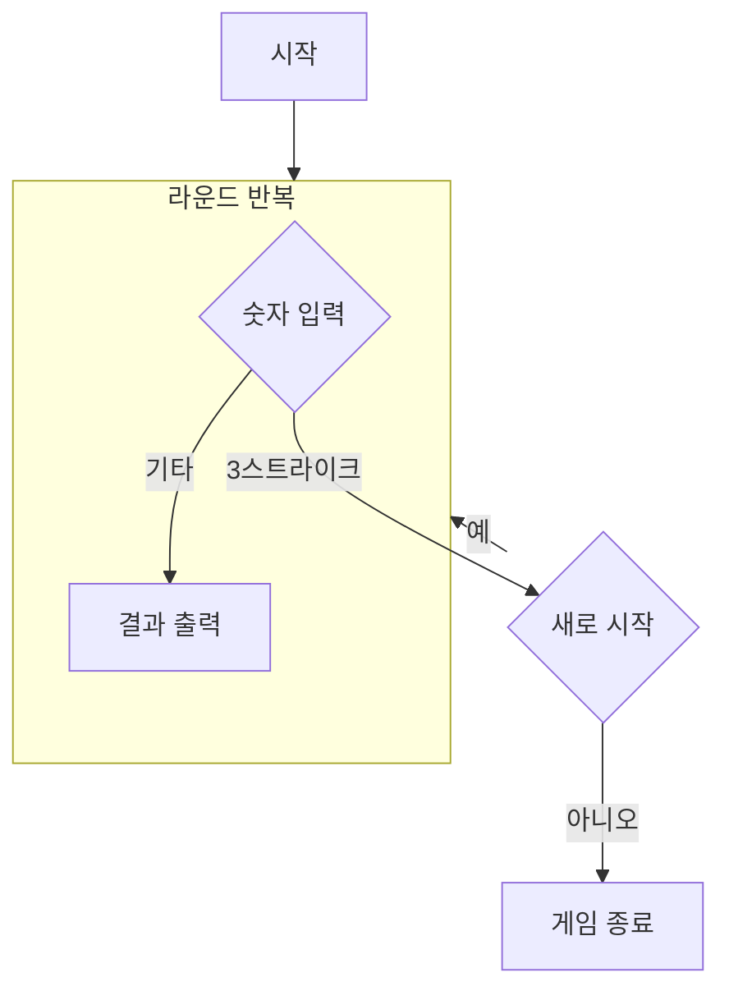

## 순서도

## 구현할 기능 목록

### Model

- 숫자 한 칸
- 스트라이크, 볼 enum 클래스

### View

#### InputView
  - 숫자 입력
  - 재시작

#### OutputView
  - 게임 시작
  - 숫자 입력
  - 결과 출력
  - 게임 종료
  - 재시작

### Controller

- 게임 시작
- 숫자 입력 후 결과 출력
- 재시작