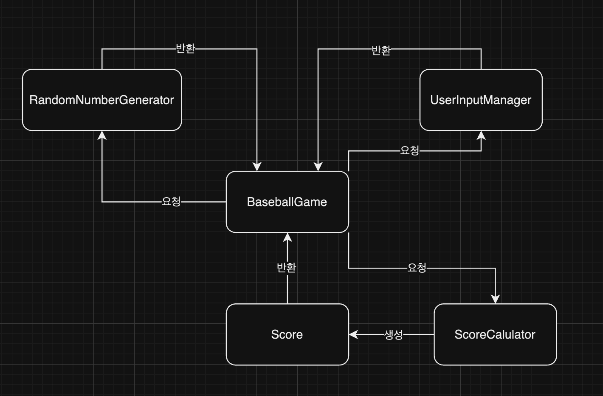

# 숫자 야구 게임 기능명세서

---
## 필요 제공 기능

### 인터페이스 출력

- 게임 시작 문수 출력

- 숫자 입력 문구 출력

- 점수 계산 문구 출력

- 게임 종료 문구 출력

- 재시작 여부 선택 문구 출력

### 사용자 입력 처리

- 3자리 숫자 입력

- 재시작/종료 여부 입력

### 랜덤 숫자 생성

- 랜덤한 3개의 숫자 생성

### 잘못된 입력 처리

- 3자리가 아닌 숫자 입력 예외 처리

- 중복된 숫자 입력 예외 처리

- 1, 2가 아닌 숫자 입력 예외 처리

### 점수 계산

- 스트라이크 볼 개수 판단

### 재시작 분기 처리

- 1입력시 게임 재시작

- 2입력시 게임 종료

--- 

## 역할 구현 클래스 목록 및 역할

---

## 클래스 연관 관계
