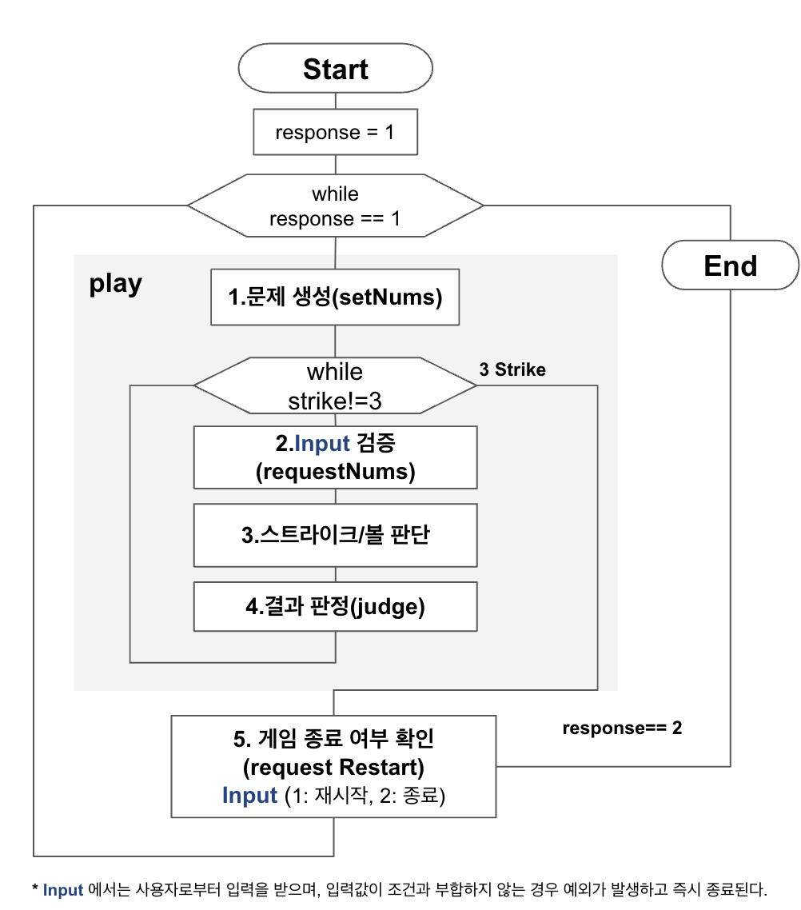

# 미션 - 숫자 야구⚾️

숫자 야구에서 문제를 출제하고, 볼/스트라이크를 판정하는 프로그램을 구현한다.

구현할 프로그램의 flowchart를 그려보면 다음과 같다. 




# 기능 목록

---

### 1️⃣ 문제 생성 (setNums)

`camp.nextstep.edu.missionutils.Randoms`의 `pickNumberInRange()`를 활용하여 1~9 사이의 **서로 다른 임의의 수 3개를 선택**한다.

README.md 의 예제 소스를 이용했다.
<details>
<summary>setNums 메서드</summary>
<div markdown="1">

```java
private static List<Integer> setNums() {
List<Integer> computer = new ArrayList<>();
while (computer.size() < 3) {
int randomNumber = Randoms.pickNumberInRange(1, 9);
if (!computer.contains(randomNumber)) {
computer.add(randomNumber);
}
}
return computer;
}
```
</div>
</details>

---

### 2️⃣ 입력 검증 (requestNums)


`camp.nextstep.edu.missionutils.Console`의 `readLine()`을 활용해 사용자로부터 숫자 3개를 입력받는다.

사용자는 3개의 중복되지 않는 숫자를 연속하여 입력해야 하며, 이외의 입력이 들어오면 예외를 발생시킨다.

-  사용자가 잘못된 값을 입력할 경우, `IllegalArgumentException`을 발생시킨 후 애플리케이션을 종료한다.


        잘못된 경우를 입력하는 경우는 다음의 세 가지로 분류했다.
    
        * 입력 값의 길이가 3이 아니다.
        * 숫자 이외의 값이 존재한다.
        * 중복되는 값이 있다.
 

- 사용자가 올바른 값을 입력한 경우, 입력 값을 int 배열로 반환한다.

<details>
<summary>requestNums() </summary>
<div markdown="1">


```java
private static int[] requestNums() {
System.out.print("숫자를 입력해주세요 : ");
String input = readLine();

        //입력값 길이 검증
        if (input.length() != 3) throw new IllegalArgumentException();
        //숫자 이외의 값 포함 검증
        if (!input.matches("\\d+")) throw new IllegalArgumentException();
        //중복값 검증
        if (input.chars()
                .distinct()
                .count() != 3) throw new IllegalArgumentException();

        return  input.chars()
                .map(Character::getNumericValue)
                .toArray();
    }
```

</div>
</details>

---

### 3️⃣ 스트라이크/볼 판단

사용자로부터 입력 받은 input 배열과 컴퓨터에서 생성한 answer를 비교한다.

- **스트라이크**는 answer와 값과 인덱스가 모두 같은 input의 개수이다.


-  **볼** 은 answer와 인덱스는 다르나 값이 같은 input의 개수이다.

<details>
<summary>코드</summary>
<div markdown="1">

```java
long strike = IntStream.range(0, input.length)
        .filter(i -> input[i] == answer.get(i))
        .count();

long ball = IntStream.range(0, input.length)
        .filter(i -> input[i] != answer.get(i) && answer.contains(input[i]))
        .count();
```

</div>
</details>

---

### 4️⃣ 결과 판정 (judge)

- 스트라이크와 볼이 모두 0이면, **"낫싱"** 을 출력한다.


- 볼이 0 이상이면, **볼 개수** 를 출력한다.

 
- 스트라이크가 0 이상이면, **스트라이크 개수** 를 출력한다.

<details>
<summary> judge(ball, strike) </summary>
<div markdown="1">

```java
private static void judge(long ball, long strike) {
    //볼, 스트라이크가 모두 없는 경우
   if (strike + ball == 0) {System.out.print("낫싱");}
   //볼이 존재하는 경우
   if (ball > 0) {System.out.print(ball + "볼 ");}
   //스트라이크가 존재하는 경우
   if (strike > 0) {System.out.print(strike + "스트라이크");}

   System.out.println();
}
```
</div>
</details>

---

### 5️⃣ 게임 종료 여부 확인 (requestRestart)


3스트라이크면 게임을 종료한 뒤, 사용자로부터 게임 재시작 여부를 입력받는다. 


-  1을 입력받은 경우 1️⃣로 돌아간다.


-  2를 입력받은 경우 게임 프로세스를 종료한다.


-  1과 2를 제외한 값을 입력받은 경우, `IllegalArgumentException`을 발생시킨 후 프로그램을 종료한다.

<details>
<summary> requestRestart  </summary>
<div markdown="1">

```java
private static int requestRestart() {
        String input = readLine();
        if (input.equals("1")) return 1;
        if (input.equals("2")) return 2;

    }

```
</div>
</details>

---
---

## 주요 고려사항

1. 코드 컨벤션

반복문과 조건문의 중첩을 피하고 Stream을 사용하는 등 1 depth로 설계하기 위해 노력했다. 
코드를 작성하기 전에 flowchart를 작성하여 주요 기능별로 메서드를 나누고 이를 구현했다. 