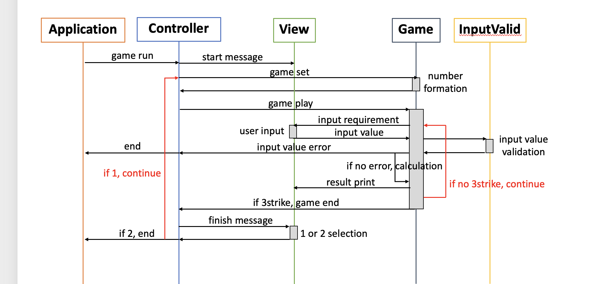

# 📑 기능 목록
1. 랜덤으로 1~9짜리 서로 다른 3개의 수(a)를 생성한다. - pickNumberInRange()
2. 사용자에게 수를 입력 받는다. - readLine()
3. 입력 받은 수를 검증한다.
   - 잘못된 값을 경우, IllegalArgumentException 발생 후 application 종료
     - 문자를 포함하고 있는 경우
     - 3자리 숫자가 아닌 경우
     - 숫자 0을 포함하고 있는 경우
     - 서로 다른 3개의 숫자가 아닌 경우(ex. 337, 299)
4. 입력 받은 수와 (a)를 비교해서 볼과 스트라이크 개수를 구함
   - 스트라이크 : 위치와 숫자 모두 일치하는 경우
   - 볼 : 숫자는 (a)에 들어가 있지만 위치가 일치하지 않은 경우
5. 위의 결과를 바탕으로 출력값을 결정
   - 스트라이크 & 볼 0개 : '낫싱'
   - 스트라이크 1~3개 & 볼 0개 : n스트라이크
   - 스트라이크 0개 & 볼 1~3개 : n볼
   - 스트라이크 1~2개 & 볼 1~2개 : n볼 n스트라이크
     - 정답 이후 : 3개의 숫자를 모두 맞히셨습니다! 게임 종료
     - 계속 여부 묻기 : 게임을 새로 시작하려면 1, 종료하려면 2를 입력하세요.
       - 1일 경우, 1번으로 다시 돌아간다.
       - 2일 경우, 게임을 완전히 종료한다.
       - 1과 2가 아닌 경우에, IllegalArgumentException 발생 후 application 종료

# 👨🏻‍💻 프로그래밍 요구 사항(신경썼던 것)
- 블록 들여쓰기 : 4 spaces(=tap)
- 열 제한 : 120자(너무 길게 쓰지 말자...)
- 들여쓰기 지속 : 최소 8 spaces
- 함수나 메서드 간의 빈 줄 삽입
- Naming...
  - UPPER_SNAKE_CASE : constant(상수)
  - UpperCamelCase : class
  - lowerCamelCase : 위의 경우 제외한 나머지

# 📝 설계 방향
- 코드를 본격적으로 작성하기 전에 1차적으로 설계해 본 순서 다이어그램
