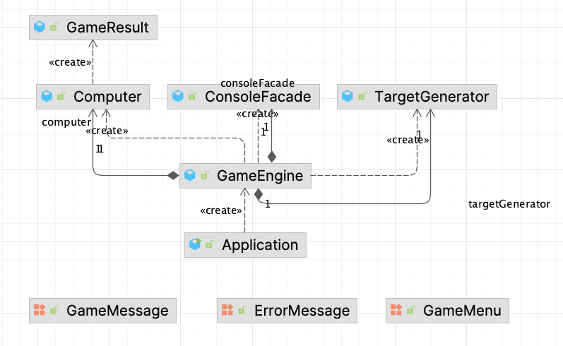

# 숫자 야구 게임

## 기능 요구 사항

- [x] 입출력
    - [x] 게임 시작 문구 출력
    - [x] 게임 종료 문구 출력
    - [x] 플레이
        - [x] 예상 숫자 입력
        - [x] 예상 숫자 결과 출력
    - [x] 게임 메뉴
        - [x] 게임 재시작 (1 입력 시)
        - [x] 게임 종료 (2 입력 시)
- [x] 랜덤
    - [x] 게임 시작 시 1-9 의 3자리 숫자 만들기
- [x] 로직
    - [x] 타깃 숫자와 예상 숫자 비교
    - [x] 잘못된 예상 숫자 입력 시 `IllegalArgumentException` 발생 후 종료

## 클래스 다이어그램

