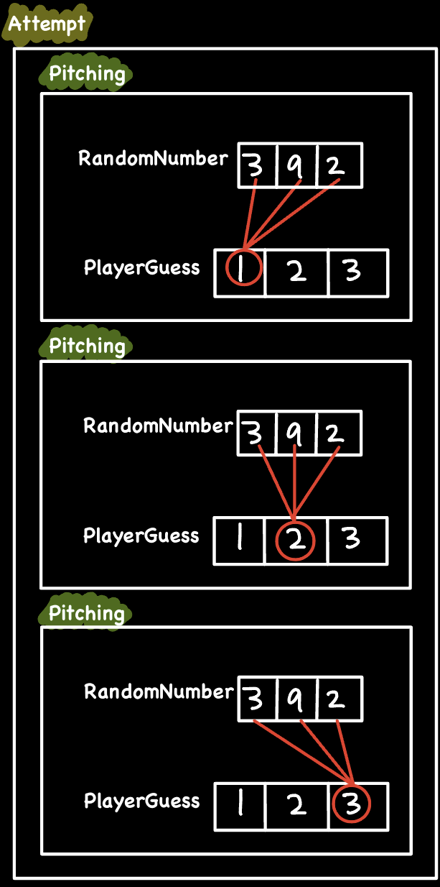
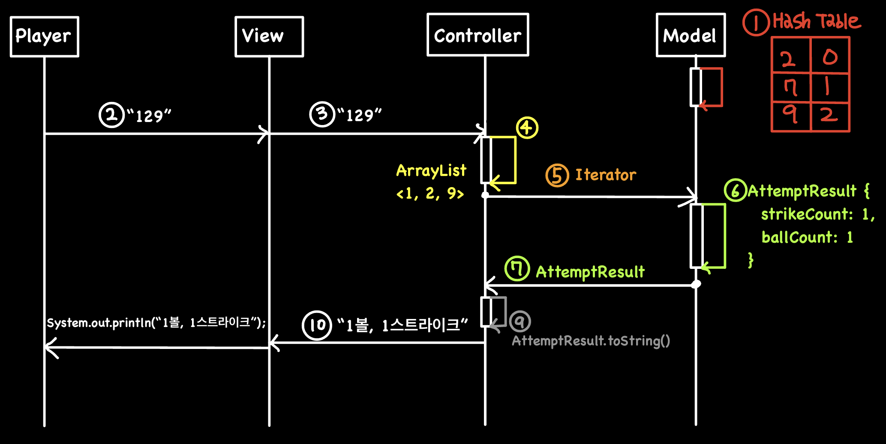

# Week1 구현 상세

---

# 기능 목록

1. 게임 시작 문구 출력
2. 1 ~ 9 사이의 서로 다른 3개 난수를 각 자릿수로 하는 숫자(***RandomNumber***) 생성
3. 사용자로부터 서로 다른 세 자리 수(***PlayerGuess***)를 입력 받음
4. ***PlayerGuess*** 유효성 검사
    1. ***PlayerGuess***의 길이는 3
    2. ***PlayerGuess***의 각 문자는 모두 1에서 9 사이의 숫자로 숫자 구성
    3. ***PlayerGuess***의 각 숫자는 중복되지 않음
    4. 유효하지 않은 입력을 받았다면, ***IllegalArgumentException*** 발생시키고, 프로그램 종료
5. ***PlayerGuess***의 각 자릿수와 ***RandomNumber***의 모든 자릿수와 비교하며,
    1. 같은 수가 같은 자리에 있으면 ***strikeCount***(스트라이크 개수)를 증가
    2. 같은 수가 다른 자리에 있으면 ***ballCount***(볼 개수)를 증가
6. 스트리이크와 볼의 값에 따라,
    1. 스트라이크가 3이라면, "3스트라이크"를 출력 후, (7)로
    2. 스트라이크와 볼이 모두 0이라면, "낫싱"을 출력 후, (3)으로
    3. 그 외에는, "{***ballCount***}볼 {***strikeCount***}스트라이크”와 같은 형식으로 투구 결과를 출력 후, (3)으로
7. 게임 종료 문구 출력
8. 시용자로부터 게임 진행 의사(***RoundEndAction***)를 입력 받음
9. ***RoundEndAction*** 유효성 검사
    1. 1: (3)으로 이동
    2. 2: 프로그램 종료
    3. 유효하지 않은 입력을 받았다면, ***IllegalArgumentException*** 발생시키고, 프로그램 종료

---
<details>
<summary> 첫 번째 시도 </summary>


# **역할에 따른 클래스 추출**

1. ***BaseballGame*** : 볼, 스트라이크 개수 관리, 문자열 출력 등의 게임 루틴
2. ***Player*** : 사용자 입력 및 입력 데이터 관리
3. ***RandomNumber*** : 1에서 9까지 서로 다른 3개의 숫자로 구성된 난수 생성 및 사용자 입력과 비교
4. \<\<enum\>\> ***PitchingResult*** : 투구 결과를 나타내는 열거형
5. \<\<enum\>\> ***GameAction*** : 게임을 계속할 지 여부를 나타내는 열거형


---


<br></br>
<br></br>

# ***RandomNumber* 구현**


📌 난수를 저장하는 자료구조로 정수형, 문자열, 해시테이블 세 가지를 시도한 결과 **해시테이블**로 결정


<br></br>
### 1️⃣ 정수형 세 자리 난수
<details>
<summary>난수 생성 과정 예시</summary>

1. 첫 번째 무작위 수

   

2. 두 번째 무작위 수

   

3. 세 번째 무작위 수

   

4. 네 번째 무작위 수

   

</details>


<details>
<summary>코드</summary>


```java
public String generateRandomNumber(){
        int randomNumber = 0;

        while (randomNumber < (int) Math.pow(10, this.digitCount - 1)){
            int randomDigit = pickNumberInRange(1, 9);

            if (!checkRedundancy(randomNumber, randomDigit)){
                randomNumber = (randomNumber * 10) + randomDigit;
            }
        }
        return Integer.toString(randomNumber);
    }

    private boolean checkRedundancy(int randomNumber, int randomDigit){
        while (randomNumber != 0){
            if ((randomNumber % 10) == randomDigit){
                return true;
            }
            randomNumber = randomNumber / 10;
        }
        return false;
    }
}
```

</details>


### 2️⃣ 문자열 세 자리 난수

<aside>
💡 반복문으로 비교를 해야하는데 정수형보다는 문자열이 좋지 않을까?!

</aside>


<details>
<summary>난수 생성 과정 예시</summary>


1. 첫 번째 무작위 수

   

2. 두 번째 무작위 수

   

3. 세 번째 무작위 수

   

4. 네 번째 무작위 수

   


</details>


### 3️⃣ 해시테이블 난수

<aside>
💡 중복 제거를 해야하니 Set이나 Hash table을 써보는 건 어떨까?!

</aside>


<details>
<summary>난수 생성 과정 예시</summary>


1. 첫 번째 무작위 수

   

2. 두 번째 무작위 수

   

3. 세 번째 무작위 수

   

4. 네 번째 무작위 수

   


</details>


**해시테이블을 선택한 이유**

1. 난수 생성 시, 반복문 같은 루틴 없이 중복 체크
2. 플레이어가 입력한 숫자와 난수를 비교할 때 이중 반복문을 사용하지 않아도 된다
    - Pseudo Code

        ```java
        for i = first index of input to last index of input:
            if input[i] in keys of hashTable:
                if hashTable(input[i]) == i:
                    strike++;
                else:
                    ball++;
        ```

<details>
<summary>난수 생성 과정 예시</summary>


1. STRIKE

   

2. BALL

   

3. NOTHING

   


</details>


생성된 난수를 전달할 때, 해시테이블을 반환할 수도 있지만,

다른 요구사항이 추가되어 난수를 다른 자료구조로 바꾸게 되면, 전달 받는 측의 처리 로직도 바뀌어야 한다.

또한, 생성된 난수의 쓰임은 사용자 입력이 ball, strike, 또는 둘 다 아닌지를 파악하는 것 뿐이다.

그러므로, ***RandomNumber*** 클래스에서 해당 로직을 처리해 결과를 처리해주는게 바람직하다고 생각했다.

이에, PitchingResult 열거형 클래스를 만들고, 사용자 입력의 각 자릿수를 입력으로 받아,

ball, strike, 또는 nothing을 반환해주는 method를 구현했다.

<br></br>
# *Player* **구현**


📌 플레이어의 행동은 두 가지 ‘**중첩되지 않은 세 자리 숫자 입력**’
또는 ‘**재시작과 종료 제어 숫자 입력**’ 이다.

<br></br>

## 중첩되지 않은 세 자리 숫자 입력

1. 사용자 입력인 세 자리 숫자를 저장할 공간으로 ***ArrayList<Integer>*** 생성

   → 데이터 중간에 삽입이 예상되지 않고, 반복문을 순회하기 좋은 자료구조

2. 사용자로부터 입력 받은 문자열의 크기가 요구하는 자릿수(3)가 맞는지 확인
3. 문자열의 각 문자가 ‘1’에서 ‘9’ 사이인지 확인
4. (2)에서 확인한 문자를 정수형으로 바꾸고 중복이 없다면 (1)에서 생성한 ArrayList에 추가

> 2 ~ 4의 유효성 검사가 실패 시 요구사항에 명시된 대로
>
>
> ***IllegalArgumentException***을 발생시키고 프로그램 종료
>

설계 초기에는 사용자 입력 전달하기 위해 <strong><em>ArrayList&lt;Integer&gt;</em></strong>를 반환.

그러나, 요구사항이 바뀌어 ***ArrayList***가 아닌 다른 자료구조로 변경될 수도 있다고 가정.

이러한 구현 변경이 다른 클래스에도 전달될 수 있다고 판단해,

두 개의 getter( ***getInputCount***, ***getNumberAt*** )를 두어 사용자 입력에 접근할 수 있도록 설계.

## 재시작과 종료 제어 숫자 입력

1. 사용자로부터 입력 받은 문자열의 길이가 1인지 확인

   → 1이 아니라면 ***IllegalArgumentException***을 발생시키고 프로그램 종료

2. 입력이 1이라면 ***GameAcion.CONTINUE***을 반환
3. 입력이 2라면 ***GameAcion.QUIT***을 반환
4. (2), (3)의 경우가 아니라면 ***IllegalArgumentException***을 발생시키고 프로그램 종료

제어 종류가 ‘계속 하기’와 ‘게임 종료’ 두 가지이므로 ***boolean***을 반환하는 방식으로 구현할 수도 있으나,

차후에 ‘기록 보기’와 같은 제어가 추가된다면 해당 method의 반환 형식 뿐 아니라,

method를 사용하는 측의 처리 로직도 변경되어야 한다.

이러한 변경의 전파를 최소화하고자 ***GameAction*** 열거형 클래스를 만들어 완충제로 두었다.


</details>


❗ **각 클래스에 너무 많은 기능이 담겨있어 다른 방식으로 분류할 필요성 인지**


---

# 두 번째 시도

<details>
<summary>용어집</summary>




- RandomNumber : 프로그램이 무작위로 생성하는 서로 다른  세 자리의 수
- PlayerGuess : 플레이어로부터 입력 받은 서로 다른 세 자리의 수
- Pitching : 플레이어가 입력한 숫자 중 하나와 RandomNumber의 세 숫자를 비교하는 시도
- PitchingResult : Pitching의 결과
    - STRIKE
    - BALL
    - NOTHING
- Attempt : PlayerGuess를 입력해 RandomNumber를 추론해보는 시도
    - 즉, 하나의 Attempt는 세 개의 Pitching으로 구성
- AttemptResult : Attempt의 결과
    - 볼과 스트라이크의 개수
- Round : 플레이어가 RandomNumber를 맞출 때까지의 과정
- RoundEnd : 플레이어가 RandomNumber의 숫자와 순서를 모두 맞춰 게임을 끝냈을 때
- RoundEndAction : RoundEnd에 플레이어가 취할 수 있는 행동
    - 1 : CONTINUE
    - 2 : QUIT
</details>

<details>
<summary>클래스 다이어그램</summary>


---

</details>


<br></br>

## 관심사 분리 ( MVC Pattern )


📌 첫 번째 시도에서 각 클래스의 여러 기능이 혼재된 근본 원인을 **관심사 분리의 실패**로 판단
수업 시간에 배운 **MVC 패턴**에 따라 모델, 뷰, 컨트롤로 나누는 것으로 시작


<br></br>


### 모델

- ***RandomNumber***와 ***AttemptResult*** 등의 데이터를 관리 및 처리 로직

### 뷰

- 플레이어로부터 문자열을 (***PlayerGuess, RoundEndAction)*** 입력 받고,
- 컨트롤러와 모델에서 처리된 데이터 출력

### 컨트롤러

- 기본적인 게임 동작 로직
- 뷰에서 입력 문자열 예외처리, 가공 후 모델에 전달
- 모델에서 처리된 데이터를 뷰에 전달

<br></br>
<br></br>
## 더 작은 구성요소로 분리 ( SRP )

<aside>
📌 관심사를 분리시켰음에도 각 모델, 뷰, 컨트롤러는 여전히 “여러 기능 또는 역할”을 가짐

따라서 SRP에 따라 각 관심사 클래스에서 기능(역할)을 떼어내 클래스를 분리

</aside>

### 모델

초기 **모델**은

1. 데이터 로직 처리
2. ***RandomNumber*** 생성 및 관리
3. 하나의 ***Attempt***에 대한 ball, strike 파악 및 결과

세 가지 역할을 가지고 있어, **모델**의 주역할인 '데이터 로직 처리’를 제외한

***RandomNumber***과 ***Attempt*** 관련 역할을 클래스로 분리

- ***RandomNumber*** :
    - 난수를 생성하고, ***PlayerGuess***의 각 숫자를 입력 받아 볼, 스트라이크를 판단해주는 클래스
- ***AttemptResult*** :
    - 하나의 ***Attempt***에 대한 볼, 스트라이크 결과를 저장, 문자열로 변환해주는 클래스


### 컨트롤러

기본적인 게임 동작 로직 외에도, **컨트롤러**는 두 가지 역할을 한다.

1. 플레이어가 입력한 문자열이 게임에서 정해진 형식에 맞는지 파악
    1. ex) 문자열의 길이가 세 자리인지, 모두 숫자인지 등…
2. 그 문자열을 가공해서 **모델**로 전달

두 기능은 서로 직접접으로 연관되어 있어,

Validator와 StringProcessor 두 개의 클래스로 나누는 것보다

두 개로 분리해야 할 명확한 요구사항이 발생하기 전까지

한 개의 클래스(***PlayerInputHandler***)에서 동작

- ***PlayerInputHandler***
    - handle(): 플레이어가 입력한 문자열의 유효성을 검사하고 가공하여 저장
    - getHandledResult(): handle()로 유효성이 검사되고 가공되어 저장된 데이터를 반환


<br></br>
<br></br>
## Program to an Interface ( DIP )


📌  ❓ 근데 플레이어 입력의 종류(***PlayerGuess, RoundEndAction***)는 두 개잖아❓

<br></br>


두 종류의 플레이어 입력에 따른 두 종류의 Handler 클래스가 필요하며,

**컨트롤러**는 모든 Handler 클래스를 알고 있어야 한다. 즉 컨트롤러의 의존성이 증가한다.

추가적으로, 플레이 입력은 요구 사항에 따라 쉽게 추가되거나 변경될 여지가 있다.

플레이 입력의 추가 및 변경은 Handler 클래스의 추가나 변경으로 이어진다.

이에 두 가지 문제를 해결해야 한다.

1. **컨트롤러**의 높은 의존성 해결
2. Handler 클래스의 추가 및 변경에 유연하게 대응( OCP )

### How to?

Handler 클래스가 제공해야 하는 기능을 인터페이스로 추상화하고

**컨트롤러**와 Handler 클래스들 사이에 인터페이스를 두어 의존성을 역전시키는 방법( DIP )을 선택

1. **컨트롤러**가 인터페이스에 의존함으로써 의존성 완화
2. 다른 유형의 Handler 클래스 추가 시 **컨트롤러**의 의존성 증가를 최소화


<br></br>
<br></br>
## 심볼의 상수화

<aside>
📌 특정 의미를 가지는 값들을 상수화

</aside>

1. ***PtchingResult***: { STRIKE, BALL, NOTHING }
2. ***RoundEndAction***: {  CONTINUE(”1”), QUIT(”2”) }
3. ***GameSettings***: 여러 클래스에서 두루 쓰이는 상수의 모음
    1. *`NUM_DIGITS`* : RandomNumber와 PlayerGuess의 자릿수
    2.  *`MIN_RANDOM_NUMBER`* , *`MAX_RANDOM_NUMBER`* : RandomNumber의 각 자릿수의 범위
    3. *`MIN_INPUT_CHARACTER`* , *`MAX_INPUT_CHARACTER`*: PlayerGuess의 각 자릿수의 범위

### 상수화의 장점

- 코드 가독성 향상:
    - ***pitching***의 결과를 0, 1, 2 등 특정 값에 매핑하지 않고 STRIKE, BALL, NOTHING과 같은 심볼을 사용함으로써 뜻을 명확히 할 수 있다.
- 휴먼 에러 방지
    - 각 자릿수의 범위가 (1 ~ 9)인데, 이는 일반적인 십진수의 범위인 (0 ~ 9)와 혼동될 수 있다.
    - 이러한 범위를 상수로 관리함으로써, 일관성을 유지하여, 실수를 미연에 방지할 수 있다.
- 유지보수
    - 자릿수가 세 자리에서 네 자리로 변경된다면, *`NUM_DIGITS`*의 값을 3에서 4로 수정해주면 된다.
    - 그러나, 상수를 사용하지 않고 ‘3’이라는 값으로 하드코딩이 되어있다면 프로그래머는 자릿수가 등장하는 모든 부분을 4로 수정해야 한다.

<br></br>
<br></br>
## 자료구조 선택 이유

### RandomNumber: ***HashTable***

빠르고 직관적인 중복 검사

1. 난수 생성 시, 반복문 없이 중복 체크
2. PlayerGuess와 비교할 때 이중 반복문을 사용하지 않아도 된다
    <details>
    <summary>예시</summary>
    
    1. strike
    
       
    
       2. ball
    
          
    
       3. Neither
    
          

</details>
        


### PlayerGuessNumberList: ***ArrayList***

1. 순서가 있는 자료구조
2. 데이터의 중간 삽입과 삭제가 없음
3. Iterator를 반환함으로써 구현을 감추고 데이터 전달 가능 → 구현 변경 시 파급 최소화
   <br></br>
   <br></br>
## 동작 과정

1. 모델: RandomNumber(***Hashtable***) 생성
2. 플레이어: 문자열 입력(PlayerGuess)
3. 뷰: 컨트롤러에게 입력 받은 문자열 전달
4. 컨트롤러: 문자열 예외처리 및 가공(***ArrayList***)
5. 컨트롤러: 모델에 (4) 생성한 ***ArrayList***에 접근할 수 있도록 수 ***Iterator*** 전달
6. 모델: 전달 받은 ***Iterator***를 순회하며 (1)에서 생성한 RandomNumber와 비교해, ***AttemptResult***를 계산
7. 모델: 완성된 ***AttemptResult***를 컨트롤러에 전달
8. 컨트롤러: 전달 받은 ***AttemptResult***를 문자열로 전환
9. 컨트롤러: 전환된 문자열을 뷰에게 전달
10. 뷰: 전달 받은 문자열 출력

