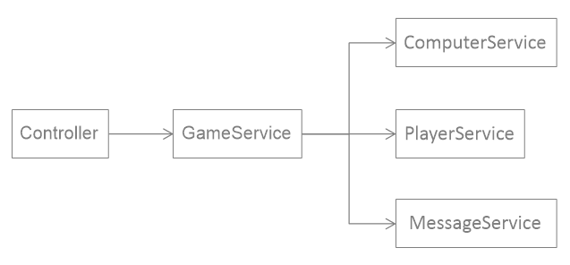
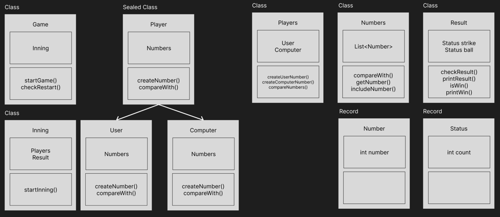

# ‍프로그래밍 목표

1. [객체지향 생활체조](ObjectCalisthenics.md) 9가지 원칙 준수
2. [Java 코드 컨벤션 가이드](GoogleJavaCodeStyle.md) 준수
3. [JDK 17 버전](JdkVersion.md) 준수
4. 이 외 공통 [프로그래밍 요구 사항](../README.md) 준수

# 기능 구현 목표

1. 랜덤 숫자 3개를 뽑는다.
    - 유효성 검사 후 필요하다면 IllegalArgumentException을 던진다.
2. 서로 다른 3자리 수를 사용자에게 입력 받는다.
    - 유효성 검사 후 필요하다면 IllegalArgumentException을 던진다.
3. 숫자 비교 후, 결과를 출력한다.
    - 유효성 검사 후 필요하다면 IllegalArgumentException을 던진다.
4. 이닝이 끝난 경우 게임 재시작/종료를 구분하는 수를 받는다.
    - 유효성 검사 후 필요하다면 IllegalArgumentException을 던진다.
5. 이닝을 재시작하거나 게임을 종료한다.

# 테스트 구현 목표

1. Game
    - Inning()이 3스트라이크로 종료 시 재시작/종료 안내 문구가 요구사항대로 출력되는지 확인한다.
2. Inning
    - startInning()시
        - 3스트라이크 시, 종료 문구가 요구사항대로 출력되는지 확인한다.
3. Number
    - getXDigit()시 해당 숫자가 잘 반환되는지 확인한다.
4. Players
    - compareNumbers()시
        - 두 객체가 잘 비교되는지 확인한다.
5. Result
    - checkResult()시
        - 0볼 0스트라이크일 경우, 낫싱이 출력되는지 확인한다.
        - 낫싱이 아닐 경우 볼과 스트라이크가 값대로 출력되는지 확인한다.
    - isWin()시
        - 3스트라이크일 경우, true가 반환되는지 확인한다.
        - 3스트라이크가 아닐 경우, false가 반환되는지 확인한다.
    - printWin()시
        - 축하메시지가 출력되는지 확인한다.
6. NumberValidate
    - validateInput()시
        - 1이나 2가 아닐 경우 IllegalArgumentException이 반환되는지 확인한다.
    - convertToNumber()시
        - 반환 인스턴스가 Number의 인스턴스인지 확인한다.
    - checkNumberValidate()시
        - 0이하 10이상일 경우 IllegalArgumentException이 반환되는지 확인한다.
7. 전체 테스트
    - 세 자리 초과 글자를 입력할 경우 IllegalArgumentException이 반환되는지 확인한다.
    - 숫자가 아닌 값을 입력할 경우 IllegalArgumentException이 반환되는지 확인한다.