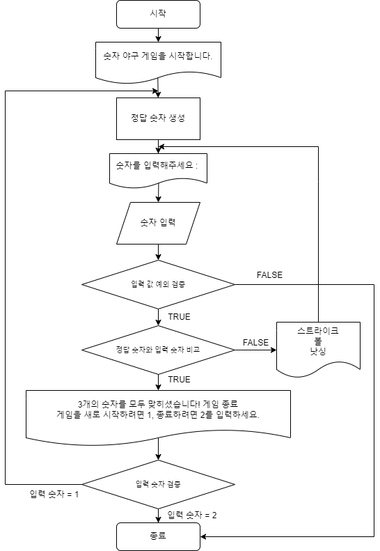

# 기능 구현 목록

## 1. 컴퓨터를 담당하는 클래스(숫자 야구 게임에서 상대방의 역할)
- 컴퓨터는 1에서 9까지 서로 다른 임의의 수 3개를 선택한다.
- 컴퓨터는 입력한 숫자에 대한 결과를 출력한다.
    ```text
    같은 수가 같은 자리에 있으면 스트라이크, 다른 자리에 있으면 볼, 같은 수가 전혀 없으면 낫싱이란 힌트를 얻고, 그 힌트를 이용해서 먼저 상대방(컴퓨터)의 수를 맞추면 승리한다.
    예) 상대방(컴퓨터)의 수가 425일 때
    123을 제시한 경우 : 1스트라이크
    456을 제시한 경우 : 1볼 1스트라이크
    789를 제시한 경우 : 낫싱
    ```

## 2. 플레이어 요청을 처리하는 클래스
- 사용자가 입력하는 값은 camp.nextstep.edu.missionutils.Console의 readLine()을 활용한다.
- 게임 플레이어는 컴퓨터가 생각하고 있는 서로 다른 3개의 숫자를 입력
- 사용자가 잘못된 값을 입력할 경우 IllegalArgumentException을 발생시킨 후 애플리케이션은 종료되어야 한다.
    ```text
    [게임 진행중]
    숫자가 아닌 다른 문자가 들어온 경우
    숫자 0이 들어온 경우
    [1-9]사이에 중복된 숫자가 들어온 경우
  
    [게임 종료]
    재시작을 요청하는 1, 종료를 요청하는 2를 제외한 숫자나 문자가 들어온경우
    ```

## 3. 게임 진행을 담당하는 클래스
- Random 값 추출은 camp.nextstep.edu.missionutils.Randoms의 pickNumberInRange()
- 사용자가 컴퓨터가 생각하고 있는 서로 다른 3개의 숫자를 맞추면 게임이 종료되고 아니라면 반복된다.

## 4. 게임에 반복을 담당하는 클래스
- 게임을 종료한 후 게임을 다시 시작하거나 완전히 종료할 수 있다.
---



