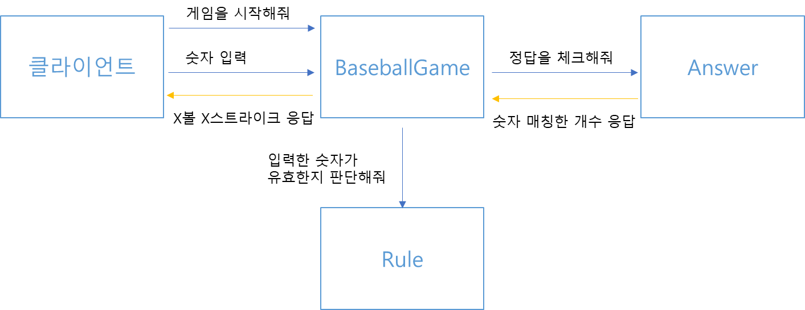

# ‍프로그래밍 목표

1. [객체지향 생활체조](ObjectCalisthenics.md) 9가지 원칙 준수
2. [Java 코드 컨벤션 가이드](GoogleJavaCodeStyle.md) 준수
3. [JDK 17 버전](JdkVersion.md) 준수
4. 이 외 공통 [프로그래밍 요구 사항](../README.md) 준수

# 기능 구현 목표

1. 랜덤 숫자 3개를 뽑는다.
    - 유효성 검사 후 필요하다면 IllegalArgumentException을 던진다.
2. 서로 다른 3자리 수를 사용자에게 입력 받는다.
    - 유효성 검사 후 필요하다면 IllegalArgumentException을 던진다.
3. 숫자 비교 후, 결과를 출력한다.
    - 유효성 검사 후 필요하다면 IllegalArgumentException을 던진다.
4. 이닝이 끝난 경우 게임 재시작/종료를 구분하는 수를 받는다.
    - 유효성 검사 후 필요하다면 IllegalArgumentException을 던진다.
5. 이닝을 재시작하거나 게임을 종료한다.

# 테스트 구현 목표

1. Game
    - startGame()시 Inning이 만들어지는지 확인한다.
    - checkingRestart()시
        - 1일 경우 startGame()을 호출하는지 확인한다.
        - 1이나 2가 아닐 경우 에러가 반환되는지 확인한다.
    - endGame()시 프로그램이 main으로 빠져나가 종료되는지 확인한다.
2. Inning
    - startInning()시
        - Players가 만들어지는지 확인한다.
        - Players에 한 명의 User와 한 명의 Computer가 있는지 확인한다.
    - startInning() 후, Result가 있는지 확인한다.
    - printResult()시
        - 문제에서 요구하는 형식에 맞춰 출력되는지 확인한다.
        - Result 변수의 값과 같은 값이 출력되는지 확인한다.
    - endInning()시
        - 종료 문구가 설정한대로 출력되는지 확인한다.
3. User
    - createNumber()시 stdout으로 받은 숫자가 들어가는지 확인한다.
    - validateNumber()시
        - validate하다면 true를 반환하는지 확인한다.
        - non-validate하다면 exception을 반환하는지 확인한다.
4. Computer
    - createNumber()시 random으로 숫자가 생성되는지 확인한다.
    - validateNumber()시
        - validate하다면 true를 반환하는지 확인한다.
        - non-validate하다면 exception을 반환하는지 확인한다.
5. Number
    - getXDigit()시 해당 숫자가 잘 반환되는지 확인한다.
    - 각각의 숫자가 1이상 9이하인지 확인한다.
6. Result
    - checkValidate()시 strike + ball의 값이 3이하인지 확인한다.
    - checkNothing()시
        - 낫싱일 경우 true를 반환하는지 확인한다.
        - 낫싱이 아닐 경우 false를 반환하는지 확인한다.
    - printStrike()시
        - 문제에서 요구하는 형식에 맞춰 출력되는지 확인한다.
        - 변수의 개수와 동일하게 출력되는지 확인한다.
    - printBall()시
        - 문제에서 요구하는 형식에 맞춰 출력되는지 확인한다.
        - 변수의 개수와 동일하게 출력되는지 확인한다.
7. Players
    - compareNumbers()시
        - Result 객체가 반환되는지 확인한다.
        - 정답과 맞는 값이 객체에 담겨있는지 확인한다.
8. Status
    - Getter가 동작하는지 확인한다.
    - checkValidate()시
        - 음수의 값이 나오면 exception을 반환하는지 확인한다.
        - 3 초과의 값이 나오면 exception을 반환하는지 확인한다.