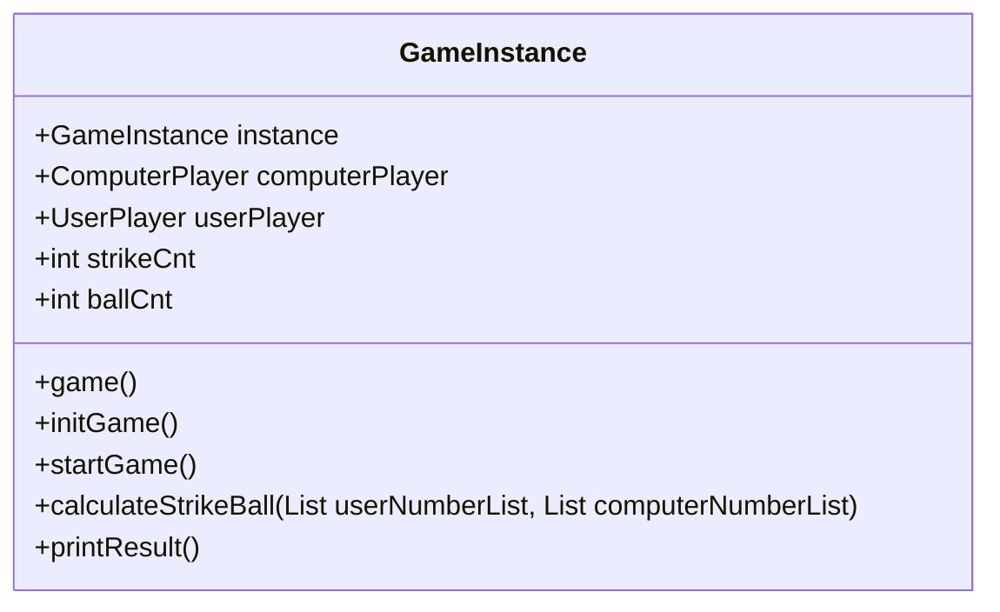
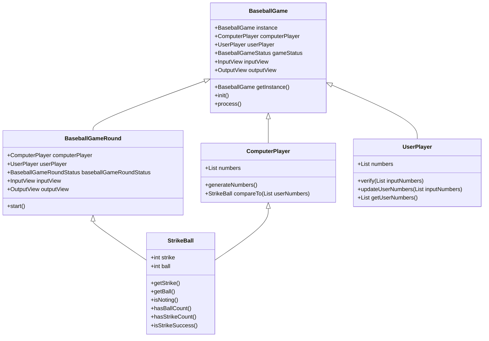

## 리펙토링 진행 과정

하나의 클래스에서 작성하던 전체 게임 로직을 객체의 역할, 책임, 협력의 관점에서 고민하여 아래와 같이 리팩토링하였습니다.

- 기존의 다이어그램


<details>
<summary>기존의 코드 보기</summary>
<div markdown="1">

```java
public class GameInstance {
    public static GameInstance instance;

    public static GameInstance getInstance() {
        if(instance == null) {
            instance = new GameInstance();
        }
        return instance;
    }

    private ComputerPlayer computerPlayer;
    private UserPlayer userPlayer;


    private static final String START_GAME_MESSAGE = "숫자 야구 게임을 시작합니다.";
    private int strikeCnt = 0;
    private int ballCnt = 0;

    private boolean destroy = false;
    public void game() {
        do {
            startGame();
            System.out.println(RESTART_GAME_MESSAGE);
            mode = Integer.parseInt(Console.readLine());
            if(mode == 2) destroy = true;
        } while (!destroy);
    }

    public void startGame() {
        initGame();
        System.out.println(START_GAME_MESSAGE);
        while(strikeCnt < 3) {
            userPlayer.input();
            calculateStrikeBall(userPlayer.getUserNumber(), computerPlayer.getComputerNumber());
            printResult();
        }
    }

    private static final String THREE_STRIKE_MESSAGE = "3개의 숫자를 모두 맞히셨습니다! 게임 종료.";

    public void printResult() {
        StringBuilder sb = new StringBuilder();

        if (ballCnt == 0 && strikeCnt == 0) sb.append("낫싱");
        if (ballCnt > 0) sb.append(ballCnt).append("볼 ");
        if (strikeCnt > 0) sb.append(strikeCnt).append("스트라이크 ");
        sb.append("\n");

        if(strikeCnt == 3) {
            sb.append(THREE_STRIKE_MESSAGE).append("\n");
        }

        System.out.printf(sb.toString());
    }

    public void calculateStrikeBall(List<Integer> userNumberList, List<Integer> computerNumberList) {
        int strike = 0, ball = 0;

        for (int i = 0; i < userNumberList.size(); i++) {
            if (computerNumberList.get(i).equals(userNumberList.get(i))) {
                strike++;
            } else if (computerNumberList.contains(userNumberList.get(i))) {
                ball++;
            }
        }

        strikeCnt = strike;
        ballCnt = ball;
    }

    private static final String RESTART_GAME_MESSAGE = "게임을 새로 시작하려면 1, 종료하려면 2를 입력하세요.";

    private int mode = 0;

    public void initGame() {
        computerPlayer = new ComputerPlayer();
        userPlayer = new UserPlayer();
        strikeCnt = 0;
        ballCnt = 0;
        destroy = false;
    }
}
```

</div>
</details>

- 리팩토링 다이어그램

### **BaseballGame**

BaseballGame 객체의 경우 숫자 야구 게임의 전체 기능을 담당합니다. 
사용자가 게임 종료를 누르기 전까지 숫자 야구 게임이 반복되며,
프로세스는 아래와 같습니다.
1. 게임 초기화
2. 게임 라운드 진행
3. 게임 재시작 여부에 따른 게임 시작 및 종료

<details>
<summary>BaseballGame 코드 보기</summary>
<div markdown="1">

``` java
public class BaseballGame {
    public static BaseballGame instance;

    public static BaseballGame getInstance() {
        if(instance == null) {
            instance = new BaseballGame();
        }
        return instance;
    }

    private ComputerPlayer computerPlayer;
    private UserPlayer userPlayer;
    private BaseballGameStatus gameStatus;
    private InputView inputView;
    private OutputView outputView;

    public void init() {
        this.computerPlayer = new ComputerPlayer();
        this.userPlayer = new UserPlayer();
        this.gameStatus = BaseballGameStatus.CONTINUE;
        this.inputView = new InputView();
        this.outputView = new OutputView();
    }

    public void process() {
        BaseballGameRound baseballGameRound;

        do {
            init();
            baseballGameRound = new BaseballGameRound(computerPlayer, userPlayer);
            baseballGameRound.start();

            outputView.printBaseballGameRestart();
            int mode = inputView.nextInt();
            if(mode == Constants.gameExit) gameStatus = BaseballGameStatus.EXIT;
        } while (gameStatus.equals(BaseballGameStatus.CONTINUE));
    }
}
```

</div>
</details>

### **BaseballGameRound**  
BaseballGameRound는 숫자 야구 게임의 한 라운드의 진행을 담당합니다.
프로세스는 아래와 같습니다.

1. 게임 시작 메세지 출력
2. 스트라이크가 3이 될 때 까지 반복
   3. 사용자 입력
   4. 스트라이크 볼 카운트 출력
3. 게임 종료 메시지 출력

<details>
<summary>BaseballGameRound 코드 보기</summary>
<div markdown="1">

``` java
public class BaseballGameRound {

    private ComputerPlayer computerPlayer;
    private UserPlayer userPlayer;
    private BaseballGameRoundStatus baseballGameRoundStatus;
    private InputView inputView;
    private OutputView outputView;

    public BaseballGameRound(ComputerPlayer computerPlayer, UserPlayer userPlayer) {
        this.computerPlayer = computerPlayer;
        this.userPlayer = userPlayer;
        this.baseballGameRoundStatus = BaseballGameRoundStatus.CONTINUE;
        this.inputView = new InputView();
        this.outputView = new OutputView();
    }

    public void start() {
        StrikeBall strikeBall;

        outputView.printBaseballGameStart();
        do {
            outputView.printUserNumberInput();
            userPlayer.updateUserNumbers(inputView.nextIntArray());
            strikeBall = computerPlayer.compareTo(userPlayer.getUserNumbers());
            outputView.printStrikeBallResult(strikeBall);

            if(strikeBall.isStrikeSuccess()) {
                outputView.printThreeStrikeSuccess();
                baseballGameRoundStatus = BaseballGameRoundStatus.EXIT;
            }
        } while (baseballGameRoundStatus.equals(BaseballGameRoundStatus.CONTINUE));
    }
}
```
</div>
</details>

### StrikeBall
스트라이크 볼은 게임 라운드 내 유저의 입력마다 스트라이크와 볼 정보를 저장합니다.  
스트라이크와 볼 개수에 따라 출력메시지가 달라지므로 필요한 메소드를 구현합니다.

<details>
<summary>StrikeBall 코드 보기</summary>
<div markdown="1">

```java
public class StrikeBall {
    private int strike;
    private int ball;

    public StrikeBall(int strike, int ball) {
        this.strike = strike;
        this.ball = ball;
    }

    public int getStrike() {
        return strike;
    }

    public int getBall() {
        return ball;
    }

    public boolean isNoting() {
        return this.strike == 0 && this.ball == 0;
    }

    public boolean hasBallCount() {
        return this.ball > 0;
    }

    public boolean hasStrikeCount() {
        return this.strike > 0;
    }

    public boolean isStrikeSuccess() {
        return this.strike == Constants.strikeTarget;
    }
}
```

</div>
</details>

### ComputerPlayer
컴퓨터 플레이어는 객체 생성 시 서로 다른 세 자리 수가 할당됩니다.  
유저 플레이어와의 수 비교를 컴퓨터 플레이어 내 메소드로 구현했습니다.  


<details>
<summary>ComputerPlayer 코드 보기</summary>
<div markdown="1">

```java
public class ComputerPlayer {
    private List<Integer> numbers = new ArrayList<>();

    public ComputerPlayer() {
        generateNumbers();
    }


    public void generateNumbers() {
        while(numbers.size() < Constants.maxNumDigit) {
            int randomNumber = Randoms.pickNumberInRange(Constants.startNum, Constants.lastNum);
            if (!numbers.contains(randomNumber)) {
                numbers.add(randomNumber);
            }
        }
    }

    public StrikeBall compareTo(List<Integer> userNumbers) {
        int strike = 0, ball = 0;

        for (int i = 0; i < userNumbers.size(); i++) {
            if (numbers.get(i).equals(userNumbers.get(i))) {
                strike++;
            } else if (numbers.contains(userNumbers.get(i))) {
                ball++;
            }
        }

        return new StrikeBall(strike, ball);
    }
}
```
</div>
</details>

### UserPlayer
유저 플레이어의 수는 입력마다 바뀌기 때문에 update 메소드로 저장하도록 하였습니다.  
업데이트 하기 전에 입력 값에 대해 유효성 검증을 실행합니다.  

<details>
<summary>UserPlayer 코드 보기</summary>
<div markdown="1">

```java
   public class UserPlayer {

   private List<Integer> numbers = new ArrayList<>();

   public void updateUserNumbers(List<Integer> inputNumbers) {
      verify(inputNumbers);

      this.numbers = inputNumbers;
   }

   public void verify(List<Integer> inputNumbers) {
      if(inputNumbers.size() < Constants.minNumDigit) {
         throw new IllegalArgumentException(ErrorConstants.NO_INPUT_NUMBER_ERROR);
      }

      if(inputNumbers.size() > Constants.maxNumDigit) {
         throw new IllegalArgumentException(ErrorConstants.EXCEEDS_THREE_DIGITS_ERROR);
      }

      if(inputNumbers.stream().distinct().toList().size() != inputNumbers.size()) {
         throw new IllegalArgumentException(ErrorConstants.DUPLICATE_NUMBER_ERROR);
      }

      if(inputNumbers.contains(Constants.invalidNum)) {
         throw new IllegalArgumentException(ErrorConstants.INVALID_NUMBER_ERROR);
      }
   }

   public List<Integer> getUserNumbers(){
      return numbers;
   }
}

```
</div>
</details>