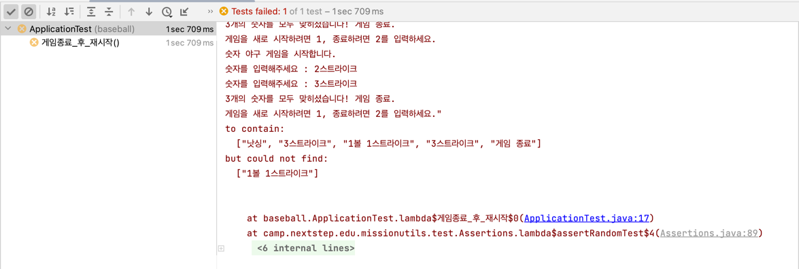
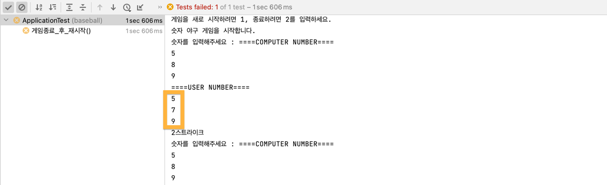

## 이슈 트러블 슈팅
테스트 실행 시 주어진 컴퓨터의 수 (ex. `135`, `589`)가 제대로 할당이 되지 않는 이슈가 있었습니다.  
``` java
assertRandomNumberInRangeTest(
        () -> {
            run("246", "135", "1", "597", "589", "2");
            assertThat(output()).contains("낫싱", "3스트라이크", "1볼 1스트라이크", "3스트라이크", "게임 종료");
        },
        1, 3, 5, 5, 8, 9
);
```

**테스트 오류 화면**


**해결 방법**  
컴퓨터 플레이어의 숫자 리스트와 유저 플레이어의 숫자 리스트를 출력하며 
입력 혹은 주어진 숫자가 순차적으로 저장되지 않고있음을 발견했습니다.  


- "597"로 순차적으로 수가 저장되지 않고 "579"로 저장되는 모습


컴퓨터 플레이어의 세 자리 랜덤 수 생성 로직을 살펴보면, 
HashSet을 통해 중복 제거를 요했지만 순차적으로 저장이 되지 않음을 확인할 수 있었습니다.

- 문제 코드
``` java
...

computer = new HashSet<>();
while(computer.size() < numDigit) {
    int randomNum = Randoms.pickNumberInRange(startInclusive, endInclusive);
    computer.add(randomNum);
}

```

- 해결 코드  

```java
computer = new LinkedHashSet<>();
```

동일하게 유저 플레이어의 입력 값에 따른 숫자 저장 시에도 HashSet을 LinkedHashSet으로 변경하였습니다.

- **LinkedHashSet vs HashSet**


| Set           | 설명                                     |
|:--------------|-----------------------------------------|
| HashSet       | 중복 허용 X, 순서 X                         |
| TreeSet       | 중복 허용 X, 값에 따른 순서 생성 (ex. a-z, 1-9) |
| LinkedHashSet | 중복 허용 X, 원소 삽입에 따른 순서 생성           |